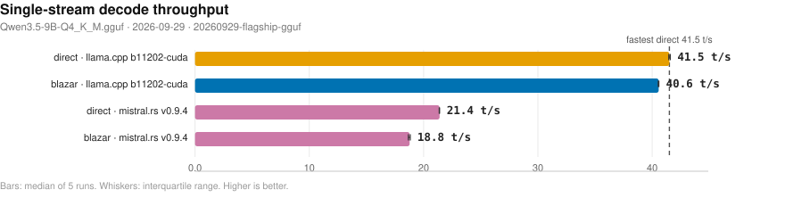
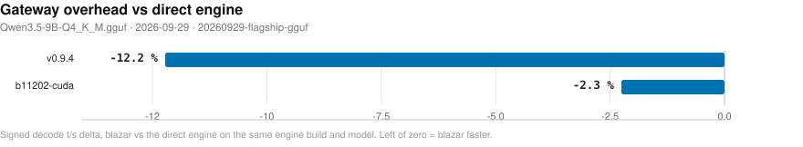
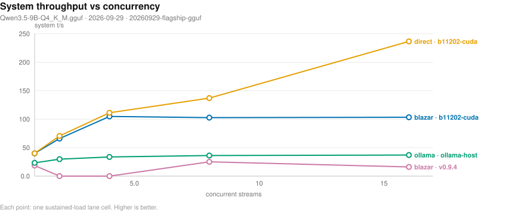
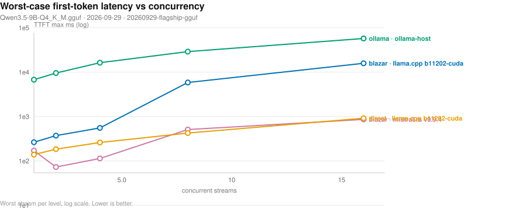
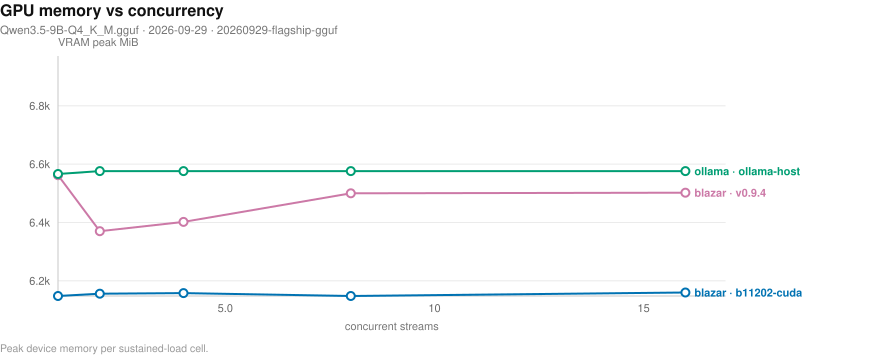
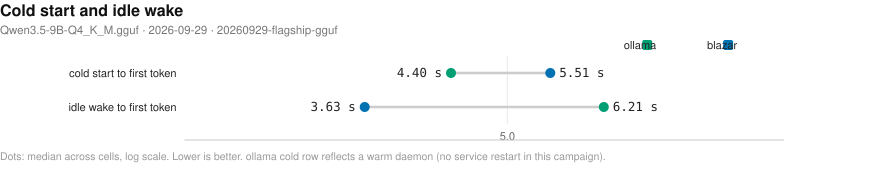
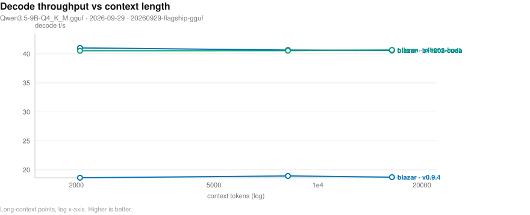
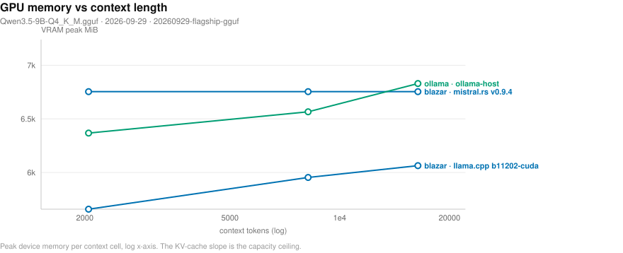

# Blazar inference benchmark

_Rendered 20260929-flagship-gguf; blazar 0.13.0; power state of gateway rows: ac._

## Executive summary

- v0.9.4: gateway 18.9 vs direct 21.4 t/s (-11.7%)
- v0.9.4 prompt-cache prefill 241 vs 243 t/s cold
- b11202-cuda sweep C=1/2/4/8/16: C1: 40.0 t/s system (4x65536); C2: 65.9 t/s system (4x65536); C4: 104.8 t/s system (4x65536); C8: 102.7 t/s system (4x65536); C16: 103.4 t/s system (4x65536)
- v0.9.4 sweep C=1/8/16: C1: 18.6 t/s system (engine-scheduled); C8: 25.0 t/s system (engine-scheduled); C16: 16.1 t/s system (engine-scheduled)
- ITL p99 51.22 ms vs ollama 75.01 ms (1.5x tighter)
- tool-call TTFT p50 117 ms vs ollama 284 ms (2.4x)
- adaptive reshape under sustained load: slots 4->8, 49.1->63.0 t/s while serving, zero failed requests
- greedy determinism: direct 20/20 exact, gateway transparency 7/20 exact at temp 0 (divergence = multi-slot batching numerics, not translation drift)
- gateway cold boot 0.52 s
- cold TTFT 8495 ms vs ollama 4404 ms (0.5x)
- idle wake 3627 ms (sleep) vs ollama 6212 ms (full reload)
- evict-ladder wake 4478 ms (full respawn still beats ollama's reload)

## Measured in this campaign

- blazar: 32 cell(s)
- cold-ollama: 1 cell(s)
- conc-blazar: 10 cell(s)
- conc-direct: 5 cell(s)
- conc-ollama: 5 cell(s)
- ctxcurve-blazar: 6 cell(s)
- ctxcurve-ollama: 3 cell(s)
- direct: 13 cell(s)
- features: 2 cell(s)
- greedy: 2 cell(s)
- greedy_gw: 1 cell(s)
- greedy_ollama: 1 cell(s)
- idle-blazar: 3 cell(s)
- idle-ollama: 1 cell(s)
- media-image: 4 cell(s)
- media-tts: 1 cell(s)
- media-tts-conc: 1 cell(s)
- media-video: 1 cell(s)
- media-whisper: 1 cell(s)
- ollama: 1 cell(s)
- ppl: 2 cell(s)
- reshape: 2 cell(s)
- tools: 2 cell(s)
- tools-ollama: 1 cell(s)

## Engine coverage

| Engine | Kind | Lane | ok cells | err cells | Status |
|---|---|---|---:|---:|---|
| v0.9.4 | mistralrs | text (direct + gateway) | 30 | 1 | benchmarked |
| b5130 | whisper | media | 1 | 0 | benchmarked |
| b11202-cuda | llamacpp | text (direct + gateway) | 49 | 0 | benchmarked |
| master-920-2f88688 | sdcpp | media | 5 | 0 | benchmarked |
| sglang-0.5.19 | - | - | 0 | 0 | excluded: model-format sweep: this campaign sweeps a GGUF file; sglang serves HF safetensors checkpoints (rerun with --model <safetensors-row>) |

## Test bed

| Component | Value |
|---|---|
| CPU | Intel Core i7-14650HX, 24 hardware threads |
| Discrete GPU | NVIDIA GeForce RTX 4070 Laptop, 8 GiB, driver 580.173.02 |
| Integrated GPU | Intel Graphics (RPL-S), Vulkan device |
| RAM | 16 GiB (13.3 GiB usable) |
| OS | Linux Mint 22.3, kernel 7.0.0-31-generic |
| Runtimes compared | blazar 0.13.0 gateway - inventory - llama.cpp b11202-cuda - mistral.rs v0.9.4 - ollama-host - piper TTS (engines lane) - stable-diffusion.cpp master-920-2f88688 - whisper.cpp b5130 |
| Model | Qwen3.5-9B-Q4_K_M.gguf, en_US-amy-medium, ggml-base, qwen-image-2.1-uncensored, wan_2.1_comfyui_repackaged |

## Methodology

<details>
<summary><b>Measurement protocol (how every number on this page was produced)</b></summary>

- All lanes speak the OpenAI-compatible streaming API; tokens are counted from usage chunks (engine-injected at the gateway), never estimated from chunk counts.
- Decode throughput = (tokens - 1) / (last-token time - TTFT); medians over 5 runs after a warmup request.
- Inter-token latency (ITL) p50/p99 from per-chunk timestamps; TTFT p50/p90/p99 + stdev.
- Prefill: a token-targeted prompt (~512 tokens via engine /tokenize); run 1 is the cold (uncached) prefill, runs 2+ ride the prompt cache.
- Concurrency: N parallel streams x 128 generated tokens each (levels via --conc-sweep, per-row `C` column); system t/s = total tokens / wall clock; sum-stream t/s = sum of per-stream rates (sum >> system indicates serialization).
- Greedy parity: 20 fixed prompts, greedy sampling, 256 tokens; exact-match count and text-similarity ratio vs a same-engine reference run.
- Tool calls: 6 single-turn scenarios (3-tool set: weather/calculate/flights), temperature 0, max 192 tokens (call JSON must complete); scored on well-formed calls, correct function selection, valid JSON arguments with required keys, and a no-tool control for false positives; stream deltas accumulated per OpenAI spec.
- Gateway transparency: a second greedy lane through the blazar gateway with identical sampling; any divergence vs the direct lane isolates translation overhead.
- Perplexity: llama-perplexity on an offline ASCII corpus, ctx 2048.
- Cold-start parity: the model file's page cache is dropped (posix_fadvise DONTNEED) and the GPU asserted idle (<512 MiB) before every cold probe on every runtime - a cold load is disk-cold, not memory-warm.
- Cold TTFT = first-token latency of the cold probe itself (max_tokens 4, aligned num_ctx 16384 on both runtimes).
- ollama daemon boot is only measured with --ollama-service-restart (systemd restart, sudo password via BENCH_SUDO_PASSWORD env, stdin-only); without it the daemon stays warm and the row says so.
- Idle-wake: blazar's reaper sleeps the child at idle_sleep_secs (weights stay RAM-resident, VRAM released) - wake TTFT is a sleep-wake; ollama's keep_alive expiry fully unloads - wake TTFT is a disk reload. The policy column names the semantic; both measured after the policy is observed via /api/ps.
- Long-context curve: per-ctx cells (blazar model_overrides ctx / ollama num_ctx) x 3-run decode suites; each ollama point evicts first so the runner respawns at that ctx.
- Sustained concurrency: sequential bursts of the parallel-stream lane (default 3 rounds); TTFT p99 aggregates every stream of every round.
- Every blazar row records the spawned engine's argv (slots/context shown in tables) and stamps blazar version, wall clock, 5-min load average, and AC/battery power state; GPU cells refuse to run on battery.
- Media lanes run in isolated sandbox daemons (same protocol as text blazar cells); the engine child spawns lazily, so each family's first request is the COLD number (spawn + weights + first artifact), labeled cold_request_s.
- Media TTFB = time to first BODY byte (first audio sample for streamed PCM, not response headers); buffered WAV TTFB equals its total by construction and the table says so.
- Video frame counts are container ground truth: the response webm is parsed for lacing-aware SimpleBlock counts and asserted against the Wan 4k+1 temporal grid (a mismatch is recorded loudly, never averaged away).
- The video scratch-gate probe sends one expected-rejected monster (duration 60s -> 960 aligned frames) and times the 400; the legit 5-frame pass rides the same warm child, so axis-row vs probe deltas price the gate itself.
- Media cells stamp GPU-busy and RAM-available at entry instead of asserting an idle GPU: a warm child from the previous family is the normal media workflow, and the receipt carries the occupancy rather than hiding it.
- TTS RTF = synthesis wall / audio seconds, audio duration parsed from the RIFF data-chunk length (not estimated from characters); whisper transcribes a WAV synthesized by the same campaign's piper voice, so the input is reproducible from the receipt.
- Image quality stamps are PIL-gated luma-domain metrics (rms contrast = luma stddev, entropy in bits, unique colors on a 256x256 downsample); when PIL is absent the row carries an honest 'skipped' note instead of a fake number, and one audit PNG per steps point is saved beside the cells for offline re-measurement.
- TTS concurrency probe: N parallel streamed-PCM requests through one sandboxed gateway; wall clock vs sum of per-stream totals yields an efficiency ratio (sum/wall ~ 1 means serialized, -> N means perfectly parallel), and the probe fails loudly if any stream errors or truncates.
- Adaptive reshape: sustained 8 concurrent streams (adoption needs a 60 s saturation streak plus a graceful drain); the child engine -np is polled from /proc every 2 s to prove the reshape landed; throughput and TTFT p50 are compared before vs after the slot transition; a dropped request anywhere fails the lane.
- Time-to-first-byte (TTFB) is stamped when the first response byte arrives on every stream; under burst arrival its per-level median upper-bounds queue wait (dashed curves on the concurrency tail-latency chart). Receipts from harness versions before TTFB capture omit the field and those curves.
- Concurrency cells sample GPU memory, GPU board power, and host CPU busy (delta /proc/stat, busy = total - idle - iowait) every 1.2 s alongside the load; the resource-vs-concurrency charts read those per-cell peaks. Legacy receipts without sampler folds omit the power chart.
- Quality suites: seven deterministic-checker suites (arithmetic reasoning, verifiable instruction following, code with executed tests, JSON schema, needle-in-haystack, multilingual, refusal/benign) on a seeded task generator (default seed 1337, --quality-seed) - the identical task set runs through blazar, the direct engine, and ollama, so pass-rate deltas isolate the gateway. Hybrid reasoning models are pinned to direct answers (enable_thinking=false on the OpenAI-compatible path, think=false on ollama's native /api/chat) so a lane measures task ability, not how much of the token budget the <think> block consumed. A parallel fast-subset probe (default C=4) rides the same daemon session; per-task prompts, raw excerpts, and checker verdicts land in cells.jsonl. Embed triples compare only within one engine (vector spaces are not cross-engine comparable). A config knob whose pass rate drops more than 2.0 pp vs default is flagged by the QC gate regardless of its speed win.

</details>

## Results

### Single-stream decode (512-token prompt, 128 generated, median of 5)

<details>
<summary><b>Receipt table - single-stream decode</b></summary>

| Runtime | slots x ctx | decode t/s | tok/s per W (net) | TTFT p50 ms | TTFT p99 ms | ITL p50 ms | ITL p99 ms | prefill cold t/s | prefill cached t/s | GPU peak MiB | GPU power W |
|---|---|---:|---:|---:|---:|---:|---:|---:|---:|---:|---:|---:|
| blazar gateway - llama.cpp b11202-cuda | 4x65536 | 40.6 | - | 121.5 | 181.4 | 24.6 | 25.7 | 1297.8 | 7364.4 | 6169 | 55.2 |
| blazar gateway - llama.cpp b11202-cuda (single-stream) | 1x16384 | 41.0 | - | 121.2 | 127.7 | 24.2 | 25.5 | 1322.2 | 7580.8 | 5666 | 55.1 |
| blazar gateway - llama.cpp b11202-cuda (cont_batching_off) | 4x65536 | 40.6 | - | 122.6 | 178.4 | 24.6 | 25.6 | 1310.7 | 7258.9 | 6152 | 55.4 |
| blazar gateway - llama.cpp b11202-cuda (fa_on) | 4x65536 | 40.6 | - | 120.9 | 129.4 | 24.6 | 25.7 | 1334.5 | 7483.4 | 6152 | 55.5 |
| blazar gateway - llama.cpp b11202-cuda (fa_off) | 4x65536 | 10.0 | - | 233.9 | 618.1 | 100.0 | 110.2 | 501.6 | 3173.8 | 6612 | 36.7 |
| blazar gateway - llama.cpp b11202-cuda (kv_unified_on) | 4x65536 | 40.7 | - | 119.7 | 126.2 | 24.6 | 25.7 | 1336.2 | 7499.3 | 6152 | 55.4 |
| blazar gateway - llama.cpp b11202-cuda (kv_unified_off) | 2x8192 | 41.0 | - | 122.5 | 128.7 | 24.4 | 25.4 | 1321.5 | 7324.0 | 5458 | 55.1 |
| blazar gateway - llama.cpp b11202-cuda (swa_full_on) | 4x65536 | 40.8 | - | 120.2 | 125.8 | 24.5 | 25.6 | 1306.7 | 7223.9 | 6152 | 55.4 |
| blazar gateway - llama.cpp b11202-cuda (no_kv_offload_on) | 2x8192 | 18.9 | - | 148.4 | 203.0 | 52.9 | 58.0 | 962.2 | 5198.1 | 5106 | 52.1 |
| blazar gateway - llama.cpp b11202-cuda (cache_q8_q8_0) | 4x65536 | 32.0 | - | 130.3 | 200.8 | 31.4 | 33.6 | 1189.8 | 6372.3 | 6544 | 53.9 |
| blazar gateway - llama.cpp b11202-cuda (ctx_checkpoints_4) | 4x65536 | 41.0 | - | 120.3 | 126.1 | 24.4 | 25.4 | 1343.2 | 7382.3 | 6152 | 55.4 |
| blazar gateway - llama.cpp b11202-cuda (spec_off) | 4x65536 | 41.0 | - | 121.0 | 174.3 | 24.3 | 25.6 | 1406.2 | 7400.1 | 6152 | 55.7 |
| blazar gateway - llama.cpp b11202-cuda (deterministic_on) | 1x16384 | 41.0 | - | 120.9 | 122.4 | 24.3 | 25.5 | 1325.5 | 7299.1 | 5666 | 55.8 |
| blazar gateway - llama.cpp b11202-cuda (mmproj_offload_off) | 4x65536 | 40.6 | - | 121.7 | 128.3 | 24.6 | 25.8 | 1302.0 | 7190.4 | 6152 | 56.9 |
| blazar gateway - llama.cpp b11202-cuda (threads_batch_8) | 4x65536 | 41.2 | - | 121.9 | 177.5 | 24.3 | 25.5 | 1319.7 | 7419.7 | 6152 | 55.5 |
| blazar gateway - llama.cpp b11202-cuda (cache_reuse_256) | 4x65536 | 40.6 | - | 120.7 | 176.9 | 24.6 | 25.7 | 1341.0 | 7188.5 | 6152 | 55.3 |
| blazar gateway - llama.cpp b11202-cuda (kv_unified_per_slot_4096) | 4x65536 | 40.6 | - | 121.7 | 126.6 | 24.5 | 25.9 | 1349.1 | 7217.1 | 6152 | 56.2 |
| blazar gateway - llama.cpp b11202-cuda (conc_default) | 4x65536 | - | - | - | - | - | 37.3 | - | - | 6158 | 55.0 |
| blazar gateway - llama.cpp b11202-cuda (adaptive_slots_off) | 4x65536 | - | - | - | - | - | 86.0 | - | - | 6148 | 54.8 |
| blazar gateway - llama.cpp b11202-cuda (poll_50) | 4x65536 | - | - | - | - | - | 51.2 | - | - | 6279 | 54.9 |
| blazar gateway - mistral.rs v0.9.4 | engine-scheduled | 18.8 | - | 132.0 | 143.2 | 53.7 | 60.9 | 242.1 | 244.6 | 6948 | 38.1 |
| blazar gateway - mistral.rs v0.9.4 (paged_attn_off) | engine-scheduled | 18.9 | - | 141.3 | 155.2 | 53.2 | 61.3 | 239.7 | 241.2 | 6948 | 42.2 |
| blazar gateway - mistral.rs v0.9.4 (single-stream) | engine-scheduled | 18.8 | - | 139.7 | 152.7 | 53.4 | 62.1 | 237.6 | 239.5 | 6948 | 41.0 |
| blazar gateway - mistral.rs v0.9.4 (kv_unified_on) | engine-scheduled | 18.9 | - | 131.3 | 136.9 | 53.3 | 61.3 | 244.0 | 247.1 | 6948 | 37.5 |
| blazar gateway - mistral.rs v0.9.4 (kv_unified_off) | engine-scheduled | 18.8 | - | 128.4 | 147.7 | 53.3 | 60.9 | 237.7 | 247.6 | 6948 | 40.4 |
| blazar gateway - mistral.rs v0.9.4 (spec_off) | engine-scheduled | 18.6 | - | 135.6 | 142.5 | 53.8 | 62.9 | 239.2 | 236.8 | 6948 | 39.6 |
| blazar gateway - mistral.rs v0.9.4 (deterministic_on) | engine-scheduled | 18.8 | - | 132.2 | 142.5 | 53.6 | 60.7 | 237.6 | 244.4 | 6948 | 37.3 |
| blazar gateway - mistral.rs v0.9.4 (pa_mem_0.85) | engine-scheduled | 18.7 | - | 130.1 | 147.4 | 52.9 | 61.5 | 237.2 | 249.6 | 6948 | 43.0 |
| blazar gateway - mistral.rs v0.9.4 (pa_mem_0.55) | engine-scheduled | 18.6 | - | 134.1 | 140.0 | 54.0 | 62.4 | 239.0 | 247.4 | 6948 | 38.4 |
| blazar gateway - mistral.rs v0.9.4 (mr_prefix_cache_256) | engine-scheduled | 18.9 | - | 131.4 | 136.1 | 53.0 | 61.1 | 241.0 | 246.5 | 6948 | 36.7 |
| blazar gateway - mistral.rs v0.9.4 (mr_enc_cache_512mb) | engine-scheduled | 18.9 | - | 137.2 | 143.7 | 53.0 | 61.0 | 243.0 | 241.0 | 6948 | 36.7 |
| direct engine - llama.cpp b11202-cuda | 1x16384 | 41.5 | - | 115.5 | 119.5 | 24.0 | 25.1 | 1335.7 | 7769.5 | 5660 | 55.2 |
| direct engine - mistral.rs v0.9.4 | 1x16384 | 21.4 | - | 105.7 | 108.1 | 46.7 | 52.3 | 321.3 | 323.4 | 7042 | 44.3 |
| ollama 0.33.3 - qwen3.5:9b (t/s NOT comparable - matrix model differs) | service | 40.7 | - | 129.7 | 140.5 | 24.8 | 75.0 | 1416.3 | 7337.1 | 6570 | 55.1 |

</details>

### Single-stream decode throughput (chart)

<p align="center"></p>

_Median decode t/s per runtime and engine; whiskers span the interquartile range of the 5 runs; the dashed line marks the fastest direct engine. Higher is better. Source: 20260929-flagship-gguf/cells.jsonl._

### Gateway overhead (chart)

<p align="center"></p>

_Decode t/s delta of routing through blazar relative to driving the same engine build directly; left of zero means the gateway path won. Source: 20260929-flagship-gguf/cells.jsonl._

### Concurrency (1x2x4x8x16 parallel streams x 128 tokens)

<details>
<summary><b>Receipt table - concurrency lanes</b></summary>

| Runtime | slots | ok streams | rounds | system t/s | sum-stream t/s | wall s | TTFT max ms | TTFT p99 ms | ITL p99 ms |
|---|---|---:|---:|---:|---:|---:|---:|---:|---:|
| blazar gateway - llama.cpp b11202-cuda | 4x65536 | 3 of 3x1 | 3 | 40.0 | 125.6 | 9.61 | 264 | 262 | 26.1 |
| blazar gateway - llama.cpp b11202-cuda | 4x65536 | 6 of 3x2 | 3 | 65.9 | 216.5 | 11.66 | 372 | 371 | 35.7 |
| blazar gateway - llama.cpp b11202-cuda | 4x65536 | 12 of 3x4 | 3 | 104.8 | 346.3 | 14.65 | 554 | 554 | 37.6 |
| blazar gateway - llama.cpp b11202-cuda | 4x65536 | 24 of 3x8 | 3 | 102.7 | 675.3 | 29.90 | 5840 | 5840 | 54.8 |
| blazar gateway - llama.cpp b11202-cuda | 4x65536 | 48 of 3x16 | 3 | 103.4 | 1350.1 | 59.43 | 15802 | 15798 | 85.8 |
| blazar gateway - mistral.rs v0.9.4 | engine-scheduled | 3 of 3x1 | 3 | 18.6 | 56.8 | 20.65 | 171 | 170 | 60.3 |
| blazar gateway - mistral.rs v0.9.4 | engine-scheduled | 6 of 3x2 | 3 | 0.0 | 0.0 | 0.18 | 73 | 73 | - |
| blazar gateway - mistral.rs v0.9.4 | engine-scheduled | 12 of 3x4 | 3 | 0.0 | 0.0 | 0.30 | 114 | 114 | - |
| blazar gateway - mistral.rs v0.9.4 | engine-scheduled | 24 of 3x8 | 3 | 25.0 | 76.0 | 25.56 | 509 | 508 | 81.8 |
| blazar gateway - mistral.rs v0.9.4 | engine-scheduled | 48 of 3x16 | 3 | 16.1 | 33.6 | 15.88 | 864 | 864 | 337.1 |
| direct engine - llama.cpp b11202-cuda | 1 | 1 of 1x1 | 1 | 40.0 | 41.5 | 3.20 | 139 | - | 25.1 |
| direct engine - llama.cpp b11202-cuda | 2 | 2 of 1x2 | 1 | 70.5 | 73.7 | 3.63 | 184 | - | 32.2 |
| direct engine - llama.cpp b11202-cuda | 4 | 4 of 1x4 | 1 | 111.3 | 117.0 | 4.60 | 260 | - | 36.5 |
| direct engine - llama.cpp b11202-cuda | 8 | 8 of 1x8 | 1 | 136.9 | 144.0 | 7.48 | 425 | - | 58.7 |
| direct engine - llama.cpp b11202-cuda | 16 | 16 of 1x16 | 1 | 236.6 | 262.5 | 8.66 | 918 | - | 69.1 |
| ollama - qwen3.5:9b | service | 3 of 3x1 | 3 | 23.3 | 121.7 | 16.49 | 6764 | 6632 | 74.2 |
| ollama - qwen3.5:9b | service | 6 of 3x2 | 3 | 29.8 | 243.3 | 25.81 | 9557 | 9392 | 74.7 |
| ollama - qwen3.5:9b | service | 12 of 3x4 | 3 | 33.6 | 486.7 | 45.69 | 16287 | 15928 | 74.8 |
| ollama - qwen3.5:9b | service | 24 of 3x8 | 3 | 36.2 | 969.7 | 84.88 | 28972 | 28217 | 74.8 |
| ollama - qwen3.5:9b | service | 48 of 3x16 | 3 | 37.0 | 1941.0 | 166.02 | 57266 | 55711 | 75.0 |

_sum-stream >> system t/s means streams serialize on one slot; roughly equal means genuinely parallel._

</details>

### Concurrency scaling (chart)

<p align="center"></p>

_Aggregate system tokens/s as parallel streams are added; flat-to-rising means the scheduler keeps the device saturated. Higher is better. Source: 20260929-flagship-gguf/cells.jsonl._

### Concurrency tail latency (chart)

<p align="center"></p>

_Worst-case first-token wait per stream as concurrency rises (log scale) - the tail the scheduler must bound. Lower is better. Source: 20260929-flagship-gguf/cells.jsonl._

### Resource cost and reliability vs concurrency

<p align="center"></p>

_Peak VRAM footprint as parallel streams (and their KV caches) stack up. Source: 20260929-flagship-gguf/cells.jsonl._

### Concurrency frontier verdicts

- blazar gateway - llama.cpp b11202-cuda: throughput plateaus at C=8 (<10% per-level gain), peak 104.8 t/s at C=4.
- blazar gateway - mistral.rs v0.9.4: 5 level(s) measured - insufficient levels for a saturation verdict.
- direct engine - llama.cpp b11202-cuda: still gaining at C=16 (40.0 -> 236.6 t/s) - saturation not reached within the sweep.
- ollama - qwen3.5:9b: throughput plateaus at C=8 (<10% per-level gain), peak 37.0 t/s at C=16.

### Adaptive reshape under sustained load (no-lag proof)

<details>
<summary><b>Receipt table - adaptive reshape</b></summary>

| Runtime | reshape | slots | time to reshape s | req before/after | TTFT p50 before->after ms | sys t/s before->after | failed |
|---|---|---|---:|---:|---:|---:|---:|
| blazar gateway - llama.cpp b11202-cuda | yes | 4->8 | 74 | 32/147 | 7413->349 | 49->63 | 0 |
| blazar gateway - mistral.rs v0.9.4 | n/a | skipped: adaptive reshape is a llamacpp-lane mechanism; this engine's child exposes no slot shape (-np) to observe or adopt | - | - | - | - | - |

<details><summary>daemon tail (slots/reshape) - llama.cpp b11202-cuda</summary>

```
2026-09-29T18:01:53.480677Z  INFO evict: terminating child and releasing the slot model="qwen3.5-9b" pid=217652
2026-09-29T18:01:53.480677Z  INFO evict: terminating child and releasing the slot model="qwen3.5-9b" pid=217652
```

</details>

</details>

### Perplexity

<details>
<summary><b>Receipt table - perplexity</b></summary>

| Engine | KV rung | perplexity (ctx 2048, offline ASCII corpus) | ppl tool |
|---|---|---:|---|
| llama.cpp b11202-cuda | f16 | 4.83 +/- 0.19 | own |
| mistral.rs v0.9.4 | f16 | 4.83 +/- 0.19 | borrowed (llama-b11202) |

</details>

### Greedy parity and gateway transparency (20 prompts, 256 tokens)

<details>
<summary><b>Receipt table - greedy parity</b></summary>

| Comparison | exact / total | ratio mean | ratio min |
|---|---:|---:|---:|
| llama.cpp b11202-cuda vs same-engine reference (direct) | 20/20 | 1.000 | 1.000 |
| mistral.rs v0.9.4 vs same-engine reference (direct) | 0/20 | 0.514 | 0.000 |
| llama.cpp b11202-cuda through blazar gateway vs direct | 7/20 | 0.643 | 0.017 |
| ollama (qwen3.5:9b) run-to-run, temp 0 | 20/20 | 1.000 | 1.000 |

_Exact-match divergence across GPU backends is expected float nondeterminism (batch shape and backend kernels), not translation drift; bit-parity across runs requires single-slot decoding (blazar `deterministic = true` pins it)._

</details>

### Tool calls (single-turn selection + schema quality)

<details>
<summary><b>Receipt table - tool calls</b></summary>

| Runtime | scenarios | well-formed | selection | args valid | control FP | TTFT p50 ms |
|---|---:|---:|---:|---:|---|---:|
| blazar gateway - b11202-cuda | 6 | 4/6 | 4/5 | 4/5 | no | 117 |
| blazar gateway - v0.9.4 | 6 | 5/6 | 5/5 | 5/5 | no | 1784 |
| ollama - qwen3.5:9b | 6 | 4/6 | 4/5 | 4/5 | no | 284 |

</details>

### Quality suites (checker-verified, seeded, greedy)

- _quality lane: **not-measured** — no quality rows in this campaign (lane not reached for the selected providers/engines)_

_Not measured in this campaign (20260929-flagship-gguf); quality suites lane not run._

### Optimization axes (ctx 4096, single stream)

<details>
<summary><b>Receipt table - optimization axes</b></summary>

| Engine | axis | setting | decode t/s | delta vs dense | prefill cold t/s | delta |
|---|---|---|---:|---:|---:|---:|
| llama.cpp b11202-cuda | kv | q8_0 | 41.1 | -0.2 | 1332.6 | 72.0 |
| llama.cpp b11202-cuda | pa | on | 41.5 | 0.1 | 1335.0 | 74.4 |
| llama.cpp b11202-cuda | spec | ngram-simple | 41.1 | -0.3 | 1330.8 | 70.2 |
| llama.cpp b11202-cuda | mmproj | True | 41.5 | 0.1 | 1342.6 | 81.9 |
| mistral.rs v0.9.4 | pa | off | 18.8 | -2.6 | 237.9 | -80.9 |

</details>

### Gateway config knobs (on/off vs default profile)

<details>
<summary><b>Receipt table - config knob A/B</b></summary>

| Engine | config | decode t/s | decode delta% | ttft p50 ms | ttft delta% | GPU peak MiB | GPU delta | output vs default |
|---|---|---:|---:|---:|---:|---:|---:|:-:|
| llama.cpp b11202-cuda | single-stream | 41.0 | +1.0% | 121 | -0.2% | 5666 | -503 | same |
| llama.cpp b11202-cuda | cont_batching_off | 40.6 | +0.2% | 123 | +0.8% | 6152 | -17 | same |
| llama.cpp b11202-cuda | fa_on | 40.6 | -0.0% | 121 | -0.5% | 6152 | -17 | same |
| llama.cpp b11202-cuda | fa_off | 10.0 | -75.3% | 234 | +92.5% | 6612 | +443 | same |
| llama.cpp b11202-cuda | kv_unified_on | 40.7 | +0.2% | 120 | -1.5% | 6152 | -17 | same |
| llama.cpp b11202-cuda | kv_unified_off | 41.0 | +1.1% | 123 | +0.8% | 5458 | -711 | same |
| llama.cpp b11202-cuda | swa_full_on | 40.8 | +0.5% | 120 | -1.1% | 6152 | -17 | same |
| llama.cpp b11202-cuda | no_kv_offload_on | 18.9 | -53.5% | 148 | +22.1% | 5106 | -1063 | same |
| llama.cpp b11202-cuda | cache_q8_q8_0 | 32.0 | -21.1% | 130 | +7.2% | 6544 | +375 | same |
| llama.cpp b11202-cuda | ctx_checkpoints_4 | 41.0 | +1.1% | 120 | -1.0% | 6152 | -17 | same |
| llama.cpp b11202-cuda | spec_off | 41.0 | +1.1% | 121 | -0.5% | 6152 | -17 | same |
| llama.cpp b11202-cuda | deterministic_on | 41.0 | +1.0% | 121 | -0.5% | 5666 | -503 | same |
| llama.cpp b11202-cuda | mmproj_offload_off | 40.6 | -0.0% | 122 | +0.1% | 6152 | -17 | same |
| llama.cpp b11202-cuda | threads_batch_8 | 41.2 | +1.6% | 122 | +0.3% | 6152 | -17 | same |
| llama.cpp b11202-cuda | cache_reuse_256 | 40.6 | +0.1% | 121 | -0.7% | 6152 | -17 | same |
| llama.cpp b11202-cuda | kv_unified_per_slot_4096 | 40.6 | +0.1% | 122 | +0.1% | 6152 | -17 | same |
| mistral.rs v0.9.4 | paged_attn_off | 18.9 | +0.5% | 141 | +7.1% | 6948 | +0 | same |
| mistral.rs v0.9.4 | single-stream | 18.8 | -0.1% | 140 | +5.9% | 6948 | +0 | same |
| mistral.rs v0.9.4 | kv_unified_on | 18.9 | +0.5% | 131 | -0.5% | 6948 | +0 | same |
| mistral.rs v0.9.4 | kv_unified_off | 18.8 | +0.3% | 128 | -2.7% | 6948 | +0 | same |
| mistral.rs v0.9.4 | spec_off | 18.6 | -1.2% | 136 | +2.8% | 6948 | +0 | same |
| mistral.rs v0.9.4 | deterministic_on | 18.8 | -0.1% | 132 | +0.2% | 6948 | +0 | same |
| mistral.rs v0.9.4 | pa_mem_0.85 | 18.7 | -0.2% | 130 | -1.4% | 6948 | +0 | same |
| mistral.rs v0.9.4 | pa_mem_0.55 | 18.6 | -0.9% | 134 | +1.7% | 6948 | +0 | same |
| mistral.rs v0.9.4 | mr_prefix_cache_256 | 18.9 | +0.7% | 131 | -0.4% | 6948 | +0 | same |
| mistral.rs v0.9.4 | mr_enc_cache_512mb | 18.9 | +0.5% | 137 | +4.0% | 6948 | +0 | same |

</details>

### Gateway scheduler knobs under concurrent load (C=8 bursts)

<details>
<summary><b>Receipt table - conc lane A/B</b></summary>

| Engine | config | sys tok/s | sys delta% | ttft p99 ms | ttft delta% | GPU peak MiB | GPU delta | errs |
|---|---|---:|---:|---:|---:|---:|---:|---:|
| llama.cpp b11202-cuda | conc_default | 84.9 | +0.0% | 10101 | +0.0% | 6158 | +0 | 0 |
| llama.cpp b11202-cuda | adaptive_slots_off | 84.3 | -0.8% | 9893 | -2.1% | 6148 | -10 | 0 |
| llama.cpp b11202-cuda | poll_50 | 84.0 | -1.1% | 10320 | +2.2% | 6279 | +121 | 0 |

</details>

### Engine capability matrix

<details>
<summary><b>Receipt table - capability matrix</b></summary>

| Capability | llama.cpp b11202-cuda | mistral.rs v0.9.4 |
|---|---:|---:|
| anthropic-api | no | yes |
| ctx-override | yes | yes |
| embeddings | yes | no |
| grammar-gbnf | yes | no |
| json-schema | yes | yes |
| kv-quant | yes | yes |
| lora-adapter | yes | yes |
| metrics-endpoint | yes | yes |
| paged-attn | yes | yes |
| parallel-np | yes | yes |
| quant-on-load | yes | yes |
| rerank | yes | no |
| slots-sessions | yes | no |
| spec-decode | yes | yes |
| tokenize-endpoint | yes | no |
| vision-mmproj | yes | yes |

</details>

### Cold start and idle wake (lifecycle)

<p align="center"></p>

_Seconds to first token after a cold start (page cache dropped) and after idle-policy expiry; blazar keeps weights resident while ollama reloads from disk. Warm-daemon ollama caveat applies. Lower is better. Source: 20260929-flagship-gguf/cells.jsonl._

_Every cold probe runs page-cache-dropped and GPU-idle-asserted on both runtimes; ollama rows without --ollama-service-restart leave the daemon warm (noted on the chart when it applies). blazar sleeps with weights in RAM (wake = resume); ollama unloads at keep_alive expiry (wake = full disk reload). Policies differ by design - each dot measures its own runtime's idle path after the policy verifiably fired. Per-run detail and per-config rows: the campaign's cells.jsonl._

### Long-context degradation curve

<p align="center"></p>

_Single-stream decode t/s as prompt context grows (log x-axis) - KV-cache pressure made visible. Source: 20260929-flagship-gguf/cells.jsonl._

<p align="center"></p>

_Peak VRAM as prompt context grows (log x-axis) - the KV-cache slope that sets the usable context ceiling. Source: 20260929-flagship-gguf/cells.jsonl._

### Media lanes (image / video / TTS / whisper)

<details>
<summary><b>Receipt tables - media lanes and config A/B</b></summary>

| Lane | cold s | median s | min s | max s | ground truth | gate reject s | TTFB speedup |
|---|---:|---:|---:|---:|---|---:|---:|
| image - qwen-image-2.1-uncensored (512x512, steps=[4]) | 56.33 | 45.55 | 45.51 | 45.83 | 512x512 PNG, entropy 7.1 bits, contrast 75.6 |  |  |
| image - qwen-image-2.1-uncensored (512x512, steps=[4]) [fa_off] | 61.94 | 52.21 | 52.19 | 52.22 | 512x512 PNG, entropy 6.9 bits, contrast 68.4 |  |  |
| image - qwen-image-2.1-uncensored (512x512, steps=[4]) [vae_tiling_on] | 58.01 | 46.45 | 46.45 | 46.52 | 512x512 PNG, entropy 7.0 bits, contrast 73.4 |  |  |
| image - qwen-image-2.1-uncensored (512x512, steps=[4]) [sage_attn_on] | 56.77 | 45.55 | 45.49 | 45.58 | 512x512 PNG, entropy 7.3 bits, contrast 70.9 |  |  |
| tts - en_US-amy-medium (840 chars, wav+pcm) | - | 2.05 | - | 3.41 | RTF wav 0.034 / pcm 0.056 (61s audio) |  | 4.08x |
| tts-conc - en_US-amy-medium (400 chars x4 pcm) | - | 4.72 | 4.88 | - | efficiency 3.83 of 4 streams |  | 1578ms max TTFB |
| video - wan_2.1_comfyui_repackaged (320x320, steps=8) | 38.24 | 11.07 | 11.07 | 11.08 | 5f: mux==reported==aligned | 0.001 |  |
| video - wan_2.1_comfyui_repackaged (320x320, steps=8) | - | 22.10 | 22.10 | 22.11 | 13f: mux==reported==aligned |  |  |
| video - wan_2.1_comfyui_repackaged (320x320, steps=8) | - | 52.16 | 52.16 | 52.17 | 33f: mux==reported==aligned |  |  |
| whisper - ggml-base (transcribes piper wav) | 2.41 | 2.14 | - | - | RTF 0.069 |  |  |

| Engine | config | median total s | delta% vs default | cold request s |
|---|---|---:|---:|---:|
| stable-diffusion.cpp master-920-2f88688 | fa_off | 52.2 | +14.6% | 61.9 |
| stable-diffusion.cpp master-920-2f88688 | vae_tiling_on | 46.5 | +2.0% | 58.0 |
| stable-diffusion.cpp master-920-2f88688 | sage_attn_on | 45.5 | inert | 56.8 |

> stable-diffusion.cpp master-920-2f88688 sage_attn_on: config knob inert on this box: profiler skipped sage_attn (SageAttention requires a CUDA device (SM80+, CUDA build) and the child dies during load otherwise; active device Vulkan1) - this row measures the default posture; treat delta% as run-to-run noise

_Media cells run through the same sandboxed gateway as text lanes but do not assert GPU-idle: a warm engine child is the normal serving shape, so each row stamps gpu_busy_mib / ram_avail_mib / loadavg instead. 3 runs (not 5); media variance is dominated by the model, not the scheduler. Video frame counts are read from the EBML container (lacing-aware), never from an API field; the VRAM gate probe times how fast an over-budget request is rejected with a teaching error._

</details>

## Findings (this campaign)

1. **Gateway overhead vs direct spawn: within measurement noise.** b11202-cuda decode 41.0 t/s through the gateway vs 41.5 t/s direct (-1.3%), greedy parity through the gateway 7/20 exact.
2. **Capacity-aware slot auto-sizing observed in argv.** Distinct engine shapes this campaign: 1x16384, 2x8192, 4x65536 - slots follow the live hardware census, each row's child_argv carries the receipt.
3. **Concurrency scaling per engine.** b11202-cuda (C=1/2/4/8/16): peak 104.8 t/s at C=4, 66% of ideal at C=4; v0.9.4 (C=1/8/16): peak 25.0 t/s at C=8, 17% of ideal at C=8; serialization behavior per level in the frontier table below.
4. **Prompt cache pays 5.7x on prefill** (7364 cached vs 1298 t/s cold).
5. **Speculative n-gram decoding is a net loss for this model** (decode 41.1 t/s, -0.3 vs dense baseline) - measured, not assumed.
6. **KV quantization (q8_0) is decode-neutral** (decode 41.1 t/s vs 41.4 dense).
7. **v0.9.4 serves this model through blazar's profile** ( blazar auto-disables PA on tight cards and the model then serves; the row's argv is the receipt).
8. **Tool-call quality (single-turn, temp 0).** b11202-cuda: selection 4/5, args 4/5 (control clean); v0.9.4: selection 5/5, args 5/5 (control clean); ollama: selection 4/5, args 4/5 (control clean); per-scenario detail in cells.jsonl.
9. **Adaptive reshape lands under sustained load.** llama.cpp b11202-cuda: reshaped 4->8 slots after 74.1 s under sustained C=8, TTFT p50 7413->349 ms, 0 dropped requests; mistral.rs v0.9.4: no reshape observed in the lane window (graceful-drain: adoption waits for in-flight streams, never kills one).
10. **Image quality stamps (PIL, luma domain): entropy 7.11 bits, rms contrast 75.6, 27459 unique colors @256x256** on qwen-image-2.1-uncensored - perceptual baseline for cross-run comparisons; audit PNG saved beside the cells.
11. **Image quality stamps (PIL, luma domain): entropy 6.94 bits, rms contrast 68.4, 27560 unique colors @256x256** on qwen-image-2.1-uncensored - perceptual baseline for cross-run comparisons; audit PNG saved beside the cells.
12. **Image quality stamps (PIL, luma domain): entropy 7.03 bits, rms contrast 73.4, 31438 unique colors @256x256** on qwen-image-2.1-uncensored - perceptual baseline for cross-run comparisons; audit PNG saved beside the cells.
13. **Image quality stamps (PIL, luma domain): entropy 7.31 bits, rms contrast 70.9, 33526 unique colors @256x256** on qwen-image-2.1-uncensored - perceptual baseline for cross-run comparisons; audit PNG saved beside the cells.
14. **Streamed PCM cuts time-to-first-audio 4.08x vs buffered WAV** (piper lane, first audio 0.50s vs 2.05s full synthesis) - total wall time is slightly higher (per-chunk synthesis), the win is interactivity.
15. **4 parallel PCM streams through one gateway: perfectly parallel** (efficiency 3.83 = sum of per-stream totals / 4.88s wall, max TTFB 1578 ms, NON-uniform stream outputs - flagged) - the scalability receipt for the TTS lane.
16. **Video VRAM gate rejects an over-budget request in 1 ms** with the full estimate math and override levers in the error body - instead of an opaque child abort minutes later.

## Failed cells (engine-reality receipts)

_These knobs crashed the engine child on this test bed; the crash signature is the receipt. Raw logs: `cells.jsonl` (`daemon_log_tail` field)._

| Engine | lane | config | failure |
|---|---|---|---|
| v0.9.4 | blazar | mr_batch_64 | cold probe failed: HTTP Error 502: Bad Gateway |

## Structured skips (tool/format boundaries)

- master-920-2f88688 (media-image): config knob inert on this box: profiler skipped sage_attn (SageAttention requires a CUDA device (SM80+, CUDA build) and the child dies during load otherwise; active device Vulkan1) - this row measures the default posture; treat delta% as run-to-run noise
- v0.9.4 (reshape): skipped: adaptive reshape is a llamacpp-lane mechanism; this engine's child exposes no slot shape (-np) to observe or adopt

## Caveats

- ollama prefill numbers come from engine counters that exclude the chat template, so they read slightly high against the 512-token lanes.
- Cross-backend greedy ratios (CUDA vs Vulkan) diverge on near-tie logits; treat ratio, not exact-match count, as the signal.
- All GPU rows measured on AC power at bounded load; rows record load average and power state (battery runs are rejected by the harness).
- Numbers are medians of 5 runs on one hybrid laptop; expect absolute shifts on other hardware, ratios to travel better.

## Reproduce

```bash
python3 scripts/bench_matrix.py --artifacts-dir bench-artifacts/20260929-flagship-gguf --engines b11202-cuda v0.9.4 master-920-2f88688 b5130 --conc-sweep 1,2,4,8,16 --md bench-artifacts/20260929-flagship-gguf/benchmark.md
python3 scripts/bench_matrix.py --render-only --artifacts-dir <dir> [--append-campaign <sibling-campaign-dir>] --md BENCHMARK.md
```

_Raw per-cell records (argv, per-run lists, daemon logs): `bench-artifacts/20260929-flagship-gguf/cells.jsonl`._


# Appended campaign: 20261006-matched-conc

_Different lane than the main publication: model Qwen3.5-9B-Q4_K_M.gguf and format differ, so absolute t/s is NOT comparable across chapters; comparisons inside this chapter use its own reference rows._
_Rendered 20261006-matched-conc; blazar 0.20.0; power state of gateway rows: ac._

### Executive summary

- b11429-cuda: gateway 40.9 vs direct 41.5 t/s (-1.3%)
- b11429-cuda prompt-cache prefill 7525 vs 1328 t/s cold
- b11429-cuda sweep C=1/2/4/8: C1: 36.7 t/s system (4x65536); C2: 57.5 t/s system (4x65536); C4: 86.1 t/s system (4x65536); C8: 87.4 t/s system (4x65536)
- gateway cold boot 0.52 s

### Measured in this campaign

- blazar: 2 cell(s)
- cold-ollama: 1 cell(s)
- conc-blazar: 4 cell(s)
- conc-blazar-matched: 4 cell(s)
- conc-direct: 4 cell(s)
- direct: 4 cell(s)
- ollama: 1 cell(s)

### Engine coverage

_Engine selection policy: latest installed version per engine kind._
| Engine | Kind | Lane | ok cells | err cells | Status |
|---|---|---|---:|---:|---|
| b11429-cuda | llamacpp | text (direct + gateway) | 18 | 0 | benchmarked |
| 2023.11.14-2 | - | - | 0 | 0 | excluded: kind 'piper' has no bench lane in this harness |
| b5130 | - | - | 0 | 0 | excluded: kind 'whisper' has no bench lane in this harness |
| master-929-3f8527a | - | - | 0 | 0 | excluded: kind 'sdcpp' has no bench lane in this harness |
| mlx-0.32.0 | - | - | 0 | 0 | excluded: kind 'mlx' has no bench lane in this harness |
| sglang-0.5.21 | - | - | 0 | 0 | excluded: model-format sweep: this campaign sweeps a GGUF file; sglang serves HF safetensors checkpoints (rerun with --model <safetensors-row>) |
| v0.9.4 | - | - | 0 | 0 | excluded: kind 'mistralrs' has no bench lane in this harness |

### Results

#### Single-stream decode (512-token prompt, 128 generated, median of 5)

<details>
<summary><b>Receipt table - single-stream decode</b></summary>

| Runtime | slots x ctx | decode t/s | tok/s per W (net) | TTFT p50 ms | TTFT p99 ms | ITL p50 ms | ITL p99 ms | prefill cold t/s | prefill cached t/s | GPU peak MiB | GPU power W |
|---|---|---:|---:|---:|---:|---:|---:|---:|---:|---:|---:|---:|
| blazar gateway - llama.cpp b11429-cuda | 4x65536 | 40.6 | 1.299 | 123.5 | 126.3 | 24.6 | 26.1 | 1311.1 | 7340.9 | 6361 | 55.6 |
| blazar gateway - llama.cpp b11429-cuda (single-stream) | 1x16384 | 40.9 | 1.356 | 124.1 | 131.0 | 24.4 | 25.8 | 1327.6 | 7525.4 | 6101 | 56.0 |
| direct engine - llama.cpp b11429-cuda | 1x16384 | 41.5 | 1.531 | 121.1 | 122.5 | 24.1 | 25.2 | 1344.0 | 7682.0 | 5681 | 55.6 |

</details>

#### Single-stream decode throughput (chart)

<p align="center"></p>

_Median decode t/s per runtime and engine; whiskers span the interquartile range of the 5 runs; the dashed line marks the fastest direct engine. Higher is better. Source: 20261006-matched-conc/cells.jsonl._

#### Gateway overhead (chart)

<p align="center"></p>

_Decode t/s delta of routing through blazar relative to driving the same engine build directly; left of zero means the gateway path won. Source: 20261006-matched-conc/cells.jsonl._

#### Concurrency (1x2x4x8 parallel streams x 128 tokens)

<details>
<summary><b>Receipt table - concurrency lanes</b></summary>

| Runtime | slots | ok streams | rounds | system t/s | sum-stream t/s | wall s | TTFT max ms | TTFT p99 ms | ITL p99 ms |
|---|---|---:|---:|---:|---:|---:|---:|---:|---:|
| blazar gateway - llama.cpp b11429-cuda | 4x65536 | 3 of 3x1 | 3 | 36.7 | 123.2 | 4.85 | 276 | 273 | 25.8 |
| blazar gateway - llama.cpp b11429-cuda | 4x65536 | 6 of 3x2 | 3 | 57.5 | 219.9 | 5.79 | 314 | 314 | 31.7 |
| blazar gateway - llama.cpp b11429-cuda | 4x65536 | 12 of 3x4 | 3 | 86.1 | 356.8 | 8.74 | 523 | 518 | 40.9 |
| blazar gateway - llama.cpp b11429-cuda | 4x65536 | 24 of 3x8 | 3 | 87.4 | 651.3 | 16.68 | 3937 | 3833 | 167.5 |
| blazar gateway (matched slots) - llama.cpp b11429-cuda | 1x16384 | 3 of 3x1 | 3 | 36.0 | 122.8 | 4.75 | 318 | 315 | 25.9 |
| blazar gateway (matched slots) - llama.cpp b11429-cuda | 2x16384 | 6 of 3x2 | 3 | 56.4 | 218.8 | 5.81 | 393 | 384 | 32.4 |
| blazar gateway (matched slots) - llama.cpp b11429-cuda | 4x16384 | 12 of 3x4 | 3 | 87.0 | 349.5 | 8.85 | 512 | 501 | 55.2 |
| blazar gateway (matched slots) - llama.cpp b11429-cuda | 8x16384 | 24 of 3x8 | 3 | 84.4 | 365.4 | 18.15 | 1159 | 1087 | 105.7 |
| direct engine - llama.cpp b11429-cuda | 1 | 3 of 3x1 | 3 | 40.1 | 124.2 | 9.58 | 128 | 128 | 25.3 |
| direct engine - llama.cpp b11429-cuda | 2 | 6 of 3x2 | 3 | 70.6 | 222.4 | 10.88 | 216 | 216 | 28.3 |
| direct engine - llama.cpp b11429-cuda | 4 | 12 of 3x4 | 3 | 109.5 | 353.4 | 14.03 | 412 | 412 | 36.6 |
| direct engine - llama.cpp b11429-cuda | 8 | 24 of 3x8 | 3 | 133.6 | 435.8 | 23.00 | 800 | 800 | 58.5 |

_sum-stream >> system t/s means streams serialize on one slot; roughly equal means genuinely parallel._

</details>

#### Concurrency scaling (chart)

<p align="center"></p>

_Aggregate system tokens/s as parallel streams are added; flat-to-rising means the scheduler keeps the device saturated. Higher is better. Source: 20261006-matched-conc/cells.jsonl._

#### Concurrency tail latency (chart)

<p align="center"></p>

_Worst-case first-token wait per stream as concurrency rises (log scale) - the tail the scheduler must bound. Lower is better. Dashed curves carry the median time-to-first-byte, which upper-bounds queue wait under burst arrival. Source: 20261006-matched-conc/cells.jsonl._

#### Resource cost and reliability vs concurrency

<p align="center"></p>

_Peak VRAM footprint as parallel streams (and their KV caches) stack up. Source: 20261006-matched-conc/cells.jsonl._

<p align="center"></p>

_Peak GPU board power per concurrency level - the energy price of keeping the device saturated. Source: 20261006-matched-conc/cells.jsonl._

#### Concurrency frontier verdicts

- blazar gateway - llama.cpp b11429-cuda: throughput plateaus at C=8 (<10% per-level gain), peak 87.4 t/s at C=8.
- blazar gateway (matched slots) - llama.cpp b11429-cuda: throughput plateaus at C=8 (<10% per-level gain), peak 87.0 t/s at C=4.
- direct engine - llama.cpp b11429-cuda: still gaining at C=8 (40.1 -> 133.6 t/s) - saturation not reached within the sweep.

#### Adaptive reshape under sustained load (no-lag proof)

_Not measured in this campaign (20261006-matched-conc); adaptive reshape lane not run._

#### Perplexity

_Not measured in this campaign (20261006-matched-conc); perplexity lane not run._

#### Greedy parity and gateway transparency (20 prompts, 256 tokens)

_Not measured in this campaign (20261006-matched-conc); greedy parity lane not run._

_Exact-match divergence across GPU backends is expected float nondeterminism (batch shape and backend kernels), not translation drift; bit-parity across runs requires single-slot decoding (blazar `deterministic = true` pins it)._

#### Tool calls (single-turn selection + schema quality)

_Not measured in this campaign (20261006-matched-conc); tool calls lane not run._

#### Quality suites (checker-verified, seeded, greedy)

- _quality lane: **not-measured** — no quality rows in this campaign (lane not reached for the selected providers/engines)_

_Not measured in this campaign (20261006-matched-conc); quality suites lane not run._

#### Optimization axes (ctx 4096, single stream)

_Not measured in this campaign (20261006-matched-conc); optimization axes lane not run._

#### Gateway config knobs (on/off vs default profile)

<details>
<summary><b>Receipt table - config knob A/B</b></summary>

| Engine | config | decode t/s | decode delta% | ttft p50 ms | ttft delta% | GPU peak MiB | GPU delta | output vs default |
|---|---|---:|---:|---:|---:|---:|---:|:-:|
| llama.cpp b11429-cuda | single-stream | 40.9 | +0.7% | 124 | +0.5% | 6101 | -260 | same |

</details>

#### Gateway scheduler knobs under concurrent load (C=8 bursts)

_Not measured in this campaign (20261006-matched-conc); conc lane A/B lane not run._

#### Engine capability matrix

_Not measured in this campaign (20261006-matched-conc); capability matrix lane not run._

#### Cold start and idle wake (lifecycle)

<p align="center"></p>

_Seconds to first token after a cold start (page cache dropped) and after idle-policy expiry; blazar keeps weights resident while ollama reloads from disk. Lower is better. Source: 20261006-matched-conc/cells.jsonl._

_Every cold probe runs page-cache-dropped and GPU-idle-asserted on both runtimes; ollama rows without --ollama-service-restart leave the daemon warm (noted on the chart when it applies). blazar sleeps with weights in RAM (wake = resume); ollama unloads at keep_alive expiry (wake = full disk reload). Policies differ by design - each dot measures its own runtime's idle path after the policy verifiably fired. Per-run detail and per-config rows: the campaign's cells.jsonl._

#### Long-context degradation curve

_Not measured in this campaign (20261006-matched-conc); long-context lane not run._

#### Media lanes (image / video / TTS / whisper)

_Not measured in this campaign (20261006-matched-conc); media lane not run._

_Not measured in this campaign (20261006-matched-conc); media config A/B lane not run._

_Media cells run through the same sandboxed gateway as text lanes but do not assert GPU-idle: a warm engine child is the normal serving shape, so each row stamps gpu_busy_mib / ram_avail_mib / loadavg instead. 3 runs (not 5); media variance is dominated by the model, not the scheduler. Video frame counts are read from the EBML container (lacing-aware), never from an API field; the VRAM gate probe times how fast an over-budget request is rejected with a teaching error._

### Findings (this campaign)

1. **Gateway overhead vs direct spawn: within measurement noise.** b11429-cuda decode 40.9 t/s through the gateway vs 41.5 t/s direct (-1.3%).
2. **Capacity-aware slot auto-sizing observed in argv.** Distinct engine shapes this campaign: 1x16384, 4x65536 - slots follow the live hardware census, each row's child_argv carries the receipt.
3. **Concurrency scaling per engine.** b11429-cuda (C=1/2/4/8): peak 87.4 t/s at C=8, 30% of ideal at C=8; serialization behavior per level in the frontier table below.
4. **Prompt cache pays 5.6x on prefill** (7341 cached vs 1311 t/s cold).

### Carried-over findings (no receipt in this campaign)

_Established in earlier campaigns whose receipts live in their bench-artifacts/ directories; this campaign did not measure these lanes._

1. **Speculative n-gram decoding is a net loss for this 9B model** (no draft model; acceptance too low to pay the verification overhead) - documented so the flag is not cargo-culted.
2. **KV q8_0 quantization is decode-neutral and prefill-neutral steady-state**; the one cold-prefill outlier below is a first-invocation pipeline-compile artifact (controlled re-probe measured full-rate steady state).
3. **mistral.rs 0.9.3 with default paged attention cannot fit this model on an 8 GiB card** (upstream sizes KV as a fraction of total VRAM); blazar's profile auto-disables paged attention on tight cards and the model then serves correctly.
4. **Gateway passes OpenAI tools verbatim** (tools-aware validation, no schema rewriting); tool-call quality is the engine's own - selection and argument schema are scored per scenario with a no-tool control for false positives.
5. Gateway adaptive slots reshape under sustained concurrency without dropping streams.

### Failed cells (engine-reality receipts)

_These knobs crashed the engine child on this test bed; the crash signature is the receipt. Raw logs: `cells.jsonl` (`daemon_log_tail` field)._

| Engine | lane | config | failure |
|---|---|---|---|
| ollama-host | cold-ollama |  | ollama not reachable on 11434 (skipped, not started) |
| ollama-host | ollama |  | ollama not reachable on 11434 (skipped, not started) |

_Raw per-cell records (argv, per-run lists, daemon logs): `bench-artifacts/20261006-matched-conc/cells.jsonl`._
