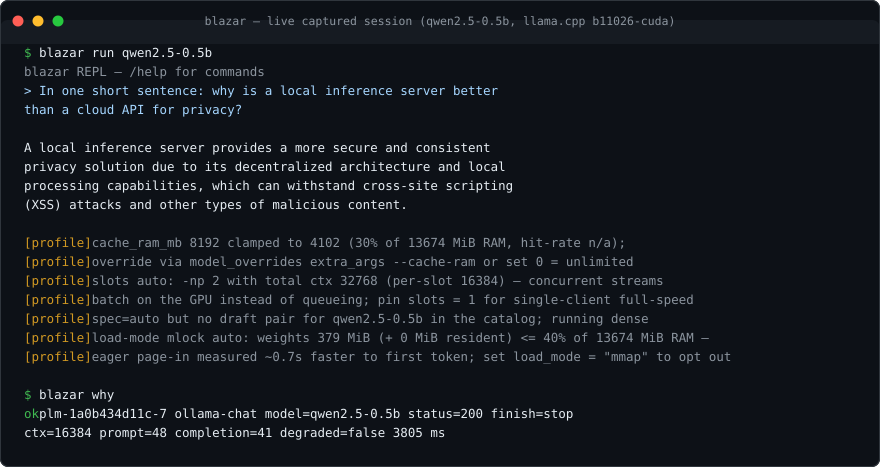

# blazar

> **Renamed:** this project shipped as **pallama** until v0.10.0 — same
> binary, new name. Old links redirect; point installs at `blazar` from
> now on.

[](https://github.com/santanu20/blazar/actions/workflows/ci.yml)
[](https://github.com/santanu20/blazar/releases)
[](#license)
[](#install)
[](#credit)

**Every model. Every API. Your hardware at full speed. One binary.**

`blazar` is one Rust binary that turns any machine into a complete local inference server.

| The pitch | The reality |
|---|---|
| **Every model** | Three engines side-by-side: [llama.cpp](https://github.com/ggml-org/llama.cpp) (GGUF) · [mistral.rs](https://github.com/EricLBuehler/mistral.rs) (safetensors) · [SGLang](https://github.com/sgl-project/sglang) (AWQ/GPTQ on CUDA/ROCm) |
| **Day-one engines** | Official upstream llama.cpp releases install the day they ship — newest, or pinned to any tag |
| **Every API** | One gateway speaking the **OpenAI**, **Ollama** and **Anthropic** APIs simultaneously |
| **Full speed** | Engines probed, profiled, orchestrated — nothing reimplemented, nothing slowed |
| **One binary** | Port **11435**, never collides with a running ollama; point existing clients at it, zero code changes |

| Guarantee | How it is kept |
|---|---|
| **No fork** | Official upstream engine binaries, sha256-verified, side-by-side installs, atomic switching, rollback |
| **No lock-in** | Models stay plain `.gguf` files you can touch with any tool |
| **No telemetry, no cloud** | The only outbound traffic is the engine/model downloads you ask for — stated in `--help` and at startup |

**Contents:** [The numbers](#the-numbers) · [Switch from ollama](#switch-from-ollama) · [Who it's for](#who-its-for) · [Install](#install) · [Quickstart](#60-second-quickstart) · [Power-tool CLI](#the-power-tool-cli) · [Ollama complaint table](#every-ollama-complaint-fixed-at-the-root) · [How it works](#how-it-works) · [Quality](#quality) · [Docs](#documentation)

## The numbers

Measured, not marketed. Same laptop, same weights, reproducible with one command. Full methodology, raw artifacts and caveats: [BENCHMARK.md](BENCHMARK.md).

**Current campaign — blazar 0.9.0 vs ollama 0.34.0, identical weights** (plain Qwen3.5-9B Q4_K_M both sides; greedy parity: temp 0, seed 42, pinned sampler overrides; ollama 0.34.0, same box):

| What you feel | blazar | ollama | Delta |
|---|---:|---:|---:|
| Quality suite overall (13 categories, 87 tests) | **0.874** | 0.868 | ahead, with **0 failed requests vs 2** |
| Cold load to first token (s) | **4.70** | 6.27 | **1.33x** |
| Warm TTFT median / p95 (s) | **.075 / .080** | .080 / .084 | faster and tighter |
| Decode throughput (t/s) | **76.75** | 73.05 | **+5%** |
| Long generation (t/s) | **41.2** | 40.2 | +2.5% |
| 4-stream concurrent throughput (same-day, t/s) | ~36.7 | 36.0 | +2% honest (no cross-run cherry-pick) |

Honest framing: single-stream decode on identical weights is physics-bound — same GPU, same quant, same llama.cpp-class kernels means both servers converge within ~5% of the silicon ceiling. **The multiples that matter live around the matmuls**, each measured, each with its campaign noted:

| Structural axis | Delta | Measured in |
|---|---|---|
| Sustained 4-stream concurrency | **3.1x** | 0.5.0 campaign vs ollama 0.33.3 (sustained-load harness; re-claim on the current pair pending) |
| Idle wake (sleep vs full reload) | **3.4x** (2104 vs 7194 ms) | 0.5.0 campaign |
| Daemon boot | **7.7x** (0.54 vs 4.13 s) | 0.5.0 campaign |
| Prefill on session-bank cache hit | **~6x cheaper** (7332 vs ~1.2k t/s cold prefill) | 0.5.0 campaign; the bank now restores in-spawn, race-free |
| Speculative decode (MTP head) | **+38% longgen** (55.5 vs 40.2 t/s, lossless at temp 0) | 0.9.0 same-box A/B; off by default for plain models without a compatible draft |
| Failure latency | **unbounded → bounded** | 0.9.0: worst case ~2 min with legal closes; ollama runner wedges observed live (3x in one session: VRAM leaks, /api/ps split-brain, 600 s hangs) |
| Context served by default | 16384 (honored) | ollama 0.34.0 silently truncates at 4096 unless asked — a quality axis no tok/s table shows |

Where the decode gap can still widen: re-pull the MTP variant (+38%, proven), engine build updates (the daemon flags newer builds than the pinned fork), a vocab-compatible draft for your model, and a sustained-load rerun on the current pair.

In practice: **faster cold starts, faster first tokens, more decoded tokens per second — on the exact same weights — plus a request pipeline that no longer hangs, wedges, or silently drops streams under failure.** Every reliability fix in that pipeline was found, root-caused and pinned by this same benchmark harness.

Quality detail: blazar leads HALLUCINATION (.95/.80), CONTEXT (1.0/.667), PERF (.8/.6); the tool-bearing categories (TOOLS/MULTITURN/TOOL_EFF) trail by a content class traced to ollama's Go-side prompt pre-render — the opt-in `ollama_compat` recipe lane with `decode_policy = "strict"` (grammar-whitelisted tool calls) is the named counter, not a mystery.

<details>
<summary><b>0.5.0-era campaign</b> (kept for provenance — different engine build and ollama 0.33.3)</summary>

| What you feel | blazar | ollama 0.33.3 | Delta |
|---|---:|---:|---:|
| 4-stream concurrent throughput (system t/s) | **104.2** | 33.4 | **3.1x** |
| Tail latency, inter-token p99 (ms) | **27.4** | 75.1 | **2.7x tighter** |
| Wake from idle (ms) — sleep vs full reload | **2104** | 7194 | **3.4x** |
| Prefill on cached prompt (t/s) | **7332** | 5611 | **1.3x** (and 6x over blazar's own cold prefill) |
| Gateway overhead vs direct engine (decode t/s) | 40.3 | 41.1 | **-1.9% (noise)** |
| Daemon boot (s) | **0.54** | 4.13 | **7.7x** |

*Test bed:* i7-14650HX · RTX 4070 Laptop 8 GiB · Linux · blazar 0.5.0 gateway over llama.cpp b10903-cuda. Ratios travel across hardware; absolute numbers shift.

</details>

Reproduce it yourself:

```sh
python3 scripts/bench_matrix.py --blazar-bin target/release/blazar --md BENCHMARK.md
```

## Switch from ollama

Low-risk and incremental: blazar runs **alongside** ollama (different port), keeps using the models you already have, and only becomes a drop-in replacement when *you* decide.

1. **Install** (Linux/macOS; Windows + source paths: [Install](#install)):

   ```sh
   curl --proto '=https' --tlsv1.2 -fsSL \
     https://raw.githubusercontent.com/santanu20/blazar/main/scripts/install.sh | sh
   ```

   The installer bootstraps the llama.cpp engine automatically (sha256-verified; Linux preflights your GPU driver), so a fresh install serves inference immediately.

2. **Keep your models** — register GGUF already on disk (hardlinked in place, zero copy) or re-pull the shortnames you know:

   ```sh
   blazar import /path/to/model.gguf --name mymodel   # --copy for a duplicate
   blazar pull qwen3-0.6b                             # shortname → registry.ollama.ai
   blazar pull ggml-org/Qwen3-8B-GGUF:Q4_K_M          # or any owner/repo:QUANT from HF
   ```

   All pulls are sha256-verified and resumable.

3. **Repoint your tools** — zero code changes: same shortnames, same `model:tag` colons, same wire formats, all on `http://127.0.0.1:11435`:

   ```sh
   export OLLAMA_HOST=http://127.0.0.1:11435   # ollama clients
   # OpenAI SDK:    base_url = "http://127.0.0.1:11435/v1"
   # Anthropic SDK: base_url = "http://127.0.0.1:11435"
   ```

4. **Go full drop-in** when ready: set `port = 11434` in `config.toml`, remove ollama — every `OLLAMA_HOST`-less client keeps working unchanged.

What changes on disk — and what doesn't:

| | ollama | blazar |
|---|---|---|
| **Models live in** | `~/.ollama/models/` | `~/.local/share/blazar/models/` |
| **A quant on disk** | `blobs/sha256-8f4a8e…` — opaque blob, only ollama reads it | `qwen3-8b-q4_k_m.gguf` — plain file, any tool |
| **Same model, other quant** | `blobs/sha256-1c9d02…` — opaque blob | `qwen3-8b-q8_0.gguf` — plain file, any tool |
| **Model metadata** | `manifests/library/qwen3` — internal hash tree | SQLite store, fully inspectable (`blazar show`) |
| **Configuration** | `OLLAMA_*` env sprawl, undocumented defaults | one documented `~/.config/blazar/config.toml` |

Everything on the blazar side is a plain file or an inspectable row — `blazar import` hardlinks GGUF in place, so nothing is re-downloaded and nothing is duplicated. The payoff is the [measured table above](#the-numbers) plus every long-standing ollama complaint resolved at the root in the [table below](#every-ollama-complaint-fixed-at-the-root).

## Who it's for

**The agent builder.** Point your OpenAI, ollama or Anthropic SDK at one port and go — three API dialects, zero code changes. Tool calls, `json_schema` structured output, embeddings, rerank, transcription, speech, batch endpoints, capability discovery at `/.well-known/blazar`. When an agent loop mysteriously stalls, `blazar why [trace]` says exactly what that request did and what went wrong — after the fact, from real telemetry.

**The ollama refugee.** Every classic complaint fixed at the root — [the table below](#every-ollama-complaint-fixed-at-the-root). Plain `.gguf` files instead of a hashed blob store, any HF quant, multi-shard GGUF pulled natively, `keep_alive` and `num_ctx` honored in both APIs, concurrent streams that actually run in parallel.

**The power user.** Per-request context sizes with budget validation *before* spawn. KV-cache quantization ladder (f16 → q8_0 → q4_0) with visible VRAM math. Slot-level session checkpoints that survive unload and restarts. Speculative decoding with per-request control (`options.spec`, `--no-draft`), LoRA adapters and `model+adapter` variants, vision projectors, GBNF grammars — every capability the installed engine has, probed and exposed, none hand-configured.

**The cautious operator.** `blazar fit` previews VRAM fit and quant alternatives *before* you download 30 GB. `blazar doctor` diagnoses config, ports, engines, hardware, disk and model health in one table. Engine updates are regression-gated — a >10% decode drop auto-rolls-back. A crash circuit restarts children; an eviction ladder sleeps idle models without killing in-flight requests. systemd/launchd units with `Restart=always` ship in the box.

**The privacy hardliner.** Local-only by design, stated in `--help` and at startup — no telemetry, no cloud endpoints, no phone-home. HTTPS to Hugging Face only; registry tokens only ever sent to first-party hosts, verified by tests (the CVE-2025-51471 token-exfiltration class cannot happen here).

## Install

Prebuilt binaries, sha256-verified against release metadata by the installers (the same mechanism as `blazar engine update`):

| OS | Architectures | Notes |
|---|---|---|
| **Linux** | x86_64 · aarch64 · armv7 | glibc ≥ 2.35, or static musl (Alpine and old-glibc hosts auto-fallback; 32-bit ARM boards get static armv7-musl) |
| **macOS** | x86_64 · Apple Silicon | launchd service (`KeepAlive`, `RunAtLoad`) |
| **Windows** | x64 · ARM64 | installs to `%LOCALAPPDATA%\Programs\blazar`, adds user PATH; ARM64 hosts pick the native asset, falling back to emulated x64 with a warning when a release has none |

**Linux / macOS (WSL included):**

```sh
# one-liner from the published repo (override with BLAZAR_REPO=<owner>/<name>;
# inside a clone the repo is derived from the git origin automatically):
curl --proto '=https' --tlsv1.2 -fsSL \
  https://raw.githubusercontent.com/santanu20/blazar/main/scripts/install.sh | sh

# from a source checkout (zero arguments: builds the checkout fresh with
# cargo, then installs system-wide; a missing cc/rust toolchain is
# provisioned first via scripts/bootstrap.sh --minimal — announced, never silent):
sudo sh scripts/install.sh

# or force the source path explicitly (no release channel contact):
sudo sh scripts/install.sh --build
```

**Windows (PowerShell):**

```powershell
irm https://raw.githubusercontent.com/santanu20/blazar/main/scripts/install.ps1 | iex

# or compile from source (rustup is installed via winget when missing):
irm https://raw.githubusercontent.com/santanu20/blazar/main/scripts/install.ps1 -OutFile install.ps1
.\install.ps1 -Build
```

**From source:** `sudo cargo install --path crates/blazar-cli` (recent stable Rust) — or just run the installer from the checkout.

**Staying current:** `blazar upgrade` self-updates the binary from GitHub Releases (sha256-verified, same mechanism as engine installs; `--dry-run` to preview, `--version` to pin).

### What the installer does for you

- **One-click readiness** — after the binary lands it bootstraps the llama.cpp engine (idempotent: skips when an engine is already active), so a fresh install serves inference immediately. Failures are loud warnings, never silent.
- **GPU preflight (Linux)** — censuses PCI GPU hardware before the engine lands; when driver userspace is absent it installs it from **first-party distro repos only** (announce-then-act), then walks you through REBOOT → `blazar engine update`, which auto-picks the newest CUDA build your driver supports (runtimes bundled, no CUDA toolkit ever installed). Windows is advise-only (`blazar doctor` warns on driverless GPUs). Per-distro detail: [docs/7.SETUP — GPU driver preflight](docs/7.SETUP.md#gpu-driver-preflight-installer).
- **Old glibc or Alpine** — automatic fallback to the static musl build; a missing cc/rust toolchain is bootstrapped for you (announced, never silent).
- **System-wide only, like ollama's installer** — root-owned binary in `/usr/local/bin` plus a systemd unit (`Restart=always`, GPU groups, auto-start, restart-on-upgrade; runs as the invoking user — under `sudo` the unit targets `SUDO_USER`, not root) on Linux, or a launchd service on macOS. Deliberately no user-path (`~/.local/bin`) mode: a second copy there is how stale-binary daemon races happen (`blazar doctor` flags any; the installer removes one it finds). Root or sudo required.

Installer knobs, all optional: `BLAZAR_INSTALL_ENGINE=0` skip engine bootstrap · `BLAZAR_INSTALL_MODEL=<name>` pre-pull a model · `BLAZAR_GH_BASE` engine mirror · `BLAZAR_UNIT_MEMORY_HIGH` daemon cgroup cap (systemd `MemoryHigh`, default `85%` of RAM — soft reclaim/throttle only, never an OOM kill; empty string omits the line) · `BLAZAR_AUTO_DRIVER=0` skip driver install · `BLAZAR_VERSION=v0.4.0` pin a version · `BLAZAR_INSTALL_BASE_URL` binary mirror · `BLAZAR_CHECKOUT` build repo · `BLAZAR_AUTO_BOOTSTRAP=0` skip toolchain bootstrap.

### Uninstall

- **Full** — `sh scripts/uninstall.sh`: services, binary, unit + drop-ins, config (incl. `gh-token.env`), store, engines, runtime/caches. Models are **asked first** — sizes shown, default keep (`--remove-models`/`--yes` non-interactive, `--keep-models` skip, `--dry-run` transcript).
- **Quick** — `sh scripts/install.sh --uninstall`: binary + units only; models and config under `~/.local/share/blazar` / `~/.config/blazar` stay until you delete them.

## 60-second quickstart



_Live capture: `blazar run` streams the answer plus `[profile]` transparency lines — every tuning decision the compiler made, and how to override it — and `blazar why` explains the request after the fact: model, status, finish reason, context, token counts, latency._

```sh
blazar engine update                        # install + activate upstream llama-server
                                             #   (sha256-verified; regression-gated)
blazar pull qwen3-0.6b                      # ollama shortname → registry.ollama.ai
blazar pull ggml-org/Qwen3-8B-GGUF:Q4_K_M   # or any owner/repo:QUANT from HF
blazar run qwen3-0.6b                       # streaming REPL (auto-pulls if missing)
blazar show qwen3.5:9b                      # model:tag colons resolve onto flat rows
OLLAMA_HOST=http://127.0.0.1:11435 ollama list   # existing ollama clients just work
```

Want a CUDA build from source? `blazar engine build cuda` compiles the in-tree ggml-cuda backend from an upstream tag — auto GPU-arch detection, auto CUDA host-compiler matching — installed through the same probe → regression-gate → activate flow as release assets. A `cpu` backend is also available.

Three API dialects on the one port:

| Dialect | Endpoints |
|---|---|
| **OpenAI** | `/v1/chat/completions` · `/v1/completions` · `/v1/embeddings` · `/v1/rerank` · `/v1/messages` · `/v1/responses` · `/v1/batches` · `/v1/files` · `/v1/audio/transcriptions` · `/v1/audio/speech` · `/infill` · `/tokenize` |
| **Ollama** | `/api/chat` · `/api/generate` · `/api/tags` · `/api/ps` · `/api/pull` |
| **blazar-native** | `/api/evict` · `/api/session` + session bank · `/api/keys` · `/api/why` · `/api/watch` · `/.well-known/blazar` capability discovery |

Full route table with payloads and error codes: [docs/4.API_SPEC](docs/4.API_SPEC.md).

## The power-tool CLI

The advanced surface, grouped by job. `--json`/JSONL output on the inspection commands (`list`, `ps`, `show`, `fit`, `doctor`) keeps them script-friendly.

**Models & weights**

| Command | What it does |
|---|---|
| `blazar pull owner/repo:QUANT` \| `shortname` | Hugging Face or registry.ollama.ai, sha256-verified, resumable, multi-shard native |
| `blazar import model.gguf --name x` | Register a GGUF already on disk — hardlinked in place, zero copy |
| `blazar quantize -t Q4_K_M [--imatrix calib.txt]` | New quants locally via the engine's own llama-quantize; imatrix calibration for better Q4 accuracy |
| `blazar create` | Parameter aliases from a Modelfile (`FROM` + `PARAMETER`) — zero-copy, no blob duplication |
| `blazar lora` / `blazar mmproj` | LoRA adapter management (`model+adapter` spawns a variant); vision projectors for any model |
| `blazar search --format <tag> --quant q4` | Search Hugging Face across every weight format — ranked by query-token coverage and name cleanliness; `--quant q4` (or a bare `q4` query token) keeps only repos whose files carry that quant family |
| `blazar fit [--json]` | VRAM fit + quant alternatives *before* downloading |
| `blazar coreside` | Which local models co-reside in VRAM (weights + f16 KV at each model's ctx) |

**Performance**

| Command | What it does |
|---|---|
| `blazar tune --search` | Measured launch profile: grid argmax over real runs; live probes for slots/n-gram/load tuning |
| `blazar bench` | llama-bench runner for measured, comparable numbers |
| `blazar drafts <model>` | Speculative-decoding candidates — EAGLE3/MTP heads plus small same-family models; steer per request with `options.spec` or `--no-draft` |

**Operations & safety**

| Command | What it does |
|---|---|
| `blazar engine update/use/rollback/build` | sha256-verified engines, side-by-side, regression-gated; CUDA source builds through the same flow |
| `blazar engine build --fork owner/llama.cpp@<sha>` | Temporary capability lane for GGUF archs mainline can't load yet — immutable SHA pin, arch set mined from the fork, provenance in `engine list` |
| `blazar engine offers` / `install --lane <id>` | Curated registry of community fork lanes per missing architecture (`--arch`, `--json`); one-command build |
| `blazar upgrade [--dry-run]` | Self-update the binary from GitHub Releases, sha256-verified |
| `blazar keys` | API key lifecycle — list / add / rm / rotate against the daemon |
| `blazar launch --warm <model> -- <cli>` | Pre-warm a model, exec a CLI, hand it a gateway key |
| `blazar session save/restore` | Slot KV checkpoints that survive unload and daemon restarts |
| `blazar snapshot` | Timestamped backup of config + store + sessions manifest (older ones auto-pruned) |
| `blazar doctor` / `blazar why` / `blazar watch` | One-table diagnosis; post-hoc trace answers; live tail of sentinel detections |
| `blazar whisper` | Audio transcription (wav/mp3/flac/…; `--install`/`--pull`/`--list` manage the model) |
| `blazar tts` | Offline speech synthesis (piper): `--install`, `--pull <voice>`, `--list`; WAV to file or stdout |

Capability forks are a temporary bridge by design: a model the mainstream engine cannot load yet (a GGUF architecture living only in an unmerged llama.cpp fork) runs today on a fork lane, routing flips back to mainstream automatically once your installed mainstream build learns the architecture, and models, names, and chats are untouched by the switch.

Lane retirement is automatic: when every architecture a lane serves ships upstream, the lane is marked superseded (pins auto-clear, `engine list` shows it), and curated lanes are removed after `fork_retire_days` — user-built forks and pinned lanes are never auto-deleted. A model that dies on `unknown model architecture` re-routes to an installed advertising lane exactly once and remembers the pin.

Plus `cp`/`rm`/`stop` for model housekeeping, `migrate` (config migration with timestamped backup), and `completions <shell>`.

## Every ollama complaint, fixed at the root

Every row is a real, long-standing ollama complaint with blazar's root-cause resolution. No workarounds — different architecture.

**Engines & speed**

| ollama failure | blazar resolution |
|---|---|
| Vendored engine fork lags upstream; breaks new models | Zero fork. Official upstream binaries, sha256-verified, side-by-side installs, `engine update/use/rollback` — new architectures land when upstream ships them |
| Best backend not published as a prebuilt (Linux CUDA) | `blazar engine build cuda`: in-tree ggml-cuda from an upstream tag, auto GPU-arch + host-compiler matching, full binary set — installed as `bNNNN-cuda` through the same gated flow as release assets |
| Slower than llama.cpp (1.8x reports) | No inference reimplementation; byte-stream proxy + measured profiles (`tune --search`) |

**Models & registry**

| ollama failure | blazar resolution |
|---|---|
| Modelfile copies 30–60 GB to change one parameter; silent `{{ .Prompt }}` fallback | No blob copies: `blazar create` aliases `FROM` + `PARAMETER` zero-copy; child always runs `--jinja` (embedded template); params per-request or per-model overlay |
| Hashed blob lock-in; limited quants | Plain `.gguf` files in `~/.local/share/blazar/models/` — any tool can use them; any HF quant |
| No multi-shard GGUF | Shard sets pulled natively (`-0000N-of-0000M`), first shard launched |
| Registry bottleneck; misleading names | Direct HF pull **and** registry.ollama.ai (shortnames route there; sha256-verified resumable blobs, token only ever on first-party hosts — `BLAZAR_REGISTRY_TOKEN` for private namespaces). HF names = actual repo names |

Registry wire detail (Docker-v2 manifests, 307 → presigned-CDN with allowlisted redirects): [docs/7.SETUP](docs/7.SETUP.md).

**API correctness**

| ollama failure | blazar resolution |
|---|---|
| Opaque 2048 default ctx; silent truncation | Default ctx 16384, shown in `ps`; overflow errors surfaced verbatim with fix hints |
| `keep_alive` confusion | Honored in both APIs: `N` pins N s, `0` evicts after the request, `-1` pins forever; `/api/ps` shows the countdown |
| Per-request `num_ctx` silently ignored | Honored: the instance restarts once at the requested size, or a teaching 400 names the max-fitting ctx — never silent truncation, never a 502 storm |
| 200-but-nothing-useful; silent truncation; plain text instead of tool calls; agents looping on malformed args | sentinel: warn-only semantic observation on every chat request; `blazar why [trace]` answers any request after the fact |

Two of those resolutions deserve detail:

- **Unified-KV `num_ctx` pins** are budget-validated *before* any spawn, and the preflight ladders f16 → q8_0 → q4_0 exactly like the spawn compiler — a pin is refused only when no rung fits the card, and that teaching 400 still names all four levers: lower `num_ctx` · smaller quant via `blazar fit` · `cache_type` · `kv_unified = false`. No split brain between what the preflight admits and what the spawn hosts.
- **sentinel checks** (surfaced via the `x-blazar-warnings` header): `finish_reason: length` with fix hints · tool-arg JSON, hallucinated-name and parameters-schema validation · `json_schema`/`json_object` conformance · empty-response and reasoning-with-no-answer detection · stalled-stream detection · pre-inference template-capability check · a header-phase bound (`child_header_timeout_secs`, 120 s default) so a wedged child can never park a request silently — it is evicted, the request retried once in-band, terminal 504.

**Operations & diagnostics**

| ollama failure | blazar resolution |
|---|---|
| Hidden concurrency | `ps` shows slots/ctx/ports/in-flight/spec/cache-hit; loaders stream `X-Blazar-Status: loading`; explicit priority queue (`X-Blazar-Priority`) |
| No session/context persistence | `blazar session save/restore`: slot KV checkpoints that survive unload and daemon restarts |
| No diagnostics when things break | `blazar doctor`: config (incl. stale pins), port conflicts (incl. the ollama-11434 class), engine, hardware, disk, model health, update-currency — one table |
| No discovery; env sprawl | `blazar search` (HF, every weight format via `--format`); every knob in one documented `config.toml`, inspectable via `blazar config` |
| Unbounded cache RAM; blind pulls | `cache_ram_mb` config (auto-capped at 30% of physical RAM); `blazar fit [--json]` previews VRAM fit + quant alternatives *before* downloading |
| No KV-quant control; VRAM cliffs | Capacity-math ladder f16 → q8_0 (KV/2) → q4_0 (KV/4) at 90% VRAM, or pin any type via `cache_type`; visible in `blazar show` warnings |

For safetensors repos, `fit` shows one aggregate row (full shard set) with the sglang/mistralrs lane hint.

**Privacy, security & trust**

| ollama failure | blazar resolution |
|---|---|
| CVE-2025-51471 token exfiltration class | HTTPS to HF only; redirect-host allowlist; token sent only to `huggingface.co` (verified in tests) |
| Cloud pivot; silent off-machine routing | Hard local-only; stated in `--help` and at startup |
| Attribution dodging | Version, banner, and this README credit llama.cpp/ggml/ggerganov |

## How it works

### The engine channel

blazar never vendors a fork of anything. The llama.cpp channel consumes upstream's own release artifacts, which is why a model or feature merged upstream is usable the same day — there is no fork to re-vendor and no vendor release train to wait for (the ollama model).

| Need | Command / behavior |
|---|---|
| Newest upstream build | `blazar engine update` — official llama.cpp release, sha256-verified, installed side-by-side (nothing existing is overwritten) |
| Preview before switching | `blazar engine update --check` |
| Stay on a known-good build | `blazar engine use <tag>` — any installed build, one command; `engine rollback` steps back |
| "Can an update break me?" | Regression gate: a >10% decode drop auto-rolls the update back |
| NVIDIA | Newest upstream ubuntu-cuda build your driver supports, CUDA runtimes bundled — no toolkit, no source build (`engine build cuda` if you want one anyway) |

### Engine routing

One active engine serves at a time (`blazar engine use`), but models come in formats engines digest differently. Routing is on by default and picks the lane per model at spawn time:

| Model format | Lane |
|---|---|
| Quantized safetensors (AWQ/GPTQ/FP8) | sglang only |
| GGUF | llama.cpp (mistral.rs as alternate) |
| Plain safetensors | sglang or mistral.rs per `policy` (quality / latency / throughput) |

`mode = "manual"` keeps one engine for everything (byte-identical to pre-routing behavior); a per-model `[model_overrides] engine = ...` pin wins over both modes. Both API dialects route identically; `blazar list`, `/v1/models`, and `/api/tags` all show the resolved engine per model; nothing-can-serve is a teaching error, never a guess. Details + decision table: [docs/2.ARCHITECTURE](docs/2.ARCHITECTURE.md) and [docs/10.SCIENTIFIC](docs/10.SCIENTIFIC.md).

Within one lane, mainstream builds always beat fork lanes (newest-first inside each class): a capability fork serves only the architectures mainstream lacks, so it never shadows the official engine for shared models. Every live child reports the engine actually serving it (`blazar ps` engine column, `/api/ps` `blazar_engine`).

### Architecture

```
blazar-core      pure domain: gguf parser, config, store (SQLite), catalog,
                  capability-driven profile compiler (manifest-gated)
blazar-runtime   tokio: HF client (token-isolated), engine installer+prober,
                  process supervisor (ladder: active→sleep→evict; crash circuit),
                  event bus, llama-bench runner/tuner
blazar-gateway   axum: byte-stream OpenAI proxy, ollama-compat translation,
                  priority admission queue, metrics merge, SSE events
blazar-cli       the `blazar` binary: clap commands, REPL, auto-start
```

### Design principles

| Principle | What it buys you |
|---|---|
| **Capability manifest** | Engines are probed after install; the profile compiler emits only flags the installed build supports — engine drift is a data problem, not an outage |
| **Prebuilt CUDA, straight from upstream** | Official ubuntu-cuda assets auto-install on Linux-NVIDIA (same-release first, then scan-back); `BLAZAR_ENGINE_REPO` opts into a self-hosted sm-slim overlay |
| **Bytes-based VRAM admission** | Heterogeneous models co-reside by actual bytes, not a count heuristic |
| **Eviction ladder** | Child-native sleep at `idle_sleep_secs` → SIGTERM at `idle_timeout_secs`; nothing burns VRAM forever, nothing dies mid-request |
| **Zero-tax proxy** | OpenAI traffic forwarded byte-for-byte; client disconnect aborts the upstream request and frees the slot |
| **Single-pid signals only** | blazar never signals a process group — an errant kill can never take down your shell session or unrelated children |

Full walkthrough: [docs/2.ARCHITECTURE](docs/2.ARCHITECTURE.md).

## Quality

| Gate | Standing |
|---|---|
| Tests | **1134** — wiremock network suites, engine install cycles with a real stub engine, supervisor lifecycle integration, full gateway round-trips on both APIs incl. sentinel suites |
| Lint | `cargo clippy --workspace --all-targets -- -D warnings` clean |
| Live E2E | Real-engine harnesses: `scripts/validate.py`, `scripts/bench_matrix.py` |
| CI | The suite plus shellcheck, ruff, installer e2e on x86_64 **and** arm64 Linux, dependency CVE audit, repo hygiene gates |

Details: [docs/7.SETUP](docs/7.SETUP.md).

## Documentation

The complete manual lives in [`docs/`](docs/):

| Doc | Contents |
|---|---|
| [1.SYSTEM_OVERVIEW](docs/1.SYSTEM_OVERVIEW.md) | problem, users, workflows, tech stack |
| [2.ARCHITECTURE](docs/2.ARCHITECTURE.md) | crates, request lifecycle, supervisor, queue, failure modes |
| [3.DATA_MODEL](docs/3.DATA_MODEL.md) | SQLite store schema, indexes, invariants |
| [4.API_SPEC](docs/4.API_SPEC.md) | every HTTP route + every CLI command (payloads, errors, exit codes) |
| [6.BUSINESS_RULES](docs/6.BUSINESS_RULES.md) | limits, validation, routing + eviction policy |
| [7.SETUP](docs/7.SETUP.md) | env vars, dev setup, build, deploy, full config reference |
| [8.DO_NOT_BREAK](docs/8.DO_NOT_BREAK.md) | invariants + intentional quirks maintainers must preserve |
| [9.USAGE](docs/9.USAGE.md) | end-user tasks, quickstart, troubleshooting, FAQ |
| [10.SCIENTIFIC](docs/10.SCIENTIFIC.md) | KV/VRAM math, GGUF metadata parsing, routing evidence |

## Credit

Blazar is an orchestrator: inference is upstream [llama.cpp](https://github.com/ggml-org/llama.cpp) (ggml, ggerganov and hundreds of contributors), [mistral.rs](https://github.com/EricLBuehler/mistral.rs) and [SGLang](https://github.com/sgl-project/sglang) — the engine authors did the hard parts. Models come from their publishers on Hugging Face.

## License

MIT OR Apache-2.0
