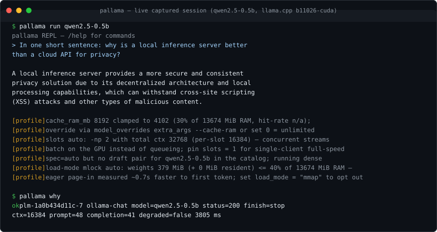

# pallama

<!-- Swap owner/pallama in the CI + release badges when the repo goes public. -->
[](https://github.com/owner/pallama/actions/workflows/ci.yml)
[](https://github.com/owner/pallama/releases)
[](#license)
[](#install)
[](#credit)

**Every model. Every API. Your hardware at full speed. One binary.**

`pallama` is one Rust binary that turns any machine into a complete local inference server:

- **Every model** — three engines, unmodified and side-by-side: [llama.cpp](https://github.com/ggml-org/llama.cpp) `llama-server` (GGUF), [mistral.rs](https://github.com/EricLBuehler/mistral.rs) (HF-style safetensors), [SGLang](https://github.com/sgl-project/sglang) (safetensors + AWQ/GPTQ on CUDA/ROCm).
- **Every API** — one gateway speaking the **OpenAI**, **Ollama** and **Anthropic** APIs simultaneously.
- **Your hardware at full speed** — engines are probed, profiled and orchestrated; nothing is reimplemented or slowed down.
- **One binary, port 11435** — pallama's own port, so it never collides with a running ollama; point existing clients at it with zero code changes.

**No fork. No lock-in. No telemetry. No cloud.** The engines are official upstream binaries, sha256-verified, installed side-by-side with atomic switching and rollback. Your models stay plain `.gguf` files you can touch with any tool. The only outbound traffic pallama ever generates is the engine/model downloads you ask for.

**Contents:** [The numbers](#the-numbers) · [Switch from ollama](#switch-from-ollama) · [Who it's for](#who-its-for) · [Install](#install) · [Quickstart](#60-second-quickstart) · [Ollama complaint table](#every-ollama-complaint-fixed-at-the-root) · [How it works](#how-it-works) · [Quality](#quality) · [Docs](#documentation)

## The numbers

Measured, not marketed. Same laptop, same model (Qwen3.5-9B Q4_K_M), reproducible with one command. Full methodology, raw artifacts and caveats: [BENCHMARK.md](BENCHMARK.md).

| What you feel | pallama | ollama 0.33.3 | Delta |
|---|---:|---:|---:|
| 4-stream concurrent throughput (system t/s) | **104.2** | 33.4 | **3.1x** |
| Tail latency, inter-token p99 (ms) | **27.4** | 75.1 | **2.7x tighter** |
| Wake from idle (ms) — sleep vs full reload | **2104** | 7194 | **3.4x** |
| Prefill on cached prompt (t/s) | **7332** | 5611 | **1.3x** (and 6x over pallama's own cold prefill) |
| Gateway overhead vs direct engine (decode t/s) | 40.3 vs 41.1 | — | **-1.9% (noise)** |
| Daemon boot (s) | **0.54** | 4.13 | **7.7x** |

What that means in practice: **3x more concurrent streams from the GPU you already own**, agent loops that don't stall on tail latency, sessions that wake in a blink — and cached prefill that stops re-paying the long-context tax every turn.

Test bed: i7-14650HX, RTX 4070 Laptop 8 GiB, Linux; pallama 0.5.0 gateway over llama.cpp b10903-cuda. Honesty clause: cold-load first token is slower than ollama's (11.6 s vs 6.6 s) because pallama defaults to a 16384 context where ollama silently truncates at 2048 — you can set `ctx` lower and get ollama's load time back, but you can't buy ollama's missing 14 Ki of context at any price. Ratios travel across hardware; absolute numbers shift.

Reproduce it yourself:

```sh
python3 scripts/bench_matrix.py --pallama-bin target/release/pallama --md BENCHMARK.md
```

## Switch from ollama

The switch is low-risk and incremental: pallama runs **alongside** ollama (different port), keeps using the models you already have, and only becomes a drop-in replacement when *you* decide.

1. **Install pallama** (Linux/macOS; Windows and source builds in [Install](#install)):

   ```sh
   export PALLAMA_REPO=owner/pallama
   curl --proto '=https' --tlsv1.2 -fsSL \
     "https://raw.githubusercontent.com/${PALLAMA_REPO%%/*}/pallama/master/scripts/install.sh" | sh
   ```

   The installer bootstraps the llama.cpp engine automatically (sha256-verified; on Linux it even preflights your GPU driver — details in [What the installer does](#what-the-installer-does-for-you)), so a fresh install can serve inference immediately.

2. **Keep your models — no re-downloads.** GGUF files already on disk are registered in place, hardlinked (zero copy; `--copy` if you want a duplicate):

   ```sh
   pallama import /path/to/model.gguf --name mymodel
   ```

   Or re-pull by the shortnames you know — they route to registry.ollama.ai, sha256-verified and resumable — and any `owner/repo:QUANT` from Hugging Face works too:

   ```sh
   pallama pull qwen3-0.6b
   pallama pull ggml-org/Qwen3-8B-GGUF:Q4_K_M
   ```

3. **Point your tools at it — zero code changes.** Same shortnames, same `model:tag` colons, same wire formats, all on `http://127.0.0.1:11435`:

   ```sh
   OLLAMA_HOST=http://127.0.0.1:11435 ollama list      # ollama clients just work
   # OpenAI SDK: base_url = "http://127.0.0.1:11435/v1"
   # Anthropic SDK: base_url = "http://127.0.0.1:11435"
   ```

4. **Go full drop-in when ready.** Set `port = 11434` in `config.toml`, remove ollama, and every `OLLAMA_HOST`-less client keeps working unchanged.

What you gain from the switch is the whole point — the measured table [above](#the-numbers), plus every long-standing ollama complaint resolved at the root in the [table below](#every-ollama-complaint-fixed-at-the-root): plain `.gguf` files instead of a hashed blob store, any HF quant, multi-shard GGUF, `keep_alive` and `num_ctx` honored in both APIs, concurrent streams that actually run in parallel.

## Who it's for

**The agent builder.** Point your OpenAI SDK, your ollama client, or your Anthropic client at `http://127.0.0.1:11435` and go — three API dialects, one port, zero code changes. Tool calls, `json_schema` structured output, embeddings, rerank, audio transcription, batch endpoints, capability discovery at `/.well-known/pallama`. And when your agent loop mysteriously stalls, `pallama why [trace]` tells you exactly what that request did and what went wrong — after the fact, from real telemetry.

**The ollama refugee.** Every classic complaint, fixed at the root — see the [table below](#every-ollama-complaint-fixed-at-the-root). Plain `.gguf` files instead of a hashed blob store. Any Hugging Face quant instead of a curated shortlist. Multi-shard GGUF pulled natively. `keep_alive` and `num_ctx` honored in both APIs, never silently ignored. Concurrent streams that actually run in parallel.

**The power user.** Per-request context sizes with budget validation *before* spawn. KV-cache quantization ladder (f16 → q8_0 → q4_0) with visible VRAM math. Slot-level session checkpoints that survive unload and daemon restarts (`pallama session save/restore`). Speculative decoding, LoRA adapters, vision projector support, GBNF grammars — every capability the installed engine has, probed and exposed, none hand-configured.

**The cautious operator.** `pallama fit` previews VRAM fit and quant alternatives *before* you download 30 GB. `pallama doctor` diagnoses config, ports, engines, hardware, disk and model health in one table. Engine updates are regression-gated: a >10% decode drop auto-rolls-back. A crash circuit restarts children; an eviction ladder sleeps idle models without killing in-flight requests. systemd/launchd units with `Restart=always` ship in the box.

**The privacy hardliner.** Local-only by design, stated in `--help` and at startup. No telemetry, no cloud endpoints, no phone-home. HTTPS to Hugging Face only; registry tokens only ever sent to first-party hosts, verified by tests (the CVE-2025-51471 token-exfiltration class cannot happen here).

## Install

Prebuilt binaries for **Linux** (x86_64/aarch64/armv7, glibc ≥ 2.35 or static musl), **macOS** (x86_64/Apple Silicon), and **Windows** (x64/ARM64) are published on GitHub Releases, sha256-verified against the release metadata by the installers (the same mechanism as `pallama engine update`).

**Linux / macOS (WSL included):**

```sh
# from a published repo (set PALLAMA_REPO to the owner/name that hosts releases;
# inside a clone it is derived from the git origin automatically):
export PALLAMA_REPO=owner/pallama
curl --proto '=https' --tlsv1.2 -fsSL \
  "https://raw.githubusercontent.com/${PALLAMA_REPO%%/*}/pallama/master/scripts/install.sh" | sh

# from a source checkout (zero arguments: builds the checkout fresh with
# cargo, then installs system-wide; a missing cc/rust toolchain is
# provisioned first via scripts/bootstrap.sh --minimal — announced, never silent):
sudo sh scripts/install.sh

# or force the source path explicitly (no release channel contact):
sudo sh scripts/install.sh --build
```

**Windows (PowerShell):**

```powershell
$env:PALLAMA_REPO = 'owner/pallama'; irm https://raw.githubusercontent.com/owner/pallama/master/scripts/install.ps1 | iex

# or compile from source (rustup is installed via winget when missing):
irm https://raw.githubusercontent.com/owner/pallama/master/scripts/install.ps1 -OutFile install.ps1
.\install.ps1 -Build -Repo owner/pallama
```

Installs to `%LOCALAPPDATA%\Programs\pallama` and adds it to the user PATH. ARM64 hosts pick the native asset automatically (falling back to the emulated x64 one with a warning when a release has none).

**From source:** `sudo cargo install --path crates/pallama-cli` (recent stable Rust) — or just run the installer from the checkout.

### What the installer does for you

- **One-click readiness:** after the binary lands, it bootstraps the llama.cpp engine (idempotent — skips when an engine is already active) so a fresh install can serve inference immediately; failures are loud warnings, never silent. Opt out with `PALLAMA_INSTALL_ENGINE=0`, pre-pull a model with `PALLAMA_INSTALL_MODEL=<name>`, point engine downloads at a mirror with `PALLAMA_GH_BASE`, or cap the daemon cgroup with `PALLAMA_UNIT_MEMORY_HIGH` (systemd `MemoryHigh`, default `85%` of RAM — soft reclaim/throttle only, never an OOM kill; empty string omits the line).
- **GPU preflight (Linux):** before the engine lands, the installer censuses PCI GPU hardware and — when the driver userspace is absent — installs it from **first-party distro repos only** (announce-then-act), then walks you through REBOOT → `pallama engine update`, which auto-picks the newest CUDA build your driver supports (runtimes bundled; no CUDA toolkit ever installed). Windows is advise-only; `pallama doctor` warns whenever PCI GPU hardware is present but its driver is not. Opt out with `PALLAMA_AUTO_DRIVER=0`. Full per-distro detail: [docs/7.SETUP — GPU driver preflight](docs/7.SETUP.md#gpu-driver-preflight-installer).
- **Older glibc than 2.35, or Alpine?** Automatic fallback to the static musl build (32-bit ARM boards get the static `armv7-unknown-linux-musleabihf` build). Pin a version with `PALLAMA_VERSION=v0.4.0`, a mirror with `PALLAMA_INSTALL_BASE_URL`, or a build repo with `PALLAMA_CHECKOUT`. No toolchain? It is bootstrapped for you (`scripts/bootstrap.sh --minimal`, opt out with `PALLAMA_AUTO_BOOTSTRAP=0`).
- **System-wide only, like ollama's installer:** root-owned binary in `/usr/local/bin` plus a systemd unit (`Restart=always`, GPU groups, auto-start, restart-on-upgrade; runs as the invoking user — under `sudo` the unit targets `SUDO_USER`, not root) on Linux, or a launchd service (`KeepAlive`, `RunAtLoad`) on macOS. There is deliberately no user-path (`~/.local/bin`) install mode: a second copy there is how stale-binary daemon races happen (`pallama doctor` flags any that already exist, and the installer removes one it finds). Root or sudo is required.

### Uninstall

`sh scripts/uninstall.sh` removes everything the installer put here plus per-user state — services, binary, unit + drop-ins, config (incl. `gh-token.env`), store, engines, runtime/caches — in one pass. Models are the one exception: GGUF + whisper model files are expensive re-downloads, so the script **asks first** (sizes shown, default keep; `--remove-models`/`--yes` for non-interactive full nuke, `--keep-models` to skip the prompt, `--dry-run` for an action transcript). For the quick binary+units-only removal, `sh scripts/install.sh --uninstall` leaves all user data in place (models and config under `~/.local/share/pallama` / `~/.config/pallama` stay until you delete them).

## 60-second quickstart



_Live capture: `pallama run` streams the answer plus `[profile]` transparency lines — every tuning decision the compiler made, and how to override it — and `pallama why` explains the request after the fact: model, status, finish reason, context, token counts, latency._

```sh
pallama engine update                        # install + activate upstream llama-server
                                             #   (sha256-verified; regression-gated)
pallama pull qwen3-0.6b                      # ollama shortname → registry.ollama.ai
pallama pull ggml-org/Qwen3-8B-GGUF:Q4_K_M   # or any owner/repo:QUANT from HF
pallama run qwen3-0.6b                       # streaming REPL (auto-pulls if missing)
pallama show qwen3.5:9b                      # model:tag colons resolve onto flat rows
OLLAMA_HOST=http://127.0.0.1:11435 ollama list   # existing ollama clients just work
```

Want a CUDA build from source? `pallama engine build cuda` compiles the in-tree ggml-cuda backend from an upstream tag — auto GPU-arch detection, auto CUDA host-compiler matching — installed through the same probe → regression-gate → activate flow as release assets. A `cpu` backend is also available.

Three API dialects on the one port:

- **OpenAI:** `/v1/chat/completions`, `/v1/completions`, `/v1/embeddings`, `/v1/rerank`, `/v1/messages`, `/v1/responses`, `/v1/batches`, `/v1/files`, `/v1/audio/transcriptions`, `/infill`, `/tokenize`
- **Ollama:** `/api/chat`, `/api/generate`, `/api/tags`, `/api/ps`, `/api/pull`
- **pallama-native:** `/api/evict`, `/api/session` + session bank, `/api/keys`, `/api/why`, `/api/watch`, `/.well-known/pallama` capability discovery

Full route table with payloads and error codes: [docs/4.API_SPEC](docs/4.API_SPEC.md).

## Every ollama complaint, fixed at the root

Every row is a real, long-standing ollama complaint with pallama's root-cause resolution. No workarounds — different architecture.

**Engines & speed**

| ollama failure | pallama resolution |
|---|---|
| Vendored engine fork lags upstream; breaks new models | Zero fork. Official upstream binaries, sha256-verified, side-by-side installs, `engine update/use/rollback`. New architectures land when upstream ships them |
| Best backend not published as a prebuilt (Linux CUDA) | `pallama engine build cuda` compiles the in-tree ggml-cuda backend from an upstream tag: auto GPU-arch detection, auto CUDA host-compiler matching, full binary set (`llama-server/-quantize/-imatrix/-perplexity/-bench`), installed as `bNNNN-cuda` through the same probe → regression-gate → activate flow as release assets |
| Slower than llama.cpp (1.8x reports) | No inference reimplementation; byte-stream proxy + measured profiles (`tune --search`) |

**Models & registry**

| ollama failure | pallama resolution |
|---|---|
| Modelfile copies 30–60 GB to change one parameter; silent `{{ .Prompt }}` fallback | No Modelfile. GGUF is self-contained truth; child always runs `--jinja` (embedded template); params per-request or per-model config overlay |
| Hashed blob lock-in; limited quants | Plain `.gguf` files at `~/.local/share/pallama/models/` — any tool can use them; any HF quant |
| No multi-shard GGUF | Shard sets pulled natively (`-0000N-of-0000M`), first shard launched |
| Registry bottleneck; misleading names | Direct HF pull **and** registry.ollama.ai pull (shortnames route to the ollama registry; Docker-v2 manifest wire, sha256-verified resumable blobs via 307→presigned-CDN with allowlisted redirects, token only ever on first-party registry host — `PALLAMA_REGISTRY_TOKEN` for private namespaces). HF names = actual repo name, never a marketing alias |

**API correctness**

| ollama failure | pallama resolution |
|---|---|
| Opaque 2048 default ctx; silent truncation | Default ctx 16384, shown in `ps`; overflow errors surfaced verbatim with fix hints |
| `keep_alive` confusion | Honored in both APIs: `N` pins N s, `0` evicts after the request, `-1` pins forever; `/api/ps` shows the countdown |
| Per-request `num_ctx` silently ignored | Honored: instance restarts once at the requested size, or a 400 with the max-fitting ctx — never silent truncation. Under unified KV the pin is budget-validated *before* any spawn; a truly unhostable pin is a single teaching 400 naming all four levers (lower `num_ctx` / smaller quant via `pallama fit` / `cache_type = "q8_0"` / `kv_unified = false`) — never a spawn-die-retry storm of 502s |
| "API returns 200 but nothing useful happens"; silent truncation; plain-text instead of tool calls; agents loop on malformed tool args | sentinel: warn-only semantic observation on every chat request — `finish_reason: length` with fix hints, tool-arg JSON + hallucinated-name + parameters-schema checks, `json_schema`/`json_object` validation, empty-response and reasoning-with-no-answer detection, stalled-stream detection, and a pre-inference template-capability check (`x-pallama-warnings` header). `pallama why [trace]` answers any request after the fact |

**Operations & diagnostics**

| ollama failure | pallama resolution |
|---|---|
| Hidden concurrency | `ps` shows slots/ctx/ports/in-flight; loaders stream `X-Pallama-Status: loading`; explicit priority queue (`X-Pallama-Priority`) |
| No session/context persistence | `pallama session save/restore`: slot KV checkpoints that survive unload and daemon restarts |
| No diagnostics when things break | `pallama doctor`: config (incl. stale pins), port conflicts (incl. the ollama-11434 class), engine, hardware, disk, model health (model-dir orphans vs the store, hardlink twins flagged as zero-space), update-currency in one table |
| No discovery; env sprawl | `pallama search` (HF, every weight format via `--format`); every knob in one documented `config.toml`, inspectable via `pallama config` |
| Unbounded cache RAM; blind pulls | `cache_ram_mb` config (auto-capped at 30% of physical RAM); `pallama fit [--json]` previews VRAM fit + quant alternatives *before* downloading — for safetensors repos one aggregate row (full shard set) with the sglang/mistralrs lane hint |
| No KV-quant control; VRAM cliffs | capacity-math ladder: f16 -> q8_0 (KV/2) -> q4_0 (KV/4) at 90% VRAM, or pin any type via `cache_type`; visible in `pallama show` warnings |

**Privacy, security & trust**

| ollama failure | pallama resolution |
|---|---|
| CVE-2025-51471 token exfiltration class | HTTPS to HF only; redirect-host allowlist; token sent only to `huggingface.co` (verified in tests) |
| Cloud pivot; silent off-machine routing | Hard local-only; stated in `--help` and at startup |
| Attribution dodging | Version, banner, and this README credit llama.cpp/ggml/ggerganov |

## How it works

### Engine routing

One active engine serves at a time (`pallama engine use`), but models come in formats engines digest differently. Routing is on by default and picks the lane per model at spawn time:

- quantized safetensors (AWQ/GPTQ/FP8) → sglang only
- GGUF → llama.cpp (mistral.rs as alternate)
- plain safetensors → sglang or mistral.rs per `policy` (quality / latency / throughput)

`mode = "manual"` keeps one engine for everything (byte-identical to pre-routing behavior); a per-model `[model_overrides] engine = ...` pin wins over both modes. Both API dialects route identically; `pallama list`, `/v1/models`, and `/api/tags` all show the resolved engine per model; nothing-can-serve is a teaching error, never a guess. Details + decision table: [docs/2.ARCHITECTURE](docs/2.ARCHITECTURE.md) and [docs/10.SCIENTIFIC](docs/10.SCIENTIFIC.md).

### Architecture

```
pallama-core      pure domain: gguf parser, config, store (SQLite), catalog,
                  capability-driven profile compiler (manifest-gated)
pallama-runtime   tokio: HF client (token-isolated), engine installer+prober,
                  process supervisor (ladder: active→sleep→evict; crash circuit),
                  event bus, llama-bench runner/tuner
pallama-gateway   axum: byte-stream OpenAI proxy, ollama-compat translation,
                  priority admission queue, metrics merge, SSE events
pallama-cli       the `pallama` binary: clap commands, REPL, auto-start
```

### Design principles

- **Capability manifest** — engines are probed after install; the profile compiler emits only flags the installed build supports. Engine drift becomes a data problem.
- **Prebuilt CUDA overlay** — upstream sources compiled with `-DGGML_CUDA=ON`, bundled runtimes, no fork.
- **Bytes-based VRAM admission** — heterogeneous models co-reside by actual bytes, not a count heuristic.
- **Eviction ladder** — child-native sleep at `idle_sleep_secs` → SIGTERM at `idle_timeout_secs`; nothing burns VRAM forever, nothing dies mid-request.
- **Zero-tax proxy** — OpenAI traffic forwarded byte-for-byte; client disconnect aborts the upstream request and frees the slot.
- **Single-pid signals only.**

Full walkthrough: [docs/2.ARCHITECTURE](docs/2.ARCHITECTURE.md).

## Quality

1070 tests (compiler tables, wiremock network suites, engine install cycles with a real stub engine, supervisor lifecycle integration, full gateway round-trips over both APIs incl. sentinel suites); `cargo clippy --workspace --all-targets -- -D warnings` clean; live E2E harnesses with a real engine (`scripts/validate.py`, `scripts/bench_matrix.py`); CI runs the suite plus shellcheck, ruff, installer e2e on x86_64 and arm64 Linux, dependency CVE audit, and repo hygiene gates. Details: [docs/7.SETUP](docs/7.SETUP.md).

## Documentation

The complete manual lives in [`docs/`](docs/):

| Doc | Contents |
|---|---|
| [1.SYSTEM_OVERVIEW](docs/1.SYSTEM_OVERVIEW.md) | problem, users, workflows, tech stack |
| [2.ARCHITECTURE](docs/2.ARCHITECTURE.md) | crates, request lifecycle, supervisor, queue, failure modes |
| [3.DATA_MODEL](docs/3.DATA_MODEL.md) | SQLite store schema, indexes, invariants |
| [4.API_SPEC](docs/4.API_SPEC.md) | every HTTP route + every CLI command (payloads, errors, exit codes) |
| [6.BUSINESS_RULES](docs/6.BUSINESS_RULES.md) | limits, validation, routing + eviction policy |
| [7.SETUP](docs/7.SETUP.md) | env vars, dev setup, build, deploy, full config reference |
| [8.DO_NOT_BREAK](docs/8.DO_NOT_BREAK.md) | invariants + intentional quirks maintainers must preserve |
| [9.USAGE](docs/9.USAGE.md) | end-user tasks, quickstart, troubleshooting, FAQ |
| [10.SCIENTIFIC](docs/10.SCIENTIFIC.md) | KV/VRAM math, GGUF metadata parsing, routing evidence |

## Credit

Pallama is an orchestrator: inference is upstream [llama.cpp](https://github.com/ggml-org/llama.cpp) (ggml, ggerganov and hundreds of contributors), [mistral.rs](https://github.com/EricLBuehler/mistral.rs) and [SGLang](https://github.com/sgl-project/sglang) — the engine authors did the hard parts. Models come from their publishers on Hugging Face.

## License

MIT OR Apache-2.0
