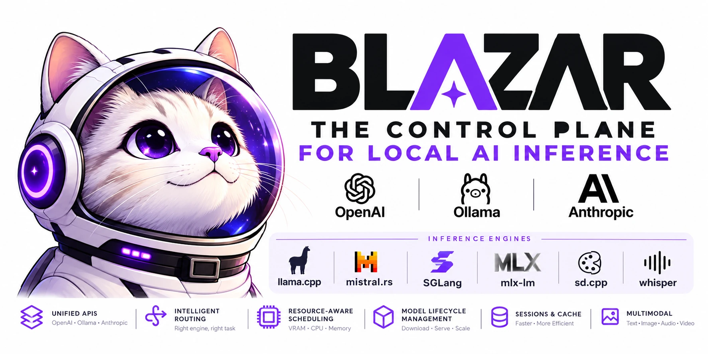
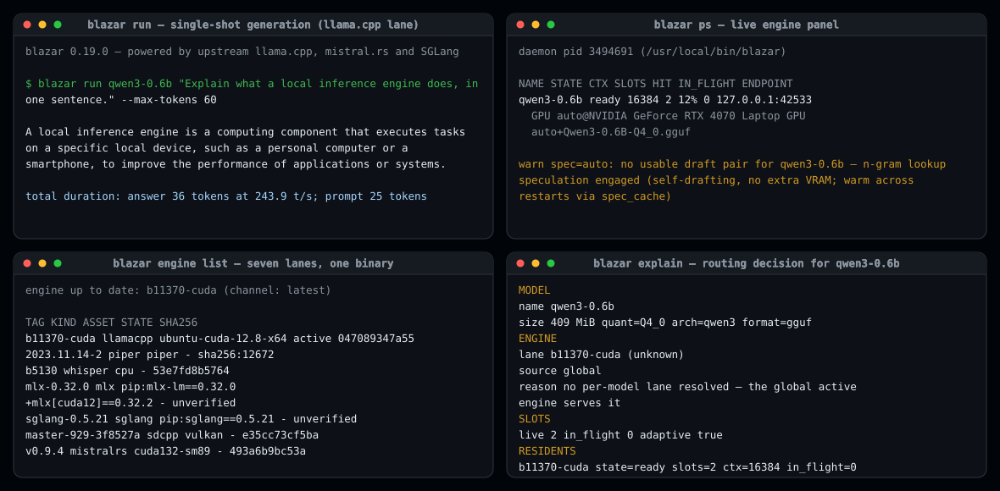

# Blazar

**The control plane for local AI inference.**

Unified OpenAI · Ollama · Anthropic gateway &nbsp;·&nbsp; Multi-engine serving &nbsp;·&nbsp; Resource-aware orchestration &nbsp;·&nbsp; Multimodal

[](https://github.com/santanu20/blazar/actions/workflows/ci.yml)
[](https://crates.io/crates/blazar)
[](https://github.com/santanu20/blazar/releases)
[](#license)
[](#installation)

<div align="center">





*Live CLI session: single-shot generation, the engine panel with speculation state, the installed-lane inventory, and the routing decision for a model — all from one daemon.*

**[Get started in 60 seconds](#60-second-quickstart)** &nbsp;·&nbsp; **[Why use Blazar](#why-use-blazar)** &nbsp;·&nbsp; **[Benchmark evidence](#benchmark-snapshot)** &nbsp;·&nbsp; **[API reference](docs/4.API_SPEC.md)**

</div>

---

## What is Blazar?

Blazar is a **local AI gateway and runtime orchestrator** in one Rust binary. Applications talk to one endpoint; Blazar manages the model store, picks or pins the right inference engine, fits workloads to your hardware, and controls concurrency, lifecycle, and diagnostics.

**Bring your client. Bring your model. Blazar handles the serving stack.**

```text
                           Applications
      ┌───────────────────────┬────────────────────────┐
      │                       │                        │
  OpenAI SDK            Ollama clients         Anthropic SDK
      │                       │                        │
      └───────────────────────┴────────────────────────┘
                              │
                              ▼
                    ┌───────────────────┐
                    │      BLAZAR       │
                    │───────────────────│
                    │ API gateway       │
                    │ Routing           │
                    │ Admission/queue   │
                    │ Model store       │
                    │ VRAM/KV fit       │
                    │ Sessions/cache    │
                    │ Diagnostics       │
                    │ Engine lifecycle  │
                    └─────────┬─────────┘
                              │
      ┌───────────┬───────────┴───────────┬───────────┐
      │           │           │           │           │
        llama.cpp  mistral.rs    SGLang        MLX
      │           │           │           │           │
      └────────────── Text / Embeddings ──────────────┘
                              │
                 ┌────────────┼─────────────┐
                 │            │             │
              sd.cpp       whisper.cpp     piper
               Images       Speech         TTS
               Video        to text
```

The engines still perform inference. **Blazar is the control plane around them** — it does not replace engines, train models, or require a hosted service.

### At a glance

| If you need | Blazar provides |
|---|---|
| Apps speaking OpenAI, Ollama, **and** Anthropic | All three dialects natively, one gateway |
| Different models on different runtimes | Capability-aware lanes across llama.cpp, mistral.rs, SGLang, MLX, sd.cpp, whisper.cpp, piper |
| GPU memory and context under control | VRAM/KV fit planning, slots, admission, co-residency, lifecycle |
| Long work that survives restarts | Durable jobs, request cancel/interrupt, restart-safe response chains (SQLite) |
| Engines that update without breaking | Side-by-side versioned installs, regression gates, rollback |
| Failures you can diagnose | `doctor`, `why`, `watch`, metrics, trace IDs, teaching errors |
| Models managed like software | Pull, import, inspect, pin, tune, snapshot, restore |
| Several machines as one pool | Capacity-aware federation: warm, replicate, route |
| Multimodal in one place | Text, embeddings, image (variations, upscale), video (Sora verbs), speech-to-text (word timestamps), TTS (wav/pcm + ffmpeg lossy), realtime voice |
| Production controls, locally | API keys, TLS, CORS, audit logging, PII scrubbing, OTLP |

---

## 60-second quickstart

### 1. Install

#### Linux / macOS

```sh
curl --proto '=https' --tlsv1.2 -fsSL \
  https://raw.githubusercontent.com/santanu20/blazar/v0.22.0/scripts/install.sh \
  | BLAZAR_REPO=santanu20/blazar sh
```

#### Windows PowerShell

```powershell
irm https://raw.githubusercontent.com/santanu20/blazar/v0.22.0/scripts/install.ps1 | iex
```

Also available: `cargo install blazar`, or [build from source](#installation).

The Blazar binary and inference engines are separate artifacts. The installer can bootstrap the default engine; manage it explicitly with `blazar engine update`. Set `BLAZAR_INSTALL_ENGINE=0` to skip engine bootstrap.

### 2. Pull a model

```sh
blazar search qwen3 instruct                        # find models on Hugging Face
blazar pull qwen3-0.6b                              # registry shortname
blazar pull ggml-org/Qwen3-8B-GGUF:Q4_K_M           # Hugging Face GGUF
blazar import /path/to/model.gguf --name mymodel    # existing local file
```

### 3. Serve and run

```sh
blazar serve                # gateway on http://127.0.0.1:11435
blazar run qwen3-0.6b       # interactive REPL
```

```sh
curl http://127.0.0.1:11435/v1/chat/completions \
  -H 'Content-Type: application/json' \
  -d '{
    "model": "qwen3-0.6b",
    "messages": [{"role": "user", "content": "Explain local inference in one paragraph."}]
  }'
```

---

## Use your existing clients

No application rewrite needed — point clients at Blazar's compatible surfaces.

| Client | Base URL | Surfaces |
|---|---|---|
| **OpenAI SDK** | `http://127.0.0.1:11435/v1` | `/v1/chat/completions`, `/v1/completions`, `/v1/responses`, `/v1/embeddings`, `/v1/rerank`, `/v1/batches`, `/v1/files`, `/v1/audio/*`, `/v1/images/*`, `/v1/videos/*` |
| **Ollama clients** | `OLLAMA_HOST=http://127.0.0.1:11435` | `/api/chat`, `/api/generate`, `/api/tags`, `/api/ps`, `/api/pull`, `/api/embeddings`, `/api/embed`, `/api/rerank`, model verbs `/api/create`, `/api/copy`, `/api/delete`, `/api/push` |
| **Anthropic SDK** | `http://127.0.0.1:11435` | `/v1/messages`, `/v1/messages/batches` |
| **Blazar Python SDK** | `BLAZAR_URL=http://127.0.0.1:11434` | chat + streaming + `best_of`/`mcp` tools, `ps`, `explain`, `failover`, realtime voice, Anthropic batches, metadata cards — zero dependencies (`sdk/python`) |

Beyond dialect compatibility: `/v1/realtime` voice, `[[failover]]` chains, the `[[mcp]]` tool catalog, completion metadata cards, and idle-sleep visibility — one line each in [Features](#features).

Blazar runs alongside an existing Ollama install, and can later serve on `11434` as a port-level replacement.

### AI CLIs and agents

```sh
blazar launch <command>     # prepare env vars, then exec the command
blazar connect              # print the client-integration plan
blazar connect --write      # apply with backup; rolls back if the test request fails
blazar connect opencode --write --all-models   # agent-harness menu in one write
blazar connect pi --write                     # pi / oh-my-pi, same treatment
```

`connect` configures Codex, Claude Code, Continue, Cline, Open WebUI, opencode, and pi (oh my pi) to talk to Blazar — capability-driven model menus included (`--all-models` lists every certified chat model; the default pick follows the chat+tools > chat > uncertified ladder). Harnesses without a `connect` lane still work: point any OpenAI-compatible client at `http://127.0.0.1:11435/v1`, any Ollama client at the gateway root, or any Anthropic SDK client at `http://127.0.0.1:11435`. Every gateway-rendered error carries a stable machine-readable `blazar_code` (see `docs/error-codes.md` or `GET /api/errors`), so clients can branch on causes instead of parsing messages.

### MCP tool calling for any client

Any app that speaks OpenAI, Anthropic, or Ollama gets MCP tools through Blazar — the client needs zero MCP knowledge. You register [MCP](https://modelcontextprotocol.io) servers once — local stdio commands or remote Streamable HTTP endpoints — and Blazar injects their tools as `mcp__<server>__<tool>` and runs the whole call loop (tool dispatch, argument passing, result replay) on the server side.

```toml
# config.toml — register servers once (stdio command OR http url)
[[mcp]]
name = "fetch"
command = ["uvx", "mcp-server-fetch"]

[[mcp]]
name = "remote"
url = "http://mcp.internal:8808/mcp"

mcp_default = "all"   # optional: every request gets the catalog with no opt-in
```

```sh
# per-request opt-in (or set mcp_default above and skip the field entirely)
curl http://127.0.0.1:11435/v1/chat/completions -d '{
  "model": "qwen3:8b", "mcp": "fetch", "stream": false,
  "messages": [{"role": "user", "content": "fetch example.com and summarize"}]
}'
```

The same `"mcp"` field (or `x-blazar-mcp` header) works on `/api/chat` and `/v1/messages`; the response carries `x-blazar-mcp: rounds=N` proving real tool executions. `stream: false` is required on mediated calls, `"none"` opts a request out when a default is set, and `GET /api/mcp` lists servers without spawning them. The Python SDK takes `Client(...).chat(model, messages, mcp="all")`. Config owners declare servers; keyed clients can only select among them — never add their own. → [`7.SETUP.md`](docs/7.SETUP.md)

---

## Why use Blazar?

When local inference has outgrown "run one server for one model", Blazar is the next step — the table above is the short version, [Features](#features) is the long one.

### Blazar vs. common approaches

Architectural role, not a universal ranking:

| Approach | Best when | What Blazar adds |
|---|---|---|
| **Direct engine server** | One runtime, one model | Gateway compatibility, model ops, admission, routing, lifecycle, diagnostics |
| **Ollama** | Simple local model management | Multiple engine families, explicit routing, deeper resource planning, lifecycle controls |
| **SGLang / vLLM-style runtime** | High-throughput serving on one runtime | A higher-level control plane across heterogeneous runtimes |
| **Custom scripts / many daemons** | Bespoke infrastructure | One API, one config model, one operator workflow |

If you only need one model, one runtime, and one process, a direct engine server is simpler — Blazar is intentionally not necessary for that case.

---

## Engines and routing

| Engine | Role | Typical workloads |
|---|---|---|
| **llama.cpp** | Mainstream local text serving | GGUF and quantized local models |
| **mistral.rs** | Alternative text runtime | Supported GGUF and safetensors models |
| **SGLang** | Safetensors-oriented serving | AWQ, GPTQ, FP8 safetensors models |
| **MLX** | Apple-Silicon and CUDA-backed serving | MLX quantized model directories (mlx-community) |
| **stable-diffusion.cpp** | Media generation | Diffusion images and video |
| **whisper.cpp** | Speech recognition | Transcription and translation |
| **piper** | Offline speech synthesis | Local TTS voices |

Full lane inventory and channel policy: [`docs/engines.md`](docs/engines.md). Routing follows model format and engine capability (the table's Workloads column is the format map). The default preserves single-active-engine behavior; per-model engine pins give deterministic placement. Curated capability lanes cover GGUF architectures the mainstream llama.cpp lane does not yet support.

---

## Features

### Dialects and request-path features

Three native dialects with per-engine **thinking management** (effort mapping, `<think>` leak suppression), **structured-output receipts** (`x-blazar-structured-output` on every constrained response), Anthropic **cache accounting** (`cache_read_input_tokens`) and **Batch API** (`/v1/messages/batches`), completion **metadata cards** (update at `POST /v1/chat/completions/{id}`), Responses-API **conversations** (`previous_response_id` chains, background jobs), and engine **passthrough utilities** (`/tokenize`, `/detokenize`, `/apply-template`, `/infill`). → [`4.API_SPEC.md`](docs/4.API_SPEC.md)

### Voice, tools, resilience add-ons

`/v1/realtime` WebSocket voice (whisper STT → chat → piper TTS); `[[mcp]]` tool catalog over stdio or Streamable HTTP — the gateway runs the tool loop for engines with no MCP support of their own, per-request opt-in or config-wide `mcp_default` (`/api/mcp` status); `[[failover]]` alias chains over ordered local/remote targets (anti-flap benching, pin/unpin at `/api/failover`); idle-sleep visibility (`blazar_sleeping` in `/api/ps`). → [`7.SETUP.md`](docs/7.SETUP.md)

### One-word UX

`plan` previews the run decision, `run` prints the daemon's real ready-card (`--intent agent|batch|coding|reasoning|vision` maps a workload class), `config preset` flips a posture, `scorecard` assembles the stored bench + certificate (never re-runs), `autopilot` recommends only real work (`--apply` runs it). Capability certificates gate admission on verified FAILs, with probe and refresh command. → [`9.USAGE.md`](docs/9.USAGE.md)

### Resource-aware scheduling and speculation

`fit` previews VRAM/KV/slots/co-residency before download; bounded admission under saturation; adaptive slot reshape from live telemetry. Speculative decoding (MTP/EAGLE/draft pairs) with n-gram auto-fallback and closed-loop governors (`spec_auto_manage`, `ubatch_auto`) that park speculation when acceptance collapses. → [`6.BUSINESS_RULES.md`](docs/6.BUSINESS_RULES.md) · [`10.SCIENTIFIC.md`](docs/10.SCIENTIFIC.md)

### Reliability: jobs, requests, durability

A SQLite ledger survives restarts: durable jobs (events/cancel/artifacts, `abandoned` marking on crash), live request cards (`GET /v1/requests`, cancel/interrupt from another connection), restart-safe `previous_response_id` chains, and disk intelligence (`storage`, `prune --orphans/--unused`). → [`4.API_SPEC.md`](docs/4.API_SPEC.md)

### Federation

Peers publish `/api/capacity`; picks prefer warm models, then queue wait, then free VRAM. `warm`, `replicate`, `route` manage placement; non-Blazar remotes degrade to pass-through peers. → [`7.SETUP.md`](docs/7.SETUP.md)

### Advanced orchestration

Per-request `best_of` fan-out, validated parallel choices (`n` 1–8), cascade routing (cheap-first, escalates on decision-ladder failure), typed decision models (`/v1/systemone`). → [`4.API_SPEC.md`](docs/4.API_SPEC.md)

### Multimodal

Images (generations/edits/ESRGAN upscale), video generation, streaming transcription with Silero VAD, piper TTS, embeddings with late-chunking opt-in, rerankers served live from GGUF. CLI: `blazar whisper`, `blazar tts`. → [`4.API_SPEC.md`](docs/4.API_SPEC.md)

### Sessions, cache, warm starts

`session save/restore` plus automatic KV session banking on graceful stop — the first request after a restart resumes with the prompt cache warm. Prefix-cache visibility, opt-in semantic cache, warm-on-pull. → [`7.SETUP.md`](docs/7.SETUP.md)

### Safe engine lifecycle

Versioned side-by-side installs, SHA-256 verification, capability probing, regression gates with auto-rollback, `engine use`/`rollback`, per-kind upstream checks in `doctor`. → [`7.SETUP.md`](docs/7.SETUP.md)

### Diagnostics and observability

`doctor` (system/GPU/engines/models/channels, `--fix`), `why` trace explanations, `explain` effective-config card, `model-doctor` capability certificates, `/api/capacity` GPU census, `/metrics`, OTLP, audit JSONL, PII scrubbing. → [`9.USAGE.md`](docs/9.USAGE.md)

### Web console

`/ui` — zero-dependency console served by the daemon (TTFT/TPOT dashboard, models, engines, compute census, benches, jobs, sessions); read-only by construction. `/api/fabric` and `/api/quantiles` expose the same read models as JSON. → [`4.API_SPEC.md`](docs/4.API_SPEC.md)

### Security and network

Loopback by default; optional scoped API keys (`keys add/rotate`), TLS, explicit CORS, DNS-rebinding hardening on loopback binds, audit logging, PII scrubbing, opt-in OTLP. → [`7.SETUP.md`](docs/7.SETUP.md)

---

## Benchmark snapshot

Two committed campaigns, full receipts in [`BENCHMARK.md`](BENCHMARK.md): the October 6, 2026 perf + matched-concurrency validation (RTX 4070 Laptop 8 GiB, i7-14650HX, Linux Mint 22.3, installed release binary with the GPU-offload pin fix — same engine build on both sides of every row) and the September 29, 2026 flagship campaign (Ollama concurrency reference lanes). Measured results from one configuration — evidence, not universal guarantees.

| Workload | Blazar | Reference | Interpretation | Campaign |
|---|---:|---:|---|---|
| Single-stream decode | **41.07 t/s** | 41.64 t/s direct engine | **~1.4%** gateway overhead | Oct 6 |
| Single-stream TTFT p50 / ITL p99 | **120 ms / 25.8 ms** | 121 / 25.2 ms direct; 122 / **75.0 ms** Ollama | parity with direct; **~3×** lower tail than Ollama | Oct 6 |
| Cached prefill | **7,494 t/s** | 7,359 t/s direct | parity–better | Oct 6 |
| Long-context hold (2k → 16k) | 41.1 → 40.6 t/s | 6,145 MiB peak vs Ollama 6,829 | −1.2% across the ladder, leaner memory | Oct 6 |
| Cold start (page cache dropped) | **4.8 s** | 4.6 s Ollama (warm daemon) | parity incl. full spawn | Oct 6 |
| Idle wake | **2.4–3.5 s** | 6.2 s Ollama | **~2×** faster wake | Oct 6 |
| Tool-call TTFT p50 | **117 ms** | 285 ms Ollama | **~2.4×** lower | Oct 6 |
| Concurrent, matched slots, C=1 | **35.0–36.8 t/s** | 40.2 t/s direct engine | ~0.9× at one stream | Oct 6 |
| Concurrent, matched slots, C=8 | **96.3 t/s** | 134.0 t/s direct engine | full-GPU pin; first-token parity (505 vs 486 ms) | Oct 6 |
| Concurrent throughput, C=4 | **104.8 t/s** | 33.6 t/s Ollama lane | **~3.1×** system throughput | Sep 29 |
| Concurrent TTFT p99, C=4 | **554 ms** | 15.9 s Ollama lane | Lower tail latency | Sep 29 |
| Adaptive serving | **49 → 63 t/s** | — | **~28%** gain, 0 failed requests | Sep 29 |

Where the gateway can matter — scheduling, residency, cache, tail control, tools — Blazar leads Ollama by receipt:

| Surface | Blazar | Ollama | Margin | Campaign |
|---|---:|---:|---|---|
| ITL p99 (tail smoothness) | **25.8 ms** | 75.0 ms | **~3×** | Oct 6 |
| Idle wake | **2.4–3.5 s** | 6.2 s | **~2×** | Oct 6 |
| Tool-call TTFT p50 | **117 ms** | 285 ms | **~2.4×** | Oct 6 |
| TTFT p99 under load, C=4 | **554 ms** | 15.9 s | **~28×** | Sep 29 |
| Cached-path TTFT | **~0.4 s** | 6.1–6.5 s | **~15×** | KV-quality |
| Throughput under load, C=4 | **104.8 t/s** | 33.6 t/s | **~3.1×** | Sep 29 |

The two parity rows in the table above are physics, not lost ground: single-stream TTFT is the same engine doing prefill in every lane (the relay adds ~0 ms), and cold start is disk-bandwidth-bound model loading — where Ollama's 4.6 s reference even ran on a warm daemon while Blazar's 4.8 s included the full gateway boot.

The Oct 6 campaign's `blazar-matched` lane pins the gateway child to the direct lane's own slot count, isolating orchestration cost from slot-capacity differences; its default lane (slots=4, unified 64k KV) legitimately trades decode speed for context capacity on an 8 GiB card. Campaigns measure more than tokens/s: prefill, saturation, cache reuse, tool-call and structured-output quality, cold starts, scheduling, lifecycle, and media lanes. Reproduce with `blazar bench <model>` or `python3 scripts/bench_matrix.py --blazar-bin target/release/blazar --md BENCHMARK.md`.

---

## Configuration

Config lives at `~/.config/blazar/config.toml`; prefer the CLI for routine changes.

```sh
blazar config defaults | list | get <key> | set <key> <value> | unset <key>
```

| Area | Examples |
|---|---|
| Serving | `host`, `port`, `default_ctx`, `slots`, `max_loaded_models` |
| Memory / quality | `cache_type`, `kv_unified`, `ctx_extend` |
| Scheduling | `singleflight`, `adaptive_slots`, admission, priorities |
| Speculation | `spec`, draft selection, n-gram lookup |
| Routing | `engine_routing`, per-model overrides, replicas |
| Access | `keys`, TLS, CORS, remotes |
| Observability | `audit_log`, `pii_scrub`, `otlp_endpoint` |
| Media | diffusion tuning, RPC, audio-lane timeouts |

`blazar config defaults` is the authoritative live reference. Authentication is optional for a default local deployment.

---

## Common commands

| Task | Command |
|---|---|
| Start gateway | `blazar serve` |
| Run a model | `blazar run <model>` |
| Run with a workload posture | `blazar run <model> --intent agent` |
| One-shot decision scoring | `blazar classify <model> "text" --labels safe,unsafe` |
| Preview a model before running | `blazar plan <model>` |
| One-page perf + quality card | `blazar scorecard <model>` |
| One-word config posture | `blazar config preset balanced` |
| Observe → recommend per model | `blazar autopilot`, `blazar autopilot --apply` |
| Pull / import models | `blazar pull <target>`, `blazar import <file> --name <name>` |
| Inspect models | `blazar list`, `blazar show <model>`, `blazar ps` |
| Stop / remove | `blazar stop` (daemon), `blazar rm <model>` |
| Quantize / attach projector | `blazar quantize <model> <out-quant>`, `blazar mmproj <model> <mmproj.gguf path>` |
| Tune generation speed | `blazar tune <model>`, `blazar bench <model>` (results stored) |
| Launch an AI CLI | `blazar launch <command>` |
| Connect AI clients | `blazar connect --write` (Claude Code, Codex, Continue, Cline, Open WebUI, opencode, pi) |
| Explain serving config | `blazar explain <model>` |
| Certify capabilities | `blazar model-doctor <model>` |
| Check health / heal | `blazar doctor`, `blazar doctor --fix`, `blazar why`, `blazar watch` |
| Preview fit / co-residency | `blazar fit <target>`, `blazar coreside` |
| Manage engines | `blazar engine update / list / use / rollback / install / build / prune` |
| Federate | `blazar warm`, `blazar replicate`, `blazar route` |
| Sessions / LoRA | `blazar session save/restore`, `blazar lora add/rm/list` |
| Audio | `blazar whisper <file>`, `blazar tts "<text>"` |
| Disk | `blazar storage`, `blazar prune --orphans/--unused` |
| Keys / benchmark / snapshot | `blazar keys ...`, `blazar bench <model>`, `blazar snapshot` |
| Search / self-update | `blazar search ...`, `blazar upgrade` |

Full CLI surface: `blazar --help`. Complete route contract: [`docs/4.API_SPEC.md`](docs/4.API_SPEC.md).

---

## Installation

### Release binaries

- Linux: x86_64, aarch64, armv7
- macOS: Intel and Apple Silicon
- Windows: x64 and ARM64

### crates.io

```sh
cargo install blazar
```

### Build from source

```sh
cargo install --path crates/blazar-cli      # or, from a checkout:
sh scripts/install.sh --build
```

Windows: `irm https://raw.githubusercontent.com/santanu20/blazar/main/scripts/install.ps1 -OutFile install.ps1; .\install.ps1 -Build`

Package-manager integrations: [Homebrew](packaging/homebrew), [Scoop](packaging/scoop), [Winget](packaging/winget).

---

## Architecture

Rust workspace with explicit boundaries; unsafe code denied by default; CI runs Clippy with warnings as failures plus formatting, tests, and installer checks.

```text
crates/
├── blazar-core       config, model catalog, GGUF metadata, profiles,
│                     hardware, storage, domain logic
├── blazar-runtime    downloads, engines, supervisor, lifecycle,
│                     benchmarking, quantization, upgrades
├── blazar-gateway    HTTP APIs, translation, scheduling, sessions,
│                     cache, media, observability
└── blazar-cli        the `blazar` executable and interactive CLI
```

---

## Documentation

This README is the product entry point; depth lives in dedicated documents. The full series is also hosted at [santanu20.github.io/blazar](https://santanu20.github.io/blazar/).

| Document | Purpose |
|---|---|
| [`docs/1.SYSTEM_OVERVIEW.md`](docs/1.SYSTEM_OVERVIEW.md) | Product shape and system overview |
| [`docs/2.ARCHITECTURE.md`](docs/2.ARCHITECTURE.md) | Internal architecture and lifecycle |
| [`docs/3.DATA_MODEL.md`](docs/3.DATA_MODEL.md) | SQLite schema and invariants |
| [`docs/4.API_SPEC.md`](docs/4.API_SPEC.md) | Complete HTTP and CLI reference |
| [`docs/6.BUSINESS_RULES.md`](docs/6.BUSINESS_RULES.md) | Routing, admission, validation, eviction rules |
| [`docs/7.SETUP.md`](docs/7.SETUP.md) | Installation, deployment, configuration |
| [`docs/8.DO_NOT_BREAK.md`](docs/8.DO_NOT_BREAK.md) | Maintainer invariants and compatibility rules |
| [`docs/9.USAGE.md`](docs/9.USAGE.md) | End-user workflows and troubleshooting |
| [`docs/10.SCIENTIFIC.md`](docs/10.SCIENTIFIC.md) | VRAM/KV math, GGUF parsing, numerical methods |
| [`BENCHMARK.md`](BENCHMARK.md) | Benchmark methodology and results |
| [`CHANGELOG.md`](CHANGELOG.md) | Release history |

---

## Contributing

1. Read [`docs/8.DO_NOT_BREAK.md`](docs/8.DO_NOT_BREAK.md).
2. For architectural changes, read [`docs/2.ARCHITECTURE.md`](docs/2.ARCHITECTURE.md) and [`docs/6.BUSINESS_RULES.md`](docs/6.BUSINESS_RULES.md).
3. Run the standard formatting, Clippy, test, and installer checks — the CI workflow is the source of truth.

---

## Credits

Blazar is an orchestration layer built on upstream open-source projects:

- Inference runtimes: [llama.cpp](https://github.com/ggml-org/llama.cpp) · [mistral.rs](https://github.com/EricLBuehler/mistral.rs) · [SGLang](https://github.com/sgl-project/sglang) · [MLX](https://github.com/ml-explore/mlx) and [mlx-lm](https://github.com/ml-explore/mlx-lm) · [stable-diffusion.cpp](https://github.com/leejet/stable-diffusion.cpp) · [whisper.cpp](https://github.com/ggml-org/whisper.cpp) · [piper](https://github.com/rhasspy/piper)
- Models and architectures: [Silero VAD](https://github.com/snakers4/silero-vad) (speech detection for streaming audio) · [ModernBERT](https://github.com/AnswerDotAI/modernbert) (the System One decision-model family rides ModernBERT-architecture GGUFs)

Those projects provide the inference runtimes. Model weights remain subject to their publishers' licenses and distribution terms.

---

## License

Dual-licensed under [MIT](LICENSE-MIT) or [Apache-2.0](LICENSE-APACHE).
