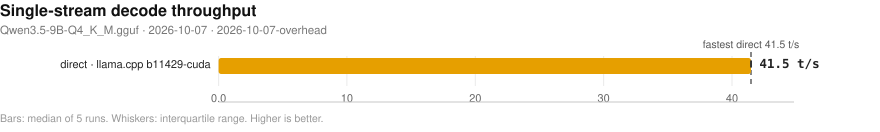
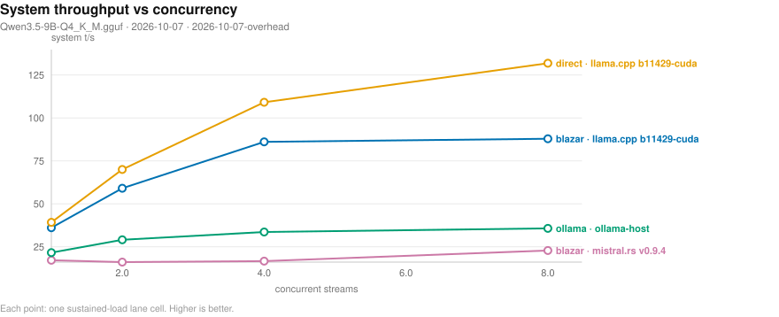
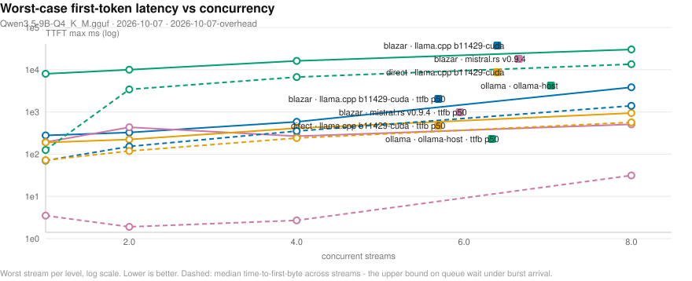
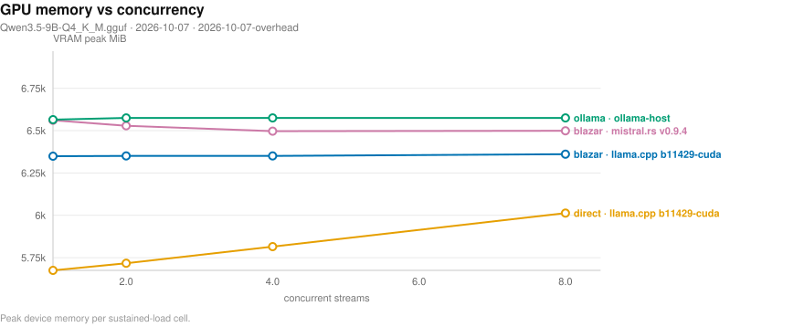
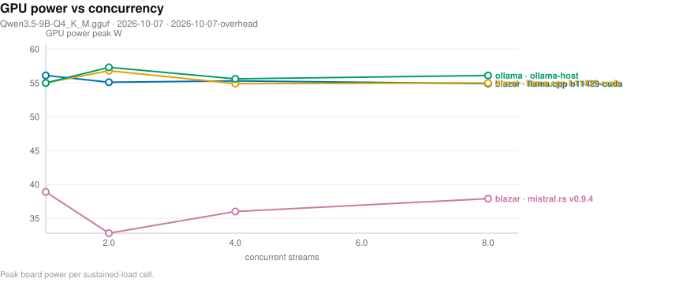

# Blazar benchmark matrix

- **date**: 2026-10-07 12:49:32
- **model**: `Qwen3.5-9B-Q4_K_M.gguf` (5366 MiB)
- **gpu**: NVIDIA GeForce RTX 4070 Laptop GPU / driver 595.91.07
- **engines**: b11429-cuda, inventory, ollama-host, v0.9.4
- **harness**: bench_matrix v4 — `--model qwen3.5-9b --engines b11429-cuda --providers direct blazar --conc-sweep 1,2,4,8 --skip-ppl --skip-tools --skip-quality --skip-media --skip-features --skip-ctxcurve --skip-reshape --skip-idle --skip-variants --blazar-bin ./target/release/blazar --artifacts-dir bench-artifacts/2026-10-07-overhead --md bench-artifacts/2026-10-07-overhead/report.md`
- **blazar**: `blazar 0.22.0` (sandbox daemon binary)
- **quality lane**: skipped — --skip-quality: no checker-verified receipts back any speed number in this campaign
- all blazar-owned rows measured by `blazar 0.22.0`

## Notable findings

- gateway vs direct decode (`v0.9.4`, 1 configs): median -11.5%, 0/1 within ±5% (parity); outliers: single-stream -11.5%.
- concurrency system throughput (`b11429-cuda`, 1 streams): 36.1 vs direct 39.3 t/s = 0.92x.
- concurrency system throughput (`b11429-cuda`, 2 streams): 59.1 vs direct 70.0 t/s = 0.84x.
- concurrency system throughput (`b11429-cuda`, 4 streams): 86.1 vs direct 109.1 t/s = 0.79x.
- concurrency system throughput (`b11429-cuda`, 8 streams): 87.9 vs direct 131.9 t/s = 0.67x.
- gateway greedy transparency (`b11429-cuda`): 7/20 exact vs same-engine direct — NOT TRANSPARENT.
- 3 cell(s) aborted on ENVIRONMENT guards (GPU/RAM co-residency), not product behavior — see Failed cells.

## Charts

- deterministic SVG renders of the cells below; source of truth is `cells.jsonl`, charts live in `plots/`.

### Single-stream decode throughput (chart)

_Median decode t/s per runtime and engine; whiskers span the interquartile range of the 5 runs; the dashed line marks the fastest direct engine. Higher is better. Source: 2026-10-07-overhead/cells.jsonl._

### Concurrency scaling (chart)

_Aggregate system tokens/s as parallel streams are added; flat-to-rising means the scheduler keeps the device saturated. Higher is better. Source: 2026-10-07-overhead/cells.jsonl._

### Concurrency tail latency (chart)

_Worst-case first-token wait per stream as concurrency rises (log scale) - the tail the scheduler must bound. Lower is better. Dashed curves carry the median time-to-first-byte, which upper-bounds queue wait under burst arrival. Source: 2026-10-07-overhead/cells.jsonl._

### Resource cost vs concurrency (chart)

_Peak VRAM footprint as parallel streams (and their KV caches) stack up. Source: 2026-10-07-overhead/cells.jsonl._

### Resource cost vs concurrency (chart)

_Peak GPU board power per concurrency level - the energy price of keeping the device saturated. Source: 2026-10-07-overhead/cells.jsonl._

### Lifecycle: cold start and idle wake (chart)

_Seconds to first token after a cold start (page cache dropped) and after idle-policy expiry; blazar keeps weights resident while ollama reloads from disk. Warm-daemon ollama caveat applies. Lower is better. Source: 2026-10-07-overhead/cells.jsonl._

## Speed (single-stream, medians)

| engine | provider | params | n | ttft p50 (ms) | ttft p99 (ms) | itl p99 (ms) | decode t/s | prefill t/s (cached) | VRAM peak (MiB) |
|---||---||---||---||---||---||---||---||---||
| b11429-cuda | direct | ctx=16384 np=1 | 1 | 122 | 126 | 25 | 41.5 | 7506.0 | 5681 |
| b11429-cuda | direct | ctx=16384 np=4 | 1 | 119 | 127 | 25 | 41.4 | 7499.7 | 5819 |
| b11429-cuda | direct | ctx=4096 np=1 | 1 | 121 | 131 | 32 | 41.1 | 7343.3 | 5285 |
| b11429-cuda | direct | ctx=4096 np=4 | 1 | 121 | 121 | 25 | 41.5 | 7573.8 | 5431 |
| ollama-host | ollama | reference=True NOTE: serves 'qwen3.5:9b' - t/s NOT comparable | 1 | 141 | 414 | 76 | 40.1 | 6662.0 | 6569 |
| v0.9.4 | blazar | config=single-stream child: ctx=16384 | 1 | 138 | 146 | 64 | 18.7 | 239.6 | 7171 |
| v0.9.4 | direct | ctx=4096 np=4 | 1 | 110 | 119 | 54 | 21.2 | 330.0 | 7041 |

## Concurrency (parallel streams, medians)

| provider | engine | params | n | sys t/s | ttft max (ms) | itl p99 (ms) | ok/errors |
|---||---||---||---||---||---||---||---||
| conc-blazar | b11429-cuda | conc=1 rounds=3 | 1 | 36.1 | 278 | 27 | 3/0 |
| conc-blazar | b11429-cuda | conc=2 rounds=3 | 1 | 59.1 | 326 | 30 | 6/0 |
| conc-blazar | b11429-cuda | conc=4 rounds=3 | 1 | 86.1 | 583 | 38 | 12/0 |
| conc-blazar | b11429-cuda | conc=8 rounds=3 | 1 | 87.9 | 3834 | 172 | 24/0 |
| conc-blazar | v0.9.4 | conc=1 rounds=3 | 1 | 17.2 | 193 | 63 | 3/0 |
| conc-blazar | v0.9.4 | conc=2 rounds=3 | 1 | 16.1 | 434 | 186 | 6/0 |
| conc-blazar | v0.9.4 | conc=4 rounds=3 | 1 | 16.7 | 267 | 255 | 12/0 |
| conc-blazar | v0.9.4 | conc=8 rounds=3 | 1 | 22.8 | 508 | 190 | 24/0 |
| conc-direct | b11429-cuda | conc=1 rounds=3 | 1 | 39.3 | 189 | 27 | 3/0 |
| conc-direct | b11429-cuda | conc=2 rounds=3 | 1 | 70.0 | 223 | 30 | 6/0 |
| conc-direct | b11429-cuda | conc=4 rounds=3 | 1 | 109.1 | 413 | 37 | 12/0 |
| conc-direct | b11429-cuda | conc=8 rounds=3 | 1 | 131.9 | 941 | 59 | 24/0 |
| conc-ollama | ollama-host | conc=1 rounds=3 | 1 | 21.6 | 8022 | 75 | 3/0 |
| conc-ollama | ollama-host | conc=2 rounds=3 | 1 | 29.1 | 10038 | 75 | 6/0 |
| conc-ollama | ollama-host | conc=4 rounds=3 | 1 | 33.6 | 16152 | 75 | 12/0 |
| conc-ollama | ollama-host | conc=8 rounds=3 | 1 | 35.7 | 30221 | 75 | 24/0 |
- sys t/s = total tokens / wall (true system throughput); flat sys t/s with growing ttft max means streams queued on a fixed slot count instead of being served concurrently.

## Quality — greedy parity vs `b11429-cuda`-direct (backend numerics)

| engine | exact matches | ratio mean | ratio min | first divergence (median chars) |
|---|---|---|---|---|
| b11429-cuda *(self — trivially 1.0) | 20/20 | 1.0 | 1.0 | 928.5 |
| v0.9.4 | 0/20 | 0.5143 | 0.0 | 0.0 |

## Quality — gateway transparency (blazar path vs direct, same engine)

| engine | exact matches | ratio mean | ratio min | first divergence (median chars) |
|---|---|---|---|---|
| b11429-cuda | 7/20 | 0.6432 | 0.0169 | 280.0 |
- expectation: 20/20 exact, ratio 1.0. A miss has TWO possible causes: gateway translation defect (sampler remap / template drift), or multi-slot batching numerics (child -np > 1 changes float reduction order; near-tie logits flip). Pin `slots = 1` and re-run: still <20/20 = translation defect, 20/20 = slot-count numerics (upstream physics).
## Feature matrix

| feature | ollama(documented) |
|---|---|
| `anthropic-api` | - |
| `ctx-override` | Y |
| `embeddings` | Y |
| `grammar-gbnf` | - |
| `json-schema` | Y |
| `kv-quant` | - |
| `lora-adapter` | Y |
| `metrics-endpoint` | - |
| `paged-attn` | - |
| `parallel-np` | Y |
| `quant-on-load` | - |
| `rerank` | - |
| `slots-sessions` | - |
| `spec-decode` | - |
| `tokenize-endpoint` | Y |
| `vision-mmproj` | Y |

## Failed cells

**product** (engine/gateway behavior):

- `v0.9.4` / direct / {'ctx': 4096, 'np': 1}: child exited rc=1 during load; last output: Error: This model does not fit on the devices ["cuda[0] (avail: 7639MB)", "cpu (avail: 6937MB)"], and exceeds tot...
- `v0.9.4` / direct / {'ctx': 16384, 'np': 1}: child exited rc=1 during load; last output: Error: This model does not fit on the devices ["cuda[0] (avail: 7639MB)", "cpu (avail: 6902MB)"], and exceeds tot...
- `v0.9.4` / direct / {'ctx': 16384, 'np': 4}: child exited rc=1 during load; last output: Error: This model does not fit on the devices ["cuda[0] (avail: 7639MB)", "cpu (avail: 6932MB)"], and exceeds tot...

**environment** (box/co-residency guards — NOT blazar defects):

- `b11429-cuda` / blazar / {'config': 'default'}: blazar cell crashed: MemAvailable 7092 MiB < needed ~7731 MiB (model 5366 MiB + headroom). A co-resident blazar/ollama engine is likely holding memory: stop ...
- `b11429-cuda` / blazar / {'config': 'single-stream'}: blazar cell crashed: MemAvailable 7360 MiB < needed ~7731 MiB (model 5366 MiB + headroom). A co-resident blazar/ollama engine is likely holding memory: stop ...
- `v0.9.4` / blazar / {'config': 'default'}: blazar cell crashed: MemAvailable 7724 MiB < needed ~7731 MiB (model 5366 MiB + headroom). A co-resident blazar/ollama engine is likely holding memory: stop ...

## Reading this report

- `direct` = raw child spawn on a probed free port (no gateway); `blazar` = full gateway path inside a sandboxed daemon (resolved engine argv in `child_argv`); `ollama` = HTTP-only reference against the host service.
- decode counts ALL emitted tokens (content + reasoning); engine `usage` counters are authoritative when present. GPU/power peaks sampled at ~1.2 s cadence.
- per-run spread, cold-start/resource detail, and every raw cell live in `cells.jsonl`; tables here are per-config medians.
