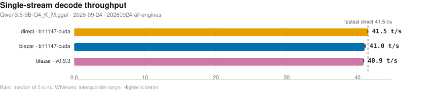
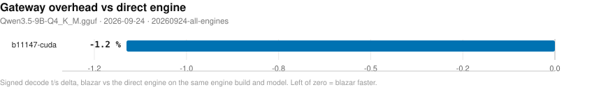
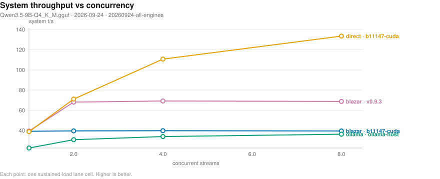
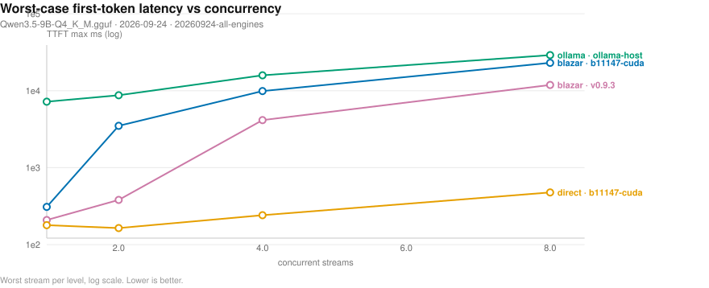
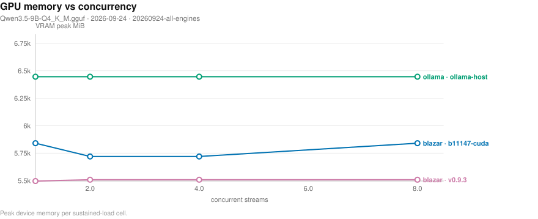
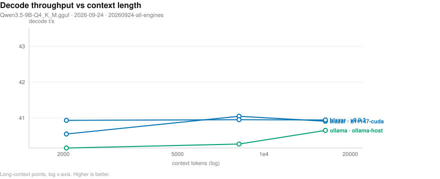
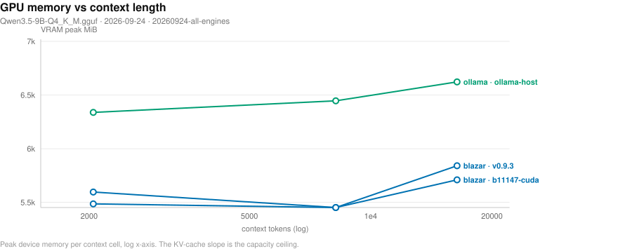
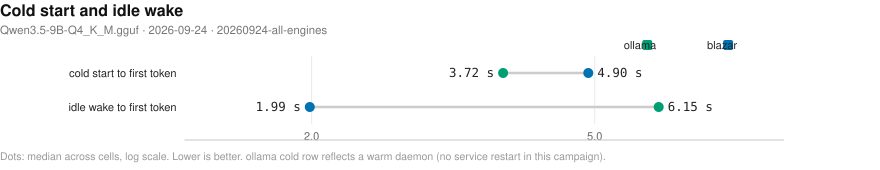
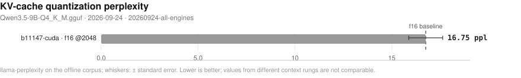

# Blazar benchmark matrix

- **date**: 2026-10-06 16:00:26
- **model**: `Qwen3.5-9B-Q4_K_M.gguf` (5366 MiB)
- **gpu**: NVIDIA GeForce RTX 4070 Laptop GPU / driver 595.91.07
- **engines**: b11147-cuda, b5130, inventory, master-890-74988b2, ollama-host, piper, v0.9.3
- **harness**: bench_matrix v4 — `regenerated (slim format)`
- **blazar**: `blazar 0.11.0` (sandbox daemon binary)
- **quality lane**: not-measured — no quality rows in this campaign (lane not reached for the selected providers/engines)
- all blazar-owned rows measured by `blazar 0.11.0`

## Notable findings

- gateway vs direct decode (`b11147-cuda`, 2 configs): median -1.5%, 2/2 within ±5% (parity).
- gateway vs direct decode (`v0.9.3`, 3 configs): median +109.1%, 0/3 within ±5% (parity); outliers: default +109.1%, single-stream +109.1%, paged_attn_off +109.3%.
- concurrency system throughput (`b11147-cuda`, 1 streams): 39.2 vs direct 38.8 t/s = 1.01x.
- concurrency system throughput (`b11147-cuda`, 2 streams): 39.6 vs direct 71.0 t/s = 0.56x — serialized/queued or wall-inflated (see note).
- concurrency system throughput (`b11147-cuda`, 4 streams): 39.8 vs direct 110.7 t/s = 0.36x — serialized/queued or wall-inflated (see note).
- concurrency system throughput (`b11147-cuda`, 8 streams): 39.5 vs direct 133.5 t/s = 0.30x — serialized/queued or wall-inflated (see note).
- kv=q8_0 (`b11147-cuda`): decode -1.3% vs baseline
- spec=ngram-simple (`b11147-cuda`): decode -2.4% vs baseline
- mmproj=True (`b11147-cuda`): decode -1.7% vs baseline
- gateway greedy transparency (`b11147-cuda`): 20/20 exact vs same-engine direct — transparent.
- 5 cell(s) aborted on ENVIRONMENT guards (GPU/RAM co-residency), not product behavior — see Failed cells.

## Charts

- deterministic SVG renders of the cells below; source of truth is `cells.jsonl`, charts live in `plots/`.

### Single-stream decode throughput (chart)

_Median decode t/s per runtime and engine; whiskers span the interquartile range of the 5 runs; the dashed line marks the fastest direct engine. Higher is better. Source: 20260924-all-engines/cells.jsonl._

### Gateway overhead (chart)

_Decode t/s delta of routing through blazar relative to driving the same engine build directly; left of zero means the gateway path won. Source: 20260924-all-engines/cells.jsonl._

### Concurrency scaling (chart)

_Aggregate system tokens/s as parallel streams are added; flat-to-rising means the scheduler keeps the device saturated. Higher is better. Source: 20260924-all-engines/cells.jsonl._

### Concurrency tail latency (chart)

_Worst-case first-token wait per stream as concurrency rises (log scale) - the tail the scheduler must bound. Lower is better. Source: 20260924-all-engines/cells.jsonl._

### Resource cost vs concurrency (chart)

_Peak VRAM footprint as parallel streams (and their KV caches) stack up. Source: 20260924-all-engines/cells.jsonl._

### Long-context degradation (chart)

_Single-stream decode t/s as prompt context grows (log x-axis) - KV-cache pressure made visible. Source: 20260924-all-engines/cells.jsonl._

### Memory vs context (chart)

_Peak VRAM as prompt context grows (log x-axis) - the KV-cache slope that sets the usable context ceiling. Source: 20260924-all-engines/cells.jsonl._

### Lifecycle: cold start and idle wake (chart)

_Seconds to first token after a cold start (page cache dropped) and after idle-policy expiry; blazar keeps weights resident while ollama reloads from disk. Warm-daemon ollama caveat applies. Lower is better. Source: 20260924-all-engines/cells.jsonl._

### KV-quant perplexity (chart)

_Perplexity per KV-cache quantization configuration (whiskers: standard error); the dashed line marks the unquantized f16 run. Lower is better; compare only within one context rung. Source: 20260924-all-engines/cells.jsonl._

## Speed (single-stream, medians)

| engine | provider | params | n | ttft p50 (ms) | ttft p99 (ms) | itl p99 (ms) | decode t/s | prefill t/s (cached) | VRAM peak (MiB) |
|---||---||---||---||---||---||---||---||---||
| b11147-cuda | blazar | config=default child: np=1 ctx=16384 | 1 | 120 | 123 | 25 | 41.0 | 7505.3 | 5715 |
| b11147-cuda | blazar | config=single-stream child: np=1 ctx=16384 | 1 | 118 | 124 | 25 | 41.1 | 7309.2 | 5715 |
| b11147-cuda | ctxcurve-blazar | ctx=16384 child: np=1 ctx=16384 | 1 | 126 | 328 | 26 | 40.9 | 7545.5 | 5710 |
| b11147-cuda | ctxcurve-blazar | ctx=2048 child: np=3 ctx=6144 | 1 | 132 | 203 | 32 | 40.6 | 6536.9 | 5486 |
| b11147-cuda | ctxcurve-blazar | ctx=8192 child: np=1 ctx=8192 | 1 | 125 | 331 | 26 | 41.0 | 7010.5 | 5452 |
| b11147-cuda | direct | ctx=16384 np=1 | 1 | 109 | 112 | 25 | 41.5 | 8292.5 | 5709 |
| b11147-cuda | direct | ctx=16384 np=4 | 1 | 108 | 112 | 25 | 41.5 | 8209.3 | 5847 |
| b11147-cuda | direct | ctx=4096 kv=q8_0 np=1 | 1 | 108 | 119 | 25 | 41.1 | 8312.1 | 5261 |
| b11147-cuda | direct | ctx=4096 mmproj=True np=1 | 1 | 116 | 121 | 26 | 41.0 | 7727.7 | 6439 |
| b11147-cuda | direct | ctx=4096 np=1 | 1 | 110 | 114 | 25 | 41.7 | 8201.4 | 5319 |
| b11147-cuda | direct | ctx=4096 np=1 spec=ngram-simple | 1 | 118 | 122 | 25 | 40.7 | 7642.3 | 5319 |
| b11147-cuda | direct | ctx=4096 np=4 | 1 | 109 | 112 | 25 | 41.5 | 8307.5 | 5459 |
| ollama-host | ctxcurve-ollama | ctx=16384 | 1 | 135 | - | - | 40.7 | - | 6622 |
| ollama-host | ctxcurve-ollama | ctx=2048 | 1 | 168 | - | - | 40.2 | - | 6338 |
| ollama-host | ctxcurve-ollama | ctx=8192 | 1 | 149 | - | - | 40.3 | - | 6446 |
| ollama-host | ollama | reference=True NOTE: serves 'qwen3.5:9b' - t/s NOT comparable | 1 | 127 | 133 | 75 | 40.6 | 8357.6 | 6626 |
| v0.9.3 | blazar | config=default child: np=2 ctx=8192 | 1 | 125 | 129 | 26 | 40.9 | 7538.8 | 5501 |
| v0.9.3 | blazar | config=paged_attn_off child: np=2 ctx=8192 | 1 | 122 | 125 | 25 | 40.9 | 7556.7 | 5501 |
| v0.9.3 | blazar | config=single-stream child: np=1 ctx=16384 | 1 | 124 | 127 | 26 | 40.9 | 7244.6 | 5715 |
| v0.9.3 | ctxcurve-blazar | ctx=16384 child: np=1 ctx=16384 | 1 | 124 | 325 | 26 | 40.9 | 7500.3 | 5841 |
| v0.9.3 | ctxcurve-blazar | ctx=2048 child: np=4 ctx=8192 | 1 | 125 | 180 | 26 | 40.9 | 7486.6 | 5596 |
| v0.9.3 | ctxcurve-blazar | ctx=8192 child: np=1 ctx=8192 | 1 | 128 | 328 | 26 | 41.0 | 7148.8 | 5452 |
| v0.9.3 | direct | ctx=4096 np=1 pa=off | 1 | 124 | 137 | 64 | 19.6 | 244.1 | 6914 |

## Concurrency (parallel streams, medians)

| provider | engine | params | n | sys t/s | ttft max (ms) | itl p99 (ms) | ok/errors |
|---||---||---||---||---||---||---||---||
| conc-blazar | b11147-cuda | conc=1 rounds=3 | 1 | 39.2 | 309 | 27 | 3/0 |
| conc-blazar | b11147-cuda | conc=2 rounds=3 | 1 | 39.6 | 3497 | 25 | 6/0 |
| conc-blazar | b11147-cuda | conc=4 rounds=3 | 1 | 39.8 | 9901 | 26 | 12/0 |
| conc-blazar | b11147-cuda | conc=8 rounds=3 | 1 | 39.5 | 23007 | 26 | 24/0 |
| conc-blazar | v0.9.3 | conc=1 rounds=3 | 1 | 39.4 | 209 | 27 | 3/0 |
| conc-blazar | v0.9.3 | conc=2 rounds=3 | 1 | 68.1 | 381 | 29 | 6/0 |
| conc-blazar | v0.9.3 | conc=4 rounds=3 | 1 | 69.2 | 4145 | 29 | 12/0 |
| conc-blazar | v0.9.3 | conc=8 rounds=3 | 1 | 68.7 | 11871 | 29 | 24/0 |
| conc-direct | b11147-cuda | conc=1 | 1 | 38.8 | 179 | 28 | 1/0 |
| conc-direct | b11147-cuda | conc=2 | 1 | 71.0 | 164 | 29 | 2/0 |
| conc-direct | b11147-cuda | conc=4 | 1 | 110.7 | 241 | 37 | 4/0 |
| conc-direct | b11147-cuda | conc=8 | 1 | 133.5 | 477 | 60 | 8/0 |
| conc-ollama | ollama-host | conc=1 rounds=3 | 1 | 22.6 | 7206 | 75 | 3/0 |
| conc-ollama | ollama-host | conc=2 rounds=3 | 1 | 30.8 | 8723 | 75 | 6/0 |
| conc-ollama | ollama-host | conc=4 rounds=3 | 1 | 34.0 | 15846 | 75 | 12/0 |
| conc-ollama | ollama-host | conc=8 rounds=3 | 1 | 36.3 | 29036 | 75 | 24/0 |
- sys t/s = total tokens / wall (true system throughput); flat sys t/s with growing ttft max means streams queued on a fixed slot count instead of being served concurrently.

## Quality — perplexity (identical pinned args)

| engine | perplexity | +/- err | wall (s) | note |
|---|---|---|---|---|
| v0.9.3 | - | - | - | llama-perplexity is llama-server-family only |
| b11147-cuda | 16.7503 | 0.87774 | 8.6 | lower = better text fit |
| v0.9.3 | - | - | - | llama-perplexity is llama-server-family only |
| v0.9.3 | - | - | - | llama-perplexity is llama-server-family only |
| v0.9.3 | - | - | - | llama-perplexity is llama-server-family only |
| v0.9.3 | - | - | - | llama-perplexity is llama-server-family only |
| v0.9.3 | - | - | - | llama-perplexity is llama-server-family only |
- corpus: deterministic offline repo text (code-heavy) — PARITY-ONLY; absolute PPL is not comparable to published wiki-text perplexities.

## Quality — greedy parity vs `reference`-direct (backend numerics)

| engine | exact matches | ratio mean | ratio min | first divergence (median chars) |
|---|---|---|---|---|
| b11147-cuda | 20/20 | 1.0 | 1.0 | 798.5 |
| v0.9.3 | 0/20 | 0.5261 | 0.0 | 0.0 |

## Quality — gateway transparency (blazar path vs direct, same engine)

| engine | exact matches | ratio mean | ratio min | first divergence (median chars) |
|---|---|---|---|---|
| b11147-cuda | 20/20 | 1.0 | 1.0 | 798.5 |
- expectation: 20/20 exact, ratio 1.0. A miss has TWO possible causes: gateway translation defect (sampler remap / template drift), or multi-slot batching numerics (child -np > 1 changes float reduction order; near-tie logits flip). Pin `slots = 1` and re-run: still <20/20 = translation defect, 20/20 = slot-count numerics (upstream physics).
## Feature matrix

| feature | b11147-cuda | v0.9.3 | ollama(documented) |
|---|---|---|---|
| `anthropic-api` | - | Y | - |
| `ctx-override` | Y | Y | Y |
| `embeddings` | Y | - | Y |
| `grammar-gbnf` | Y | - | - |
| `json-schema` | Y | Y | Y |
| `kv-quant` | Y | Y | - |
| `lora-adapter` | Y | Y | Y |
| `metrics-endpoint` | Y | Y | - |
| `paged-attn` | Y | Y | - |
| `parallel-np` | Y | Y | Y |
| `quant-on-load` | Y | Y | - |
| `rerank` | Y | - | - |
| `slots-sessions` | Y | - | - |
| `spec-decode` | Y | Y | - |
| `tokenize-endpoint` | Y | - | Y |
| `vision-mmproj` | Y | Y | Y |

## Failed cells

**product** (engine/gateway behavior):

- `v0.9.3` / direct (32 cells): child exited rc=1 during load; last output: Error: Num GPU blocks is 0. This means there is not enough memory. Either reduce the memory amount/utilization/co... [{'ctx': 4096, 'np': 1}; {'ctx': 4096, 'np': 4}; {'ctx': 16384, 'np': 1}; {'ctx': 16384, 'np': 4}; +28 more]
- `v0.9.3` / ppl (6 cells): llama-perplexity is llama-server-family only [{'ppl': 2048}; {'ppl': 2048}; {'ppl': 2048}; {'ppl': 2048}; +2 more]
- `b11147-cuda` / tools / {'tools': True}: tools lane: every scenario failed transport — {"error":{"code":404,"message":"model \"Qwen3.5-9B-Q4_K_M.gguf\" not found; try `blazar list`","type":"blazar_e...
- `v0.9.3` / tools (2 cells): tools lane: every scenario failed transport — {"error":{"code":404,"message":"model \"default\" not found; try `blazar list`","type":"blazar_error"}} [{'tools': True}; {'tools': True}]
- `v0.9.3` / tools / {'tools': True}: tools cell crashed: '<=' not supported between instances of 'list' and 'set'

**environment** (box/co-residency guards — NOT blazar defects):

- `v0.9.3` / direct (4 cells): GPU memory floor exceeded before cell [{'ctx': 4096, 'np': 1}; {'ctx': 4096, 'np': 4}; {'ctx': 16384, 'np': 1}; {'ctx': 16384, 'np': 4}]
- `v0.9.3` / reshape / {'reshape': True}: reshape cell crashed: MemAvailable 6986 MiB < needed ~7795 MiB (model 5417 MiB + headroom). A co-resident blazar/ollama engine is likely holding memory: stop...

## Reading this report

- `direct` = raw child spawn on a probed free port (no gateway); `blazar` = full gateway path inside a sandboxed daemon (resolved engine argv in `child_argv`); `ollama` = HTTP-only reference against the host service.
- decode counts ALL emitted tokens (content + reasoning); engine `usage` counters are authoritative when present. GPU/power peaks sampled at ~1.2 s cadence.
- per-run spread, cold-start/resource detail, and every raw cell live in `cells.jsonl`; tables here are per-config medians.
