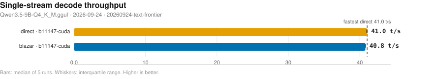
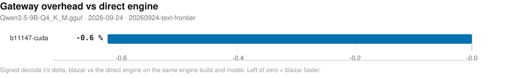
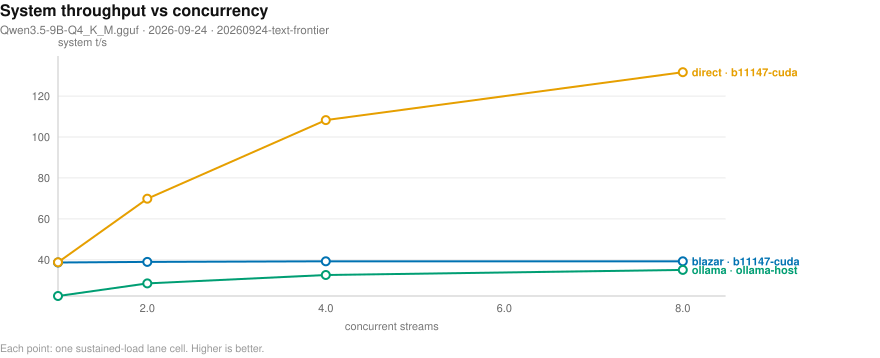
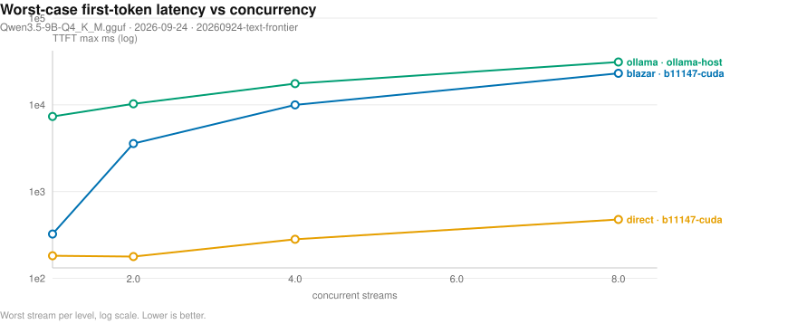
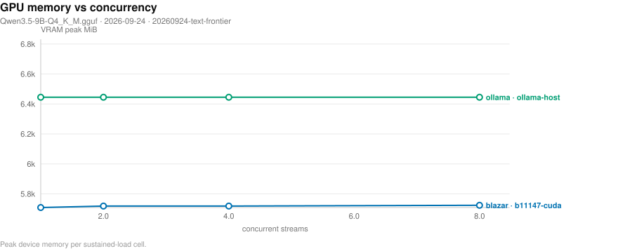
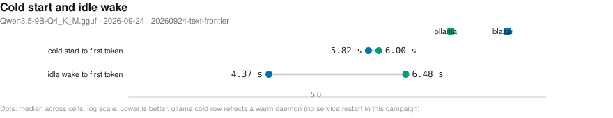

# Blazar benchmark matrix

- **date**: 2026-10-06 16:00:26
- **model**: `Qwen3.5-9B-Q4_K_M.gguf` (5366 MiB)
- **gpu**: NVIDIA GeForce RTX 4070 Laptop GPU / driver 595.91.07
- **engines**: b11147-cuda, ollama-host
- **harness**: bench_matrix v4 — `regenerated (slim format)`
- **blazar**: `blazar 0.11.0` (sandbox daemon binary)
- **quality lane**: not-measured — no quality rows in this campaign (lane not reached for the selected providers/engines)
- all blazar-owned rows measured by `blazar 0.11.0`

## Notable findings

- gateway vs direct decode (`b11147-cuda`, 2 configs): median -0.2%, 2/2 within ±5% (parity).
- concurrency system throughput (`b11147-cuda`, 1 streams): 38.7 vs direct 38.8 t/s = 1.00x.
- concurrency system throughput (`b11147-cuda`, 2 streams): 39.0 vs direct 69.9 t/s = 0.56x — serialized/queued or wall-inflated (see note).
- concurrency system throughput (`b11147-cuda`, 4 streams): 39.3 vs direct 108.3 t/s = 0.36x — serialized/queued or wall-inflated (see note).
- concurrency system throughput (`b11147-cuda`, 8 streams): 39.3 vs direct 131.7 t/s = 0.30x — serialized/queued or wall-inflated (see note).
- kv=q8_0 (`b11147-cuda`): decode -0.7% vs baseline
- spec=ngram-simple (`b11147-cuda`): decode -0.8% vs baseline
- mmproj=True (`b11147-cuda`): decode +0.3% vs baseline
- gateway greedy transparency (`b11147-cuda`): 20/20 exact vs same-engine direct — transparent.

## Charts

- deterministic SVG renders of the cells below; source of truth is `cells.jsonl`, charts live in `plots/`.

### Single-stream decode throughput (chart)

_Median decode t/s per runtime and engine; whiskers span the interquartile range of the 5 runs; the dashed line marks the fastest direct engine. Higher is better. Source: 20260924-text-frontier/cells.jsonl._

### Gateway overhead (chart)

_Decode t/s delta of routing through blazar relative to driving the same engine build directly; left of zero means the gateway path won. Source: 20260924-text-frontier/cells.jsonl._

### Concurrency scaling (chart)

_Aggregate system tokens/s as parallel streams are added; flat-to-rising means the scheduler keeps the device saturated. Higher is better. Source: 20260924-text-frontier/cells.jsonl._

### Concurrency tail latency (chart)

_Worst-case first-token wait per stream as concurrency rises (log scale) - the tail the scheduler must bound. Lower is better. Source: 20260924-text-frontier/cells.jsonl._

### Resource cost vs concurrency (chart)

_Peak VRAM footprint as parallel streams (and their KV caches) stack up. Source: 20260924-text-frontier/cells.jsonl._

### Lifecycle: cold start and idle wake (chart)

_Seconds to first token after a cold start (page cache dropped) and after idle-policy expiry; blazar keeps weights resident while ollama reloads from disk. Warm-daemon ollama caveat applies. Lower is better. Source: 20260924-text-frontier/cells.jsonl._

## Speed (single-stream, medians)

| engine | provider | params | n | ttft p50 (ms) | ttft p99 (ms) | itl p99 (ms) | decode t/s | prefill t/s (cached) | VRAM peak (MiB) |
|---||---||---||---||---||---||---||---||---||
| b11147-cuda | blazar | config=default child: np=1 ctx=16384 | 1 | 128 | 134 | 26 | 40.8 | 6783.8 | 5840 |
| b11147-cuda | blazar | config=single-stream child: np=1 ctx=16384 | 1 | 130 | 136 | 26 | 40.7 | 7997.0 | 5715 |
| b11147-cuda | direct | ctx=16384 np=1 | 1 | 121 | 129 | 26 | 41.0 | 7645.1 | 5715 |
| b11147-cuda | direct | ctx=16384 np=4 | 1 | 120 | 123 | 26 | 41.0 | 7596.6 | 5853 |
| b11147-cuda | direct | ctx=4096 kv=q8_0 np=1 | 1 | 117 | 121 | 26 | 40.6 | 7608.8 | 5255 |
| b11147-cuda | direct | ctx=4096 mmproj=True np=1 | 1 | 119 | 130 | 25 | 41.0 | 7180.2 | 6445 |
| b11147-cuda | direct | ctx=4096 np=1 | 1 | 132 | 134 | 26 | 40.8 | 7020.6 | 5313 |
| b11147-cuda | direct | ctx=4096 np=1 spec=ngram-simple | 1 | 122 | 131 | 26 | 40.5 | 7576.8 | 5313 |
| b11147-cuda | direct | ctx=4096 np=4 | 1 | 122 | 125 | 26 | 41.0 | 7523.6 | 5465 |
| ollama-host | ollama | reference=True NOTE: serves 'qwen3.5:9b' - t/s NOT comparable | 1 | 173 | 197 | 76 | 40.0 | 7508.6 | 6447 |

## Concurrency (parallel streams, medians)

| provider | engine | params | n | sys t/s | ttft max (ms) | itl p99 (ms) | ok/errors |
|---||---||---||---||---||---||---||---||
| conc-blazar | b11147-cuda | conc=1 rounds=3 | 1 | 38.7 | 324 | 26 | 3/0 |
| conc-blazar | b11147-cuda | conc=2 rounds=3 | 1 | 39.0 | 3580 | 26 | 6/0 |
| conc-blazar | b11147-cuda | conc=4 rounds=3 | 1 | 39.3 | 9990 | 26 | 12/0 |
| conc-blazar | b11147-cuda | conc=8 rounds=3 | 1 | 39.3 | 23054 | 26 | 24/0 |
| conc-direct | b11147-cuda | conc=1 | 1 | 38.8 | 182 | 26 | 1/0 |
| conc-direct | b11147-cuda | conc=2 | 1 | 69.9 | 178 | 30 | 2/0 |
| conc-direct | b11147-cuda | conc=4 | 1 | 108.3 | 282 | 39 | 4/0 |
| conc-direct | b11147-cuda | conc=8 | 1 | 131.7 | 477 | 64 | 8/0 |
| conc-ollama | ollama-host | conc=1 rounds=3 | 1 | 22.3 | 7332 | 76 | 3/0 |
| conc-ollama | ollama-host | conc=2 rounds=3 | 1 | 28.5 | 10284 | 76 | 6/0 |
| conc-ollama | ollama-host | conc=4 rounds=3 | 1 | 32.6 | 17537 | 76 | 12/0 |
| conc-ollama | ollama-host | conc=8 rounds=3 | 1 | 35.0 | 31172 | 76 | 24/0 |
- sys t/s = total tokens / wall (true system throughput); flat sys t/s with growing ttft max means streams queued on a fixed slot count instead of being served concurrently.

## Quality — greedy parity vs `reference`-direct (backend numerics)

| engine | exact matches | ratio mean | ratio min | first divergence (median chars) |
|---|---|---|---|---|
| b11147-cuda | 20/20 | 1.0 | 1.0 | 798.5 |

## Quality — gateway transparency (blazar path vs direct, same engine)

| engine | exact matches | ratio mean | ratio min | first divergence (median chars) |
|---|---|---|---|---|
| b11147-cuda | 20/20 | 1.0 | 1.0 | 798.5 |
- expectation: 20/20 exact, ratio 1.0. A miss has TWO possible causes: gateway translation defect (sampler remap / template drift), or multi-slot batching numerics (child -np > 1 changes float reduction order; near-tie logits flip). Pin `slots = 1` and re-run: still <20/20 = translation defect, 20/20 = slot-count numerics (upstream physics).
## Feature matrix

| feature | b11147-cuda | ollama(documented) |
|---|---|---|
| `anthropic-api` | - | - |
| `ctx-override` | Y | Y |
| `embeddings` | Y | Y |
| `grammar-gbnf` | Y | - |
| `json-schema` | Y | Y |
| `kv-quant` | Y | - |
| `lora-adapter` | Y | Y |
| `metrics-endpoint` | Y | - |
| `paged-attn` | Y | - |
| `parallel-np` | Y | Y |
| `quant-on-load` | Y | - |
| `rerank` | Y | - |
| `slots-sessions` | Y | - |
| `spec-decode` | Y | - |
| `tokenize-endpoint` | Y | Y |
| `vision-mmproj` | Y | Y |

## Reading this report

- `direct` = raw child spawn on a probed free port (no gateway); `blazar` = full gateway path inside a sandboxed daemon (resolved engine argv in `child_argv`); `ollama` = HTTP-only reference against the host service.
- decode counts ALL emitted tokens (content + reasoning); engine `usage` counters are authoritative when present. GPU/power peaks sampled at ~1.2 s cadence.
- per-run spread, cold-start/resource detail, and every raw cell live in `cells.jsonl`; tables here are per-config medians.
