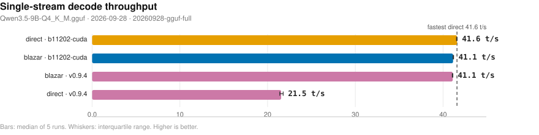
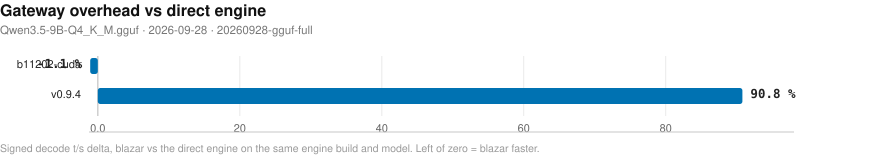
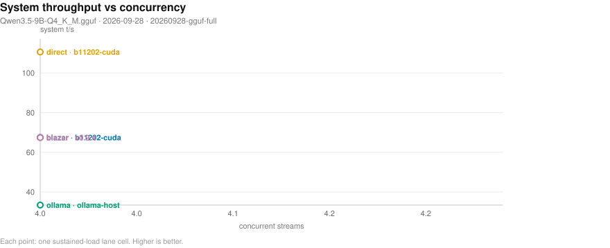
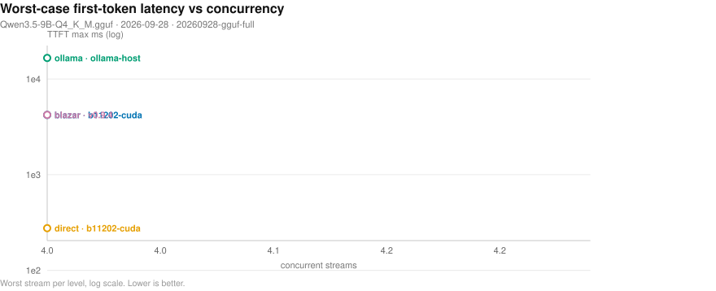
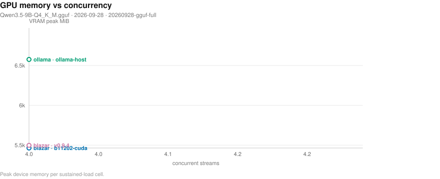
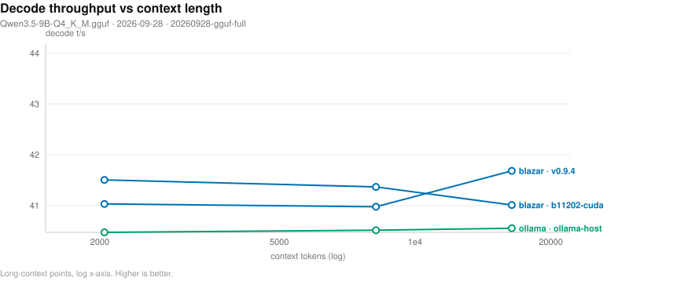
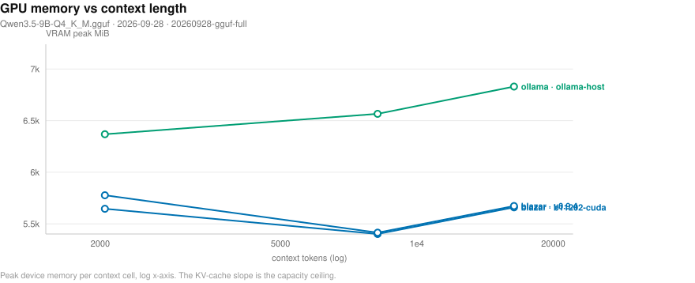
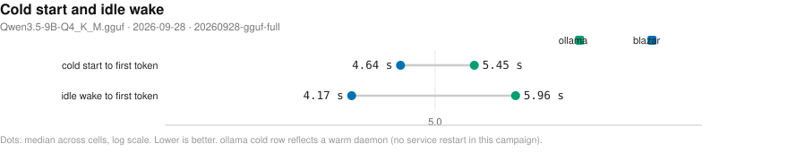
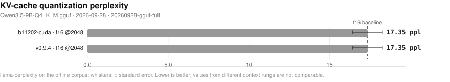

# Blazar benchmark matrix

- **date**: 2026-10-06 16:00:26
- **model**: `Qwen3.5-9B-Q4_K_M.gguf` (5366 MiB)
- **gpu**: NVIDIA GeForce RTX 4070 Laptop GPU / driver 595.91.07
- **engines**: b11202-cuda, b5130, inventory, master-920-2f88688, ollama-host, piper, v0.9.4
- **harness**: bench_matrix v4 — `--model qwen3.5-9b --artifacts-dir bench-artifacts/20260928-gguf-full --md BENCHMARK.md`
- **blazar**: `blazar 0.13.0` (sandbox daemon binary)
- **quality lane**: not-measured — no quality rows in this campaign (lane not reached for the selected providers/engines)
- all blazar-owned rows measured by `blazar 0.13.0`

## Notable findings

- gateway vs direct decode (`b11202-cuda`, 17 configs): median -0.5%, 16/17 within ±5% (parity); outliers: no_kv_offload_on -55.0%.
- gateway vs direct decode (`v0.9.4`, 12 configs): median +125.4%, 0/12 within ±5% (parity); outliers: mr_prefix_cache_256 +124.8%, mr_enc_cache_512mb +125.0%, deterministic_on +125.1%, pa_mem_0.55 +125.2%, kv_unified_on +125.3%, pa_mem_0.85 +125.3%, kv_unified_off +125.4%, default +125.6%, spec_off +127.4%, single-stream +127.6%, mr_batch_64 +128.1%, paged_attn_off +128.1%.
- concurrency system throughput (`b11202-cuda`, 4 streams): 67.5 vs direct 110.6 t/s = 0.61x.
- kv=q8_0 (`b11202-cuda`): decode -0.5% vs baseline
- pa=on (`b11202-cuda`): decode +0.6% vs baseline
- spec=ngram-simple (`b11202-cuda`): decode -0.5% vs baseline
- mmproj=True (`b11202-cuda`): decode +0.4% vs baseline
- pa=off (`v0.9.4`): decode -14.3% vs baseline
- gateway greedy transparency (`b11202-cuda`): 16/20 exact vs same-engine direct — NOT TRANSPARENT.

## Charts

- deterministic SVG renders of the cells below; source of truth is `cells.jsonl`, charts live in `plots/`.

### Single-stream decode throughput (chart)

_Median decode t/s per runtime and engine; whiskers span the interquartile range of the 5 runs; the dashed line marks the fastest direct engine. Higher is better. Source: 20260928-gguf-full/cells.jsonl._

### Gateway overhead (chart)

_Decode t/s delta of routing through blazar relative to driving the same engine build directly; left of zero means the gateway path won. Source: 20260928-gguf-full/cells.jsonl._

### Concurrency scaling (chart)

_Aggregate system tokens/s as parallel streams are added; flat-to-rising means the scheduler keeps the device saturated. Higher is better. Source: 20260928-gguf-full/cells.jsonl._

### Concurrency tail latency (chart)

_Worst-case first-token wait per stream as concurrency rises (log scale) - the tail the scheduler must bound. Lower is better. Source: 20260928-gguf-full/cells.jsonl._

### Resource cost vs concurrency (chart)

_Peak VRAM footprint as parallel streams (and their KV caches) stack up. Source: 20260928-gguf-full/cells.jsonl._

### Long-context degradation (chart)

_Single-stream decode t/s as prompt context grows (log x-axis) - KV-cache pressure made visible. Source: 20260928-gguf-full/cells.jsonl._

### Memory vs context (chart)

_Peak VRAM as prompt context grows (log x-axis) - the KV-cache slope that sets the usable context ceiling. Source: 20260928-gguf-full/cells.jsonl._

### Lifecycle: cold start and idle wake (chart)

_Seconds to first token after a cold start (page cache dropped) and after idle-policy expiry; blazar keeps weights resident while ollama reloads from disk. Warm-daemon ollama caveat applies. Lower is better. Source: 20260928-gguf-full/cells.jsonl._

### KV-quant perplexity (chart)

_Perplexity per KV-cache quantization configuration (whiskers: standard error); the dashed line marks the unquantized f16 run. Lower is better; compare only within one context rung. Source: 20260928-gguf-full/cells.jsonl._

## Speed (single-stream, medians)

| engine | provider | params | n | ttft p50 (ms) | ttft p99 (ms) | itl p99 (ms) | decode t/s | prefill t/s (cached) | VRAM peak (MiB) |
|---||---||---||---||---||---||---||---||---||
| b11202-cuda | blazar | config=cache_q8_q8_0 child: np=2 ctx=8192 | 1 | 124 | 125 | 26 | 40.6 | 7580.5 | 5338 |
| b11202-cuda | blazar | config=cache_reuse_256 child: np=2 ctx=8192 | 1 | 125 | 175 | 26 | 41.0 | 7243.0 | 5458 |
| b11202-cuda | blazar | config=cont_batching_off child: np=2 ctx=8192 | 1 | 125 | 177 | 26 | 41.0 | 7191.5 | 5458 |
| b11202-cuda | blazar | config=ctx_checkpoints_4 child: np=2 ctx=8192 | 1 | 121 | 125 | 26 | 41.0 | 7538.2 | 5477 |
| b11202-cuda | blazar | config=default child: np=2 ctx=8192 | 1 | 124 | 174 | 26 | 41.1 | 7212.0 | 5458 |
| b11202-cuda | blazar | config=deterministic_on child: np=1 ctx=16384 | 1 | 123 | 124 | 25 | 41.1 | 7424.7 | 5666 |
| b11202-cuda | blazar | config=fa_off child: np=2 ctx=8192 | 1 | 160 | 351 | 26 | 40.7 | 7434.7 | 5696 |
| b11202-cuda | blazar | config=fa_on child: np=2 ctx=8192 | 1 | 124 | 131 | 25 | 41.0 | 7293.1 | 5458 |
| b11202-cuda | blazar | config=kv_unified_off child: np=2 ctx=8192 | 1 | 123 | 126 | 26 | 41.0 | 7293.5 | 5458 |
| b11202-cuda | blazar | config=kv_unified_on child: np=2 ctx=8192 | 1 | 122 | 127 | 25 | 41.0 | 7327.4 | 5458 |
| b11202-cuda | blazar | config=kv_unified_per_slot_4096 child: np=2 ctx=8192 | 1 | 123 | 124 | 26 | 41.0 | 7549.6 | 5458 |
| b11202-cuda | blazar | config=mmproj_offload_off child: np=2 ctx=8192 | 1 | 124 | 124 | 25 | 41.6 | 7229.0 | 5458 |
| b11202-cuda | blazar | config=no_kv_offload_on child: np=2 ctx=8192 | 1 | 150 | 205 | 60 | 18.5 | 5074.5 | 5106 |
| b11202-cuda | blazar | config=single-stream child: np=1 ctx=16384 | 1 | 125 | 127 | 25 | 41.6 | 7239.3 | 5666 |
| b11202-cuda | blazar | config=spec_off child: np=2 ctx=8192 | 1 | 119 | 132 | 25 | 41.6 | 7349.5 | 5452 |
| b11202-cuda | blazar | config=swa_full_on child: np=2 ctx=8192 | 1 | 123 | 125 | 25 | 41.6 | 7460.8 | 5458 |
| b11202-cuda | blazar | config=threads_batch_8 child: np=2 ctx=8192 | 1 | 126 | 174 | 25 | 41.0 | 7246.5 | 5458 |
| b11202-cuda | ctxcurve-blazar | ctx=16384 child: np=1 ctx=16384 | 1 | 122 | 317 | 25 | 41.0 | 7410.0 | 5660 |
| b11202-cuda | ctxcurve-blazar | ctx=2048 child: np=4 ctx=8192 | 1 | 125 | 182 | 26 | 41.5 | 7176.7 | 5646 |
| b11202-cuda | ctxcurve-blazar | ctx=8192 child: np=1 ctx=8192 | 1 | 122 | 329 | 25 | 41.4 | 7358.1 | 5402 |
| b11202-cuda | direct | ctx=16384 np=1 | 1 | 123 | 125 | 25 | 41.6 | 7439.5 | 5666 |
| b11202-cuda | direct | ctx=16384 np=4 | 1 | 122 | 123 | 25 | 41.4 | 7303.2 | 5804 |
| b11202-cuda | direct | ctx=4096 kv=q8_0 np=1 | 1 | 119 | 121 | 26 | 41.0 | 7737.8 | 5210 |
| b11202-cuda | direct | ctx=4096 mmproj=True np=1 | 1 | 123 | 124 | 26 | 41.4 | 7456.5 | 6394 |
| b11202-cuda | direct | ctx=4096 np=1 | 1 | 127 | 132 | 32 | 41.2 | 7373.7 | 5270 |
| b11202-cuda | direct | ctx=4096 np=1 pa=on | 1 | 124 | 124 | 25 | 41.5 | 7490.3 | 5270 |
| b11202-cuda | direct | ctx=4096 np=1 spec=ngram-simple | 1 | 122 | 125 | 25 | 41.0 | 7380.1 | 5270 |
| b11202-cuda | direct | ctx=4096 np=4 | 1 | 123 | 125 | 25 | 41.6 | 7467.2 | 5410 |
| ollama-host | ctxcurve-ollama | ctx=16384 | 1 | 130 | - | - | 40.6 | - | 6830 |
| ollama-host | ctxcurve-ollama | ctx=2048 | 1 | 135 | - | - | 40.5 | - | 6368 |
| ollama-host | ctxcurve-ollama | ctx=8192 | 1 | 128 | - | - | 40.5 | - | 6566 |
| ollama-host | ollama | reference=True NOTE: serves 'qwen3.5:9b' - t/s NOT comparable | 1 | 126 | 132 | 75 | 40.6 | 7372.4 | 6570 |
| v0.9.4 | blazar | config=default child: np=2 ctx=8192 | 1 | 122 | 124 | 26 | 41.1 | 7160.5 | 5458 |
| v0.9.4 | blazar | config=deterministic_on child: np=1 ctx=16384 | 1 | 118 | 122 | 25 | 41.0 | 7244.9 | 5666 |
| v0.9.4 | blazar | config=kv_unified_off child: np=2 ctx=8192 | 1 | 120 | 125 | 26 | 41.1 | 7397.5 | 5465 |
| v0.9.4 | blazar | config=kv_unified_on child: np=2 ctx=8192 | 1 | 124 | 125 | 26 | 41.1 | 7414.7 | 5464 |
| v0.9.4 | blazar | config=mr_batch_64 child: np=2 ctx=8192 | 1 | 123 | 126 | 25 | 41.6 | 7352.9 | 5464 |
| v0.9.4 | blazar | config=mr_enc_cache_512mb child: np=2 ctx=8192 | 1 | 121 | 123 | 26 | 41.0 | 7396.1 | 5464 |
| v0.9.4 | blazar | config=mr_prefix_cache_256 child: np=2 ctx=8192 | 1 | 121 | 174 | 26 | 41.0 | 7358.3 | 5464 |
| v0.9.4 | blazar | config=pa_mem_0.55 child: np=2 ctx=8192 | 1 | 121 | 122 | 25 | 41.0 | 7371.5 | 5458 |
| v0.9.4 | blazar | config=pa_mem_0.85 child: np=2 ctx=8192 | 1 | 122 | 124 | 25 | 41.1 | 7667.6 | 5458 |
| v0.9.4 | blazar | config=paged_attn_off child: np=2 ctx=8192 | 1 | 119 | 125 | 25 | 41.6 | 7447.0 | 5458 |
| v0.9.4 | blazar | config=single-stream child: np=1 ctx=16384 | 1 | 122 | 123 | 25 | 41.5 | 7654.8 | 5666 |
| v0.9.4 | blazar | config=spec_off child: np=2 ctx=8192 | 1 | 123 | 124 | 25 | 41.4 | 7317.3 | 5458 |
| v0.9.4 | ctxcurve-blazar | ctx=16384 child: np=1 ctx=16384 | 1 | 120 | 308 | 25 | 41.7 | 7395.3 | 5673 |
| v0.9.4 | ctxcurve-blazar | ctx=2048 child: np=4 ctx=8192 | 1 | 123 | 176 | 25 | 41.0 | 7304.5 | 5777 |
| v0.9.4 | ctxcurve-blazar | ctx=8192 child: np=1 ctx=8192 | 1 | 122 | 323 | 26 | 41.0 | 7442.1 | 5415 |
| v0.9.4 | direct | ctx=16384 np=1 | 1 | 151 | 185 | 55 | 21.5 | 345.2 | 7042 |
| v0.9.4 | direct | ctx=16384 np=4 | 1 | 145 | 219 | 56 | 21.1 | 312.5 | 7042 |
| v0.9.4 | direct | ctx=4096 np=1 | 1 | 127 | 141 | 54 | 21.3 | 323.5 | 7042 |
| v0.9.4 | direct | ctx=4096 np=1 pa=off | 1 | 154 | 214 | 64 | 18.2 | 236.1 | 6882 |
| v0.9.4 | direct | ctx=4096 np=4 | 1 | 168 | 191 | 56 | 21.1 | 297.9 | 7042 |

## Concurrency (parallel streams, medians)

| provider | engine | params | n | sys t/s | ttft max (ms) | itl p99 (ms) | ok/errors |
|---||---||---||---||---||---||---||---||
| blazar | b11202-cuda | conc=8 config=adaptive_slots_off | 1 | 58.9 | 16588 | 62 | 16/0 |
| blazar | b11202-cuda | conc=8 config=conc_default | 1 | 58.6 | 16272 | 79 | 16/0 |
| blazar | b11202-cuda | conc=8 config=poll_50 | 1 | 58.7 | 16675 | 30 | 16/0 |
| conc-blazar | b11202-cuda | conc=4 rounds=3 | 1 | 67.5 | 4205 | 81 | 12/0 |
| conc-blazar | v0.9.4 | conc=4 rounds=3 | 1 | 67.4 | 4216 | 33 | 12/0 |
| conc-direct | b11202-cuda | conc=4 | 1 | 110.6 | 276 | 41 | 4/0 |
| conc-ollama | ollama-host | conc=4 rounds=3 | 1 | 33.4 | 16572 | 75 | 12/0 |
- sys t/s = total tokens / wall (true system throughput); flat sys t/s with growing ttft max means streams queued on a fixed slot count instead of being served concurrently.

## Quality — perplexity (identical pinned args)

| engine | perplexity | +/- err | wall (s) | note |
|---|---|---|---|---|
| b11202-cuda | 17.3512 | 0.91919 | 10.0 | lower = better text fit |
| v0.9.4 | 17.3512 | 0.91919 | 10.4 | lower = better text fit |
- corpus: deterministic offline repo text (code-heavy) — PARITY-ONLY; absolute PPL is not comparable to published wiki-text perplexities.

## Quality — greedy parity vs `reference`-direct (backend numerics)

| engine | exact matches | ratio mean | ratio min | first divergence (median chars) |
|---|---|---|---|---|
| b11202-cuda | 20/20 | 1.0 | 1.0 | 928.5 |
| v0.9.4 | 0/20 | 0.5143 | 0.0 | 0.0 |

## Quality — gateway transparency (blazar path vs direct, same engine)

| engine | exact matches | ratio mean | ratio min | first divergence (median chars) |
|---|---|---|---|---|
| b11202-cuda | 16/20 | 0.9404 | 0.0169 | 822.5 |
- expectation: 20/20 exact, ratio 1.0. A miss has TWO possible causes: gateway translation defect (sampler remap / template drift), or multi-slot batching numerics (child -np > 1 changes float reduction order; near-tie logits flip). Pin `slots = 1` and re-run: still <20/20 = translation defect, 20/20 = slot-count numerics (upstream physics).
## Feature matrix

| feature | b11202-cuda | v0.9.4 | ollama(documented) |
|---|---|---|---|
| `anthropic-api` | - | Y | - |
| `ctx-override` | Y | Y | Y |
| `embeddings` | Y | - | Y |
| `grammar-gbnf` | Y | - | - |
| `json-schema` | Y | Y | Y |
| `kv-quant` | Y | Y | - |
| `lora-adapter` | Y | Y | Y |
| `metrics-endpoint` | Y | Y | - |
| `paged-attn` | Y | Y | - |
| `parallel-np` | Y | Y | Y |
| `quant-on-load` | Y | Y | - |
| `rerank` | Y | - | - |
| `slots-sessions` | Y | - | - |
| `spec-decode` | Y | Y | - |
| `tokenize-endpoint` | Y | - | Y |
| `vision-mmproj` | Y | Y | Y |

## Reading this report

- `direct` = raw child spawn on a probed free port (no gateway); `blazar` = full gateway path inside a sandboxed daemon (resolved engine argv in `child_argv`); `ollama` = HTTP-only reference against the host service.
- decode counts ALL emitted tokens (content + reasoning); engine `usage` counters are authoritative when present. GPU/power peaks sampled at ~1.2 s cadence.
- per-run spread, cold-start/resource detail, and every raw cell live in `cells.jsonl`; tables here are per-config medians.
