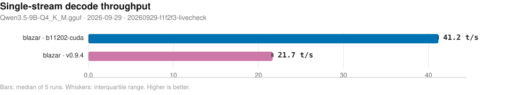
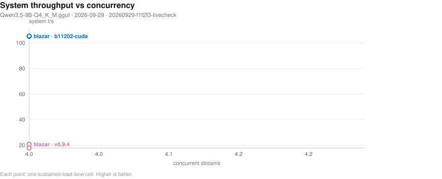
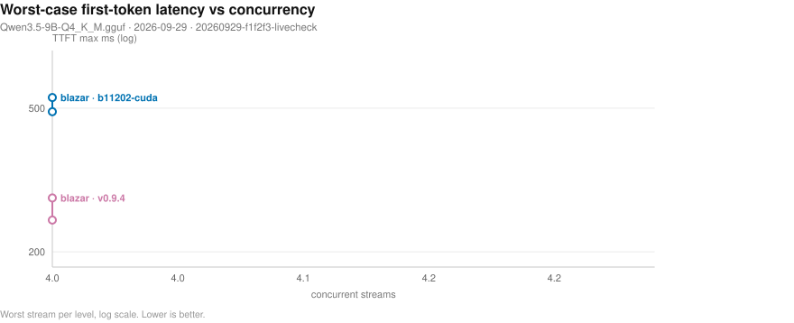
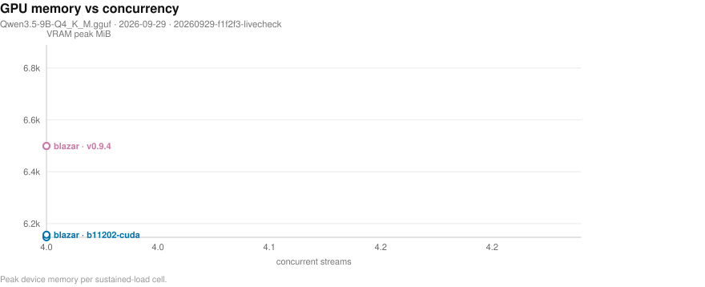
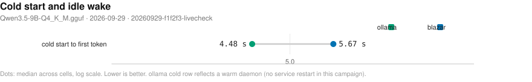

# Blazar benchmark matrix

- **date**: 2026-10-06 16:00:26
- **model**: `Qwen3.5-9B-Q4_K_M.gguf` (5366 MiB)
- **gpu**: NVIDIA GeForce RTX 4070 Laptop GPU / driver 595.91.07
- **engines**: b11202-cuda, inventory, ollama-host, v0.9.4
- **harness**: bench_matrix v4 — `--artifacts-dir bench-artifacts/20260929-f1f2f3-livecheck --engines b11202-cuda v0.9.4 --providers blazar --skip-ppl --s`
- **blazar**: `blazar 0.13.0` (sandbox daemon binary)
- **quality lane**: not-measured — no quality rows in this campaign (lane not reached for the selected providers/engines)
- all blazar-owned rows measured by `blazar 0.13.0`

## Notable findings

- 5 cell(s) aborted on ENVIRONMENT guards (GPU/RAM co-residency), not product behavior — see Failed cells.

## Charts

- deterministic SVG renders of the cells below; source of truth is `cells.jsonl`, charts live in `plots/`.

### Single-stream decode throughput (chart)

_Median decode t/s per runtime and engine; whiskers span the interquartile range of the 5 runs; the dashed line marks the fastest direct engine. Higher is better. Source: 20260929-f1f2f3-livecheck/cells.jsonl._

### Concurrency scaling (chart)

_Aggregate system tokens/s as parallel streams are added; flat-to-rising means the scheduler keeps the device saturated. Higher is better. Source: 20260929-f1f2f3-livecheck/cells.jsonl._

### Concurrency tail latency (chart)

_Worst-case first-token wait per stream as concurrency rises (log scale) - the tail the scheduler must bound. Lower is better. Source: 20260929-f1f2f3-livecheck/cells.jsonl._

### Resource cost vs concurrency (chart)

_Peak VRAM footprint as parallel streams (and their KV caches) stack up. Source: 20260929-f1f2f3-livecheck/cells.jsonl._

### Lifecycle: cold start and idle wake (chart)

_Seconds to first token after a cold start (page cache dropped) and after idle-policy expiry; blazar keeps weights resident while ollama reloads from disk. Warm-daemon ollama caveat applies. Lower is better. Source: 20260929-f1f2f3-livecheck/cells.jsonl._

## Speed (single-stream, medians)

| engine | provider | params | n | ttft p50 (ms) | ttft p99 (ms) | itl p99 (ms) | decode t/s | prefill t/s (cached) | VRAM peak (MiB) |
|---||---||---||---||---||---||---||---||---||
| b11202-cuda | blazar | config=default child: np=4 ctx=65536 | 1 | 108 | 117 | 25 | 41.2 | 8119.5 | 6151 |
| b11202-cuda | blazar | config=single-stream child: np=1 ctx=16384 | 1 | 108 | 111 | 25 | 41.6 | 8330.2 | 5665 |
| ollama-host | ollama | reference=True NOTE: serves 'qwen3.5:9b' - t/s NOT comparable | 2 | 109 | 114 | 74 | 41.1 | 8342.6 | 6569 |
| v0.9.4 | blazar | config=default child: ctx=16384 | 1 | 120 | 153 | 57 | 21.7 | 266.2 | 6947 |
| v0.9.4 | blazar | config=single-stream child: ctx=16384 | 1 | 122 | 134 | 56 | 21.6 | 269.0 | 6947 |

## Concurrency (parallel streams, medians)

| provider | engine | params | n | sys t/s | ttft max (ms) | itl p99 (ms) | ok/errors |
|---||---||---||---||---||---||---||---||
| conc-blazar | b11202-cuda | conc=4 rounds=3 | 2 | 105.2 | 512 | 78 | 24/0 |
| conc-blazar | v0.9.4 | conc=4 rounds=3 | 2 | 19.3 | 264 | 67 | 24/0 |
- sys t/s = total tokens / wall (true system throughput); flat sys t/s with growing ttft max means streams queued on a fixed slot count instead of being served concurrently.

## Feature matrix

| feature | ollama(documented) |
|---|---|
| `anthropic-api` | - |
| `ctx-override` | Y |
| `embeddings` | Y |
| `grammar-gbnf` | - |
| `json-schema` | Y |
| `kv-quant` | - |
| `lora-adapter` | Y |
| `metrics-endpoint` | - |
| `paged-attn` | - |
| `parallel-np` | Y |
| `quant-on-load` | - |
| `rerank` | - |
| `slots-sessions` | - |
| `spec-decode` | - |
| `tokenize-endpoint` | Y |
| `vision-mmproj` | Y |

## Failed cells

**product** (engine/gateway behavior):

- `ollama-host` / ollama / {'reference': True}: ollama not reachable on 11434 (skipped, not started)
- `ollama-host` / cold-ollama / {'cold': True}: ollama not reachable on 11434 (skipped, not started)

**environment** (box/co-residency guards — NOT blazar defects):

- `b11202-cuda` / blazar / {'config': 'default'}: blazar cell crashed: MemAvailable 7345 MiB < needed ~7731 MiB (model 5366 MiB + headroom). A co-resident blazar/ollama engine is likely holding memory: stop ...
- `b11202-cuda` / blazar / {'config': 'single-stream'}: blazar cell crashed: MemAvailable 7381 MiB < needed ~7731 MiB (model 5366 MiB + headroom). A co-resident blazar/ollama engine is likely holding memory: stop ...
- `v0.9.4` / blazar / {'config': 'default'}: blazar cell crashed: MemAvailable 7456 MiB < needed ~7731 MiB (model 5366 MiB + headroom). A co-resident blazar/ollama engine is likely holding memory: stop ...
- `v0.9.4` / blazar / {'config': 'single-stream'}: blazar cell crashed: MemAvailable 7371 MiB < needed ~7731 MiB (model 5366 MiB + headroom). A co-resident blazar/ollama engine is likely holding memory: stop ...
- `b11202-cuda` / reshape / {'reshape': True}: reshape cell crashed: MemAvailable 7554 MiB < needed ~7731 MiB (model 5366 MiB + headroom). A co-resident blazar/ollama engine is likely holding memory: stop...

## Reading this report

- `direct` = raw child spawn on a probed free port (no gateway); `blazar` = full gateway path inside a sandboxed daemon (resolved engine argv in `child_argv`); `ollama` = HTTP-only reference against the host service.
- decode counts ALL emitted tokens (content + reasoning); engine `usage` counters are authoritative when present. GPU/power peaks sampled at ~1.2 s cadence.
- per-run spread, cold-start/resource detail, and every raw cell live in `cells.jsonl`; tables here are per-config medians.
