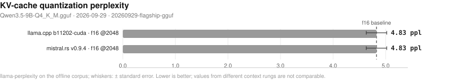

# Blazar benchmark matrix

- **date**: 2026-10-06 16:00:26
- **model**: `Qwen3.5-9B-Q4_K_M.gguf` (5366 MiB)
- **gpu**: NVIDIA GeForce RTX 4070 Laptop GPU / driver 595.91.07
- **engines**: b11202-cuda, b5130, inventory, master-920-2f88688, ollama-host, piper, v0.9.4
- **harness**: bench_matrix v4 — `--artifacts-dir bench-artifacts/20260929-flagship-gguf --engines b11202-cuda v0.9.4 master-920-2f88688 b5130 --conc-swee`
- **blazar**: `blazar 0.13.0` (sandbox daemon binary)
- **quality lane**: not-measured — no quality rows in this campaign (lane not reached for the selected providers/engines)
- all blazar-owned rows measured by `blazar 0.13.0`

## Notable findings

- gateway vs direct decode (`b11202-cuda`, 17 configs): median -1.8%, 14/17 within ±5% (parity); outliers: fa_off -75.8%, no_kv_offload_on -54.4%, cache_q8_q8_0 -22.7%.
- gateway vs direct decode (`v0.9.4`, 11 configs): median -12.2%, 0/11 within ±5% (parity); outliers: spec_off -13.2%, pa_mem_0.55 -13.0%, pa_mem_0.85 -12.3%, deterministic_on -12.3%, single-stream -12.3%, default -12.2%, kv_unified_off -11.9%, paged_attn_off -11.8%, kv_unified_on -11.7%, mr_enc_cache_512mb -11.7%, mr_prefix_cache_256 -11.6%.
- concurrency system throughput (`b11202-cuda`, 1 streams): 40.0 vs direct 40.0 t/s = 1.00x.
- concurrency system throughput (`b11202-cuda`, 2 streams): 65.9 vs direct 70.5 t/s = 0.93x.
- concurrency system throughput (`b11202-cuda`, 4 streams): 104.8 vs direct 111.3 t/s = 0.94x.
- concurrency system throughput (`b11202-cuda`, 8 streams): 102.7 vs direct 136.9 t/s = 0.75x.
- concurrency system throughput (`b11202-cuda`, 16 streams): 103.4 vs direct 236.6 t/s = 0.44x — serialized/queued or wall-inflated (see note).
- kv=q8_0 (`b11202-cuda`): decode -0.5% vs baseline
- pa=on (`b11202-cuda`): decode +0.3% vs baseline
- spec=ngram-simple (`b11202-cuda`): decode -0.7% vs baseline
- mmproj=True (`b11202-cuda`): decode +0.3% vs baseline
- pa=off (`v0.9.4`): decode -12.3% vs baseline
- gateway greedy transparency (`b11202-cuda`): 7/20 exact vs same-engine direct — NOT TRANSPARENT.

## Charts

- deterministic SVG renders of the cells below; source of truth is `cells.jsonl`, charts live in `plots/`.

### Single-stream decode throughput (chart)

_Median decode t/s per runtime and engine; whiskers span the interquartile range of the 5 runs; the dashed line marks the fastest direct engine. Higher is better. Source: 20260929-flagship-gguf/cells.jsonl._

### Gateway overhead (chart)

_Decode t/s delta of routing through blazar relative to driving the same engine build directly; left of zero means the gateway path won. Source: 20260929-flagship-gguf/cells.jsonl._

### Concurrency scaling (chart)

_Aggregate system tokens/s as parallel streams are added; flat-to-rising means the scheduler keeps the device saturated. Higher is better. Source: 20260929-flagship-gguf/cells.jsonl._

### Concurrency tail latency (chart)

_Worst-case first-token wait per stream as concurrency rises (log scale) - the tail the scheduler must bound. Lower is better. Source: 20260929-flagship-gguf/cells.jsonl._

### Resource cost vs concurrency (chart)

_Peak VRAM footprint as parallel streams (and their KV caches) stack up. Source: 20260929-flagship-gguf/cells.jsonl._

### Long-context degradation (chart)

_Single-stream decode t/s as prompt context grows (log x-axis) - KV-cache pressure made visible. Source: 20260929-flagship-gguf/cells.jsonl._

### Memory vs context (chart)

_Peak VRAM as prompt context grows (log x-axis) - the KV-cache slope that sets the usable context ceiling. Source: 20260929-flagship-gguf/cells.jsonl._

### Lifecycle: cold start and idle wake (chart)

_Seconds to first token after a cold start (page cache dropped) and after idle-policy expiry; blazar keeps weights resident while ollama reloads from disk. Warm-daemon ollama caveat applies. Lower is better. Source: 20260929-flagship-gguf/cells.jsonl._

### KV-quant perplexity (chart)

_Perplexity per KV-cache quantization configuration (whiskers: standard error); the dashed line marks the unquantized f16 run. Lower is better; compare only within one context rung. Source: 20260929-flagship-gguf/cells.jsonl._

## Speed (single-stream, medians)

| engine | provider | params | n | ttft p50 (ms) | ttft p99 (ms) | itl p99 (ms) | decode t/s | prefill t/s (cached) | VRAM peak (MiB) |
|---||---||---||---||---||---||---||---||---||
| b11202-cuda | blazar | config=cache_q8_q8_0 child: np=4 ctx=65536 | 1 | 130 | 201 | 34 | 32.0 | 6372.3 | 6544 |
| b11202-cuda | blazar | config=cache_reuse_256 child: np=4 ctx=65536 | 1 | 121 | 177 | 26 | 40.6 | 7188.5 | 6152 |
| b11202-cuda | blazar | config=cont_batching_off child: np=4 ctx=65536 | 1 | 123 | 178 | 26 | 40.6 | 7258.9 | 6152 |
| b11202-cuda | blazar | config=ctx_checkpoints_4 child: np=4 ctx=65536 | 1 | 120 | 126 | 25 | 41.0 | 7382.3 | 6152 |
| b11202-cuda | blazar | config=default child: np=4 ctx=65536 | 1 | 122 | 181 | 26 | 40.6 | 7364.4 | 6169 |
| b11202-cuda | blazar | config=deterministic_on child: np=1 ctx=16384 | 1 | 121 | 122 | 26 | 41.0 | 7299.1 | 5666 |
| b11202-cuda | blazar | config=fa_off child: np=4 ctx=65536 | 1 | 234 | 618 | 110 | 10.0 | 3173.8 | 6612 |
| b11202-cuda | blazar | config=fa_on child: np=4 ctx=65536 | 1 | 121 | 129 | 26 | 40.6 | 7483.4 | 6152 |
| b11202-cuda | blazar | config=kv_unified_off child: np=2 ctx=8192 | 1 | 123 | 129 | 25 | 41.0 | 7324.0 | 5458 |
| b11202-cuda | blazar | config=kv_unified_on child: np=4 ctx=65536 | 1 | 120 | 126 | 26 | 40.7 | 7499.3 | 6152 |
| b11202-cuda | blazar | config=kv_unified_per_slot_4096 child: np=4 ctx=65536 | 1 | 122 | 127 | 26 | 40.6 | 7217.1 | 6152 |
| b11202-cuda | blazar | config=mmproj_offload_off child: np=4 ctx=65536 | 1 | 122 | 128 | 26 | 40.6 | 7190.4 | 6152 |
| b11202-cuda | blazar | config=no_kv_offload_on child: np=2 ctx=8192 | 1 | 148 | 203 | 58 | 18.9 | 5198.1 | 5106 |
| b11202-cuda | blazar | config=single-stream child: np=1 ctx=16384 | 1 | 121 | 128 | 26 | 41.0 | 7580.8 | 5666 |
| b11202-cuda | blazar | config=spec_off child: np=4 ctx=65536 | 1 | 121 | 174 | 26 | 41.0 | 7400.1 | 6152 |
| b11202-cuda | blazar | config=swa_full_on child: np=4 ctx=65536 | 1 | 120 | 126 | 26 | 40.8 | 7223.9 | 6152 |
| b11202-cuda | blazar | config=threads_batch_8 child: np=4 ctx=65536 | 1 | 122 | 178 | 26 | 41.2 | 7419.7 | 6152 |
| b11202-cuda | ctxcurve-blazar | ctx=16384 child: np=3 ctx=49152 | 1 | 122 | 176 | 26 | 40.6 | 7049.2 | 6064 |
| b11202-cuda | ctxcurve-blazar | ctx=2048 child: np=4 ctx=8192 | 1 | 125 | 174 | 26 | 41.0 | 7262.4 | 5658 |
| b11202-cuda | ctxcurve-blazar | ctx=8192 child: np=4 ctx=32768 | 1 | 123 | 171 | 26 | 40.7 | 7444.0 | 5954 |
| b11202-cuda | direct | ctx=16384 np=1 | 1 | 115 | 119 | 25 | 41.5 | 7769.5 | 5660 |
| b11202-cuda | direct | ctx=16384 np=4 | 1 | 118 | 125 | 25 | 41.5 | 7559.5 | 5804 |
| b11202-cuda | direct | ctx=4096 kv=q8_0 np=1 | 1 | 117 | 121 | 25 | 41.1 | 7825.6 | 5210 |
| b11202-cuda | direct | ctx=4096 mmproj=True np=1 | 1 | 118 | 123 | 25 | 41.5 | 7469.8 | 6394 |
| b11202-cuda | direct | ctx=4096 np=1 | 1 | 123 | 128 | 27 | 41.4 | 7263.0 | 5270 |
| b11202-cuda | direct | ctx=4096 np=1 pa=on | 1 | 121 | 123 | 25 | 41.5 | 7466.6 | 5270 |
| b11202-cuda | direct | ctx=4096 np=1 spec=ngram-simple | 1 | 119 | 123 | 25 | 41.1 | 7449.2 | 5270 |
| b11202-cuda | direct | ctx=4096 np=4 | 1 | 114 | 119 | 25 | 41.5 | 7698.9 | 5416 |
| ollama-host | ctxcurve-ollama | ctx=16384 | 1 | 120 | - | - | 40.7 | - | 6830 |
| ollama-host | ctxcurve-ollama | ctx=2048 | 1 | 132 | - | - | 40.5 | - | 6368 |
| ollama-host | ctxcurve-ollama | ctx=8192 | 1 | 132 | - | - | 40.6 | - | 6566 |
| ollama-host | ollama | reference=True NOTE: serves 'qwen3.5:9b' - t/s NOT comparable | 1 | 130 | 141 | 75 | 40.7 | 7337.1 | 6570 |
| v0.9.4 | blazar | config=default child: ctx=16384 | 1 | 132 | 143 | 61 | 18.8 | 244.6 | 6948 |
| v0.9.4 | blazar | config=deterministic_on child: ctx=16384 | 1 | 132 | 142 | 61 | 18.8 | 244.4 | 6948 |
| v0.9.4 | blazar | config=kv_unified_off child: ctx=16384 | 1 | 128 | 148 | 61 | 18.8 | 247.6 | 6948 |
| v0.9.4 | blazar | config=kv_unified_on child: ctx=16384 | 1 | 131 | 137 | 61 | 18.9 | 247.1 | 6948 |
| v0.9.4 | blazar | config=mr_enc_cache_512mb child: ctx=16384 | 1 | 137 | 144 | 61 | 18.9 | 241.0 | 6948 |
| v0.9.4 | blazar | config=mr_prefix_cache_256 child: ctx=16384 | 1 | 131 | 136 | 61 | 18.9 | 246.5 | 6948 |
| v0.9.4 | blazar | config=pa_mem_0.55 child: ctx=16384 | 1 | 134 | 140 | 62 | 18.6 | 247.4 | 6948 |
| v0.9.4 | blazar | config=pa_mem_0.85 child: ctx=16384 | 1 | 130 | 147 | 62 | 18.7 | 249.6 | 6948 |
| v0.9.4 | blazar | config=paged_attn_off child: ctx=16384 | 1 | 141 | 155 | 61 | 18.9 | 241.2 | 6948 |
| v0.9.4 | blazar | config=single-stream child: ctx=16384 | 1 | 140 | 153 | 62 | 18.8 | 239.5 | 6948 |
| v0.9.4 | blazar | config=spec_off child: ctx=16384 | 1 | 136 | 142 | 63 | 18.6 | 236.8 | 6948 |
| v0.9.4 | ctxcurve-blazar | ctx=16384 child: ctx=16384 | 1 | 139 | 144 | 61 | 18.7 | 245.3 | 6754 |
| v0.9.4 | ctxcurve-blazar | ctx=2048 child: ctx=2048 | 1 | 136 | 147 | 61 | 18.6 | 245.0 | 6754 |
| v0.9.4 | ctxcurve-blazar | ctx=8192 child: ctx=8192 | 1 | 135 | 135 | 61 | 18.9 | 235.4 | 6754 |
| v0.9.4 | direct | ctx=16384 np=1 | 1 | 106 | 108 | 52 | 21.4 | 323.4 | 7042 |
| v0.9.4 | direct | ctx=16384 np=4 | 1 | 104 | 112 | 52 | 21.5 | 322.7 | 7042 |
| v0.9.4 | direct | ctx=4096 np=1 | 1 | 115 | 125 | 52 | 21.4 | 326.8 | 7042 |
| v0.9.4 | direct | ctx=4096 np=1 pa=off | 1 | 131 | 133 | 62 | 18.8 | 245.0 | 6882 |
| v0.9.4 | direct | ctx=4096 np=4 | 1 | 99 | 112 | 52 | 21.3 | 316.3 | 7042 |

## Concurrency (parallel streams, medians)

| provider | engine | params | n | sys t/s | ttft max (ms) | itl p99 (ms) | ok/errors |
|---||---||---||---||---||---||---||---||
| blazar | b11202-cuda | conc=8 config=adaptive_slots_off | 1 | 84.3 | 9921 | 86 | 16/0 |
| blazar | b11202-cuda | conc=8 config=conc_default | 1 | 84.9 | 10130 | 37 | 16/0 |
| blazar | b11202-cuda | conc=8 config=poll_50 | 1 | 84.0 | 10320 | 51 | 16/0 |
| conc-blazar | b11202-cuda | conc=1 rounds=3 | 1 | 40.0 | 264 | 26 | 3/0 |
| conc-blazar | b11202-cuda | conc=16 rounds=3 | 1 | 103.4 | 15802 | 86 | 48/0 |
| conc-blazar | b11202-cuda | conc=2 rounds=3 | 1 | 65.9 | 372 | 36 | 6/0 |
| conc-blazar | b11202-cuda | conc=4 rounds=3 | 1 | 104.8 | 554 | 38 | 12/0 |
| conc-blazar | b11202-cuda | conc=8 rounds=3 | 1 | 102.7 | 5840 | 55 | 24/0 |
| conc-blazar | v0.9.4 | conc=1 rounds=3 | 1 | 18.6 | 171 | 60 | 3/0 |
| conc-blazar | v0.9.4 | conc=16 rounds=3 | 1 | 16.1 | 864 | 337 | 48/0 |
| conc-blazar | v0.9.4 | conc=2 rounds=3 | 1 | 0.0 | 73 | - | 6/0 |
| conc-blazar | v0.9.4 | conc=4 rounds=3 | 1 | 0.0 | 114 | - | 12/0 |
| conc-blazar | v0.9.4 | conc=8 rounds=3 | 1 | 25.0 | 509 | 82 | 24/0 |
| conc-direct | b11202-cuda | conc=1 | 1 | 40.0 | 139 | 25 | 1/0 |
| conc-direct | b11202-cuda | conc=16 | 1 | 236.6 | 918 | 69 | 16/0 |
| conc-direct | b11202-cuda | conc=2 | 1 | 70.5 | 184 | 32 | 2/0 |
| conc-direct | b11202-cuda | conc=4 | 1 | 111.3 | 260 | 36 | 4/0 |
| conc-direct | b11202-cuda | conc=8 | 1 | 136.9 | 425 | 59 | 8/0 |
| conc-ollama | ollama-host | conc=1 rounds=3 | 1 | 23.3 | 6764 | 74 | 3/0 |
| conc-ollama | ollama-host | conc=16 rounds=3 | 1 | 37.0 | 57266 | 75 | 48/0 |
| conc-ollama | ollama-host | conc=2 rounds=3 | 1 | 29.8 | 9557 | 75 | 6/0 |
| conc-ollama | ollama-host | conc=4 rounds=3 | 1 | 33.6 | 16287 | 75 | 12/0 |
| conc-ollama | ollama-host | conc=8 rounds=3 | 1 | 36.2 | 28972 | 75 | 24/0 |
- sys t/s = total tokens / wall (true system throughput); flat sys t/s with growing ttft max means streams queued on a fixed slot count instead of being served concurrently.

## Quality — perplexity (identical pinned args)

| engine | perplexity | +/- err | wall (s) | note |
|---|---|---|---|---|
| b11202-cuda | 4.8259 | 0.19419 | 11.8 | lower = better text fit |
| v0.9.4 | 4.8259 | 0.19419 | 8.5 | lower = better text fit |
- corpus: deterministic offline repo text (code-heavy) — PARITY-ONLY; absolute PPL is not comparable to published wiki-text perplexities.

## Quality — greedy parity vs `reference`-direct (backend numerics)

| engine | exact matches | ratio mean | ratio min | first divergence (median chars) |
|---|---|---|---|---|
| b11202-cuda | 20/20 | 1.0 | 1.0 | 928.5 |
| v0.9.4 | 0/20 | 0.5143 | 0.0 | 0.0 |

## Quality — gateway transparency (blazar path vs direct, same engine)

| engine | exact matches | ratio mean | ratio min | first divergence (median chars) |
|---|---|---|---|---|
| b11202-cuda | 7/20 | 0.6432 | 0.0169 | 280.0 |
- expectation: 20/20 exact, ratio 1.0. A miss has TWO possible causes: gateway translation defect (sampler remap / template drift), or multi-slot batching numerics (child -np > 1 changes float reduction order; near-tie logits flip). Pin `slots = 1` and re-run: still <20/20 = translation defect, 20/20 = slot-count numerics (upstream physics).
## Feature matrix

| feature | b11202-cuda | v0.9.4 | ollama(documented) |
|---|---|---|---|
| `anthropic-api` | - | Y | - |
| `ctx-override` | Y | Y | Y |
| `embeddings` | Y | - | Y |
| `grammar-gbnf` | Y | - | - |
| `json-schema` | Y | Y | Y |
| `kv-quant` | Y | Y | - |
| `lora-adapter` | Y | Y | Y |
| `metrics-endpoint` | Y | Y | - |
| `paged-attn` | Y | Y | - |
| `parallel-np` | Y | Y | Y |
| `quant-on-load` | Y | Y | - |
| `rerank` | Y | - | - |
| `slots-sessions` | Y | - | - |
| `spec-decode` | Y | Y | - |
| `tokenize-endpoint` | Y | - | Y |
| `vision-mmproj` | Y | Y | Y |

## Failed cells

**product** (engine/gateway behavior):

- `b11202-cuda` / blazar (2 cells): cold probe failed: HTTP Error 502: Bad Gateway [{'config': 'fa_off'}; {'config': 'fa_off'}]
- `v0.9.4` / blazar (3 cells): cold probe failed: HTTP Error 502: Bad Gateway [{'config': 'mr_batch_64'}; {'config': 'mr_batch_64'}; {'config': 'mr_batch_64'}]

## Reading this report

- `direct` = raw child spawn on a probed free port (no gateway); `blazar` = full gateway path inside a sandboxed daemon (resolved engine argv in `child_argv`); `ollama` = HTTP-only reference against the host service.
- decode counts ALL emitted tokens (content + reasoning); engine `usage` counters are authoritative when present. GPU/power peaks sampled at ~1.2 s cadence.
- per-run spread, cold-start/resource detail, and every raw cell live in `cells.jsonl`; tables here are per-config medians.
