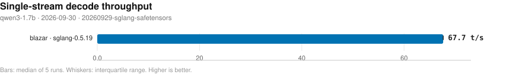
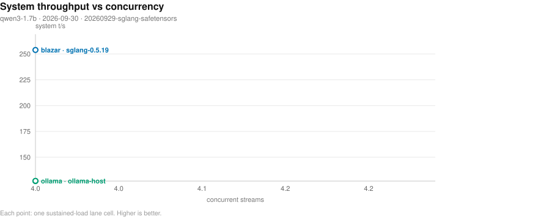
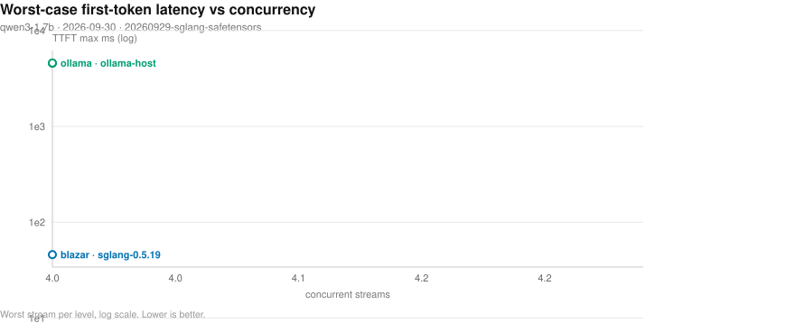
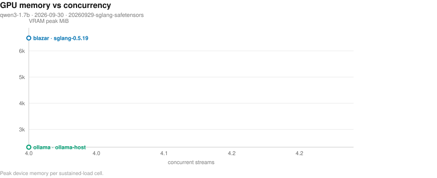
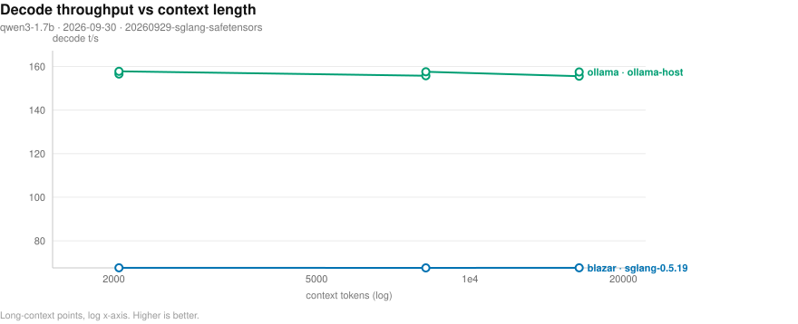
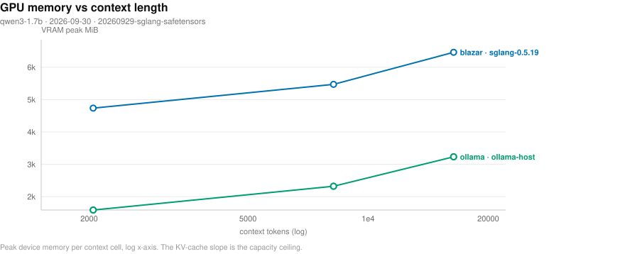
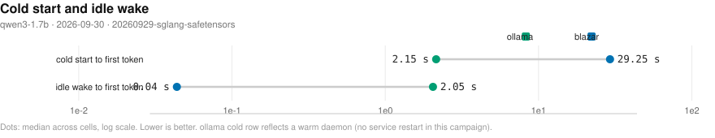

# Blazar benchmark matrix

- **date**: 2026-10-06 16:00:26
- **model**: `qwen3-1.7b.d` (3890 MiB)
- **gpu**: NVIDIA GeForce RTX 4070 Laptop GPU / driver 595.91.07
- **engines**: inventory, ollama-host, piper, sglang-0.5.19
- **harness**: bench_matrix v4 — `--model qwen3-1.7b --engines sglang-0.5.19 --artifacts-dir bench-artifacts/20260929-sglang-safetensors --md bench-artifa`
- **blazar**: `blazar 0.13.0` (sandbox daemon binary)
- **quality lane**: not-measured — no quality rows in this campaign (lane not reached for the selected providers/engines)
- all blazar-owned rows measured by `blazar 0.13.0`

## Charts

- deterministic SVG renders of the cells below; source of truth is `cells.jsonl`, charts live in `plots/`.

### Single-stream decode throughput (chart)

_Median decode t/s per runtime and engine; whiskers span the interquartile range of the 5 runs; the dashed line marks the fastest direct engine. Higher is better. Source: 20260929-sglang-safetensors/cells.jsonl._

### Concurrency scaling (chart)

_Aggregate system tokens/s as parallel streams are added; flat-to-rising means the scheduler keeps the device saturated. Higher is better. Source: 20260929-sglang-safetensors/cells.jsonl._

### Concurrency tail latency (chart)

_Worst-case first-token wait per stream as concurrency rises (log scale) - the tail the scheduler must bound. Lower is better. Source: 20260929-sglang-safetensors/cells.jsonl._

### Resource cost vs concurrency (chart)

_Peak VRAM footprint as parallel streams (and their KV caches) stack up. Source: 20260929-sglang-safetensors/cells.jsonl._

### Long-context degradation (chart)

_Single-stream decode t/s as prompt context grows (log x-axis) - KV-cache pressure made visible. Source: 20260929-sglang-safetensors/cells.jsonl._

### Memory vs context (chart)

_Peak VRAM as prompt context grows (log x-axis) - the KV-cache slope that sets the usable context ceiling. Source: 20260929-sglang-safetensors/cells.jsonl._

### Lifecycle: cold start and idle wake (chart)

_Seconds to first token after a cold start (page cache dropped) and after idle-policy expiry; blazar keeps weights resident while ollama reloads from disk. Warm-daemon ollama caveat applies. Lower is better. Source: 20260929-sglang-safetensors/cells.jsonl._

## Speed (single-stream, medians)

| engine | provider | params | n | ttft p50 (ms) | ttft p99 (ms) | itl p99 (ms) | decode t/s | prefill t/s (cached) | VRAM peak (MiB) |
|---||---||---||---||---||---||---||---||---||
| ollama-host | ctxcurve-ollama | ctx=16384 | 2 | 47 | - | - | 156.5 | - | 3234 |
| ollama-host | ctxcurve-ollama | ctx=2048 | 2 | 42 | - | - | 157.2 | - | 1588 |
| ollama-host | ctxcurve-ollama | ctx=8192 | 2 | 34 | - | - | 156.7 | - | 2322 |
| ollama-host | ollama | reference=True NOTE: serves 'qwen3:1.7b' - t/s NOT comparable | 2 | 42 | 46 | 7 | 156.6 | 60400.7 | 2322 |
| sglang-0.5.19 | blazar | config=cg_bs_16 | 1 | 32 | 33 | 15 | 67.6 | 11089.8 | 6430 |
| sglang-0.5.19 | blazar | config=cg_bs_256 | 1 | 33 | 33 | 15 | 67.6 | 11084.3 | 6804 |
| sglang-0.5.19 | blazar | config=chunked_prefill_4096 | 1 | 33 | 34 | 16 | 67.6 | 10976.7 | 6750 |
| sglang-0.5.19 | blazar | config=default | 1 | 33 | 33 | 15 | 67.7 | 10962.7 | 6470 |
| sglang-0.5.19 | blazar | config=deterministic_on | 1 | 58 | 59 | 27 | 39.5 | 6262.8 | 6698 |
| sglang-0.5.19 | blazar | config=kv_dtype_bf16 | 1 | 32 | 33 | 15 | 67.6 | 11099.8 | 6416 |
| sglang-0.5.19 | blazar | config=kv_dtype_e4m3 | 1 | 33 | 34 | 15 | 67.3 | 11236.5 | 6416 |
| sglang-0.5.19 | blazar | config=kv_unified_off | 1 | 33 | 33 | 15 | 67.6 | 10977.2 | 6454 |
| sglang-0.5.19 | blazar | config=kv_unified_on | 1 | 33 | 33 | 15 | 67.6 | 10983.0 | 6424 |
| sglang-0.5.19 | blazar | config=mem_frac_0.90 | 1 | 33 | 33 | 15 | 67.6 | 11094.6 | 6556 |
| sglang-0.5.19 | blazar | config=memory_saver_on | 1 | 33 | 33 | 16 | 67.6 | 11152.5 | 6476 |
| sglang-0.5.19 | blazar | config=page_64 | 1 | 34 | 34 | 15 | 67.5 | 10581.2 | 6440 |
| sglang-0.5.19 | blazar | config=radix_session_on | 1 | 33 | 34 | 15 | 67.6 | 10986.2 | 6454 |
| sglang-0.5.19 | blazar | config=single-stream | 1 | 33 | 33 | 15 | 67.6 | 10957.0 | 6282 |
| sglang-0.5.19 | blazar | config=spec_off | 1 | 32 | 34 | 16 | 67.6 | 11032.7 | 6490 |
| sglang-0.5.19 | blazar | config=torch_compile_on | 1 | 32 | 32 | 15 | 68.7 | 11275.5 | 6470 |
| sglang-0.5.19 | ctxcurve-blazar | ctx=16384 | 1 | 33 | 33 | 15 | 67.6 | 11040.6 | 6464 |
| sglang-0.5.19 | ctxcurve-blazar | ctx=2048 | 1 | 32 | 33 | 15 | 67.6 | 11076.1 | 4738 |
| sglang-0.5.19 | ctxcurve-blazar | ctx=8192 | 1 | 33 | 33 | 15 | 67.6 | 11000.3 | 5472 |

## Concurrency (parallel streams, medians)

| provider | engine | params | n | sys t/s | ttft max (ms) | itl p99 (ms) | ok/errors |
|---||---||---||---||---||---||---||---||
| conc-blazar | sglang-0.5.19 | conc=4 rounds=3 | 1 | 253.8 | 46 | 17 | 12/0 |
| conc-ollama | ollama-host | conc=4 rounds=3 | 2 | 127.0 | 4568 | 8 | 24/0 |
- sys t/s = total tokens / wall (true system throughput); flat sys t/s with growing ttft max means streams queued on a fixed slot count instead of being served concurrently.

## Quality — perplexity (identical pinned args)

| engine | perplexity | +/- err | wall (s) | note |
|---|---|---|---|---|
| sglang-0.5.19 | - | - | - | lower = better text fit |
- corpus: deterministic offline repo text (code-heavy) — PARITY-ONLY; absolute PPL is not comparable to published wiki-text perplexities.

## Feature matrix

| feature | sglang-0.5.19 | ollama(documented) |
|---|---|---|
| `anthropic-api` | - | - |
| `ctx-override` | - | Y |
| `embeddings` | - | Y |
| `grammar-gbnf` | - | - |
| `json-schema` | - | Y |
| `kv-quant` | - | - |
| `lora-adapter` | - | Y |
| `metrics-endpoint` | - | - |
| `paged-attn` | - | - |
| `parallel-np` | - | Y |
| `quant-on-load` | - | - |
| `rerank` | - | - |
| `slots-sessions` | - | - |
| `spec-decode` | - | - |
| `tokenize-endpoint` | - | Y |
| `vision-mmproj` | - | Y |

## Failed cells

**product** (engine/gateway behavior):

- `sglang-0.5.19` / blazar / {'config': 'hicache_on'}: cold probe failed: HTTP Error 400: Bad Request

## Reading this report

- `direct` = raw child spawn on a probed free port (no gateway); `blazar` = full gateway path inside a sandboxed daemon (resolved engine argv in `child_argv`); `ollama` = HTTP-only reference against the host service.
- decode counts ALL emitted tokens (content + reasoning); engine `usage` counters are authoritative when present. GPU/power peaks sampled at ~1.2 s cadence.
- per-run spread, cold-start/resource detail, and every raw cell live in `cells.jsonl`; tables here are per-config medians.
