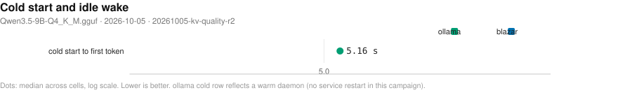
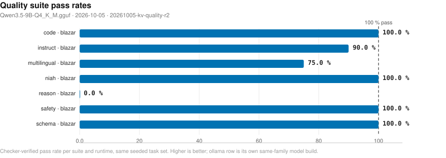

# Blazar benchmark matrix

- **date**: 2026-10-06 16:00:26
- **model**: `Qwen3.5-9B-Q4_K_M.gguf` (5366 MiB)
- **gpu**: NVIDIA GeForce RTX 4070 Laptop GPU / driver 595.91.07
- **engines**: b11393-cuda, inventory, ollama-host
- **harness**: bench_matrix v4 — `--artifacts-dir bench-artifacts/20261005-kv-quality-r2 --model qwen3.5-9b --engines b11393-cuda --providers blazar --ski`
- **blazar**: `blazar 0.20.0` (sandbox daemon binary)
- **quality lane**: ran — 1 scored row(s); suites: code, instruct, multilingual, niah, reason, safety, schema
- all blazar-owned rows measured by `blazar 0.20.0`

## Notable findings

- 2 cell(s) aborted on ENVIRONMENT guards (GPU/RAM co-residency), not product behavior — see Failed cells.

## Charts

- deterministic SVG renders of the cells below; source of truth is `cells.jsonl`, charts live in `plots/`.

### Lifecycle: cold start and idle wake (chart)

_Seconds to first token after a cold start (page cache dropped) and after idle-policy expiry; blazar keeps weights resident while ollama reloads from disk. Warm-daemon ollama caveat applies. Lower is better. Source: 20261005-kv-quality-r2/cells.jsonl._

### Quality suites (chart)

_Deterministic-checker pass rates per suite (reasoning, instruction following, code, schema, needle-in-haystack, multilingual, safety) across runtimes on the identical seeded task set. Source: 20261005-kv-quality-r2/cells.jsonl._

## Speed (single-stream, medians)

| engine | provider | params | n | ttft p50 (ms) | ttft p99 (ms) | itl p99 (ms) | decode t/s | prefill t/s (cached) | VRAM peak (MiB) |
|---||---||---||---||---||---||---||---||---||
| ollama-host | ollama | reference=True NOTE: serves 'qwen3.5:9b' - t/s NOT comparable | 1 | 897 | 897 | 617 | 4.9 | 1414.9 | 6735 |

## Feature matrix

| feature | ollama(documented) |
|---|---|
| `anthropic-api` | - |
| `ctx-override` | Y |
| `embeddings` | Y |
| `grammar-gbnf` | - |
| `json-schema` | Y |
| `kv-quant` | - |
| `lora-adapter` | Y |
| `metrics-endpoint` | - |
| `paged-attn` | - |
| `parallel-np` | Y |
| `quant-on-load` | - |
| `rerank` | - |
| `slots-sessions` | - |
| `spec-decode` | - |
| `tokenize-endpoint` | Y |
| `vision-mmproj` | Y |

## Failed cells

**environment** (box/co-residency guards — NOT blazar defects):

- `b11393-cuda` / blazar / {'config': 'default'}: GPU memory floor exceeded before cell
- `b11393-cuda` / blazar / {'config': 'single-stream'}: blazar cell crashed: MemAvailable 5774 MiB < needed ~7731 MiB (model 5366 MiB + headroom). A co-resident blazar/ollama engine is likely holding memory: stop ...

## Reading this report

- `direct` = raw child spawn on a probed free port (no gateway); `blazar` = full gateway path inside a sandboxed daemon (resolved engine argv in `child_argv`); `ollama` = HTTP-only reference against the host service.
- decode counts ALL emitted tokens (content + reasoning); engine `usage` counters are authoritative when present. GPU/power peaks sampled at ~1.2 s cadence.
- per-run spread, cold-start/resource detail, and every raw cell live in `cells.jsonl`; tables here are per-config medians.
