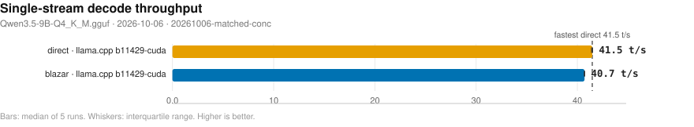
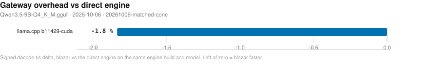
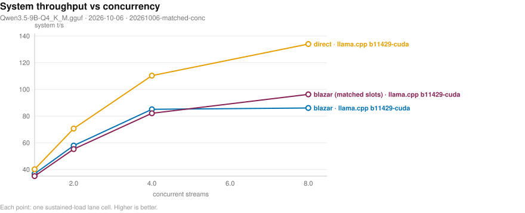
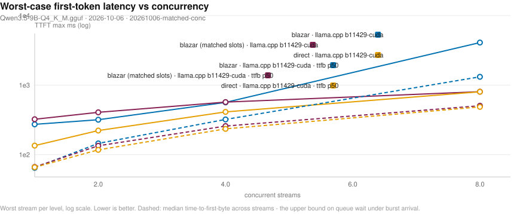
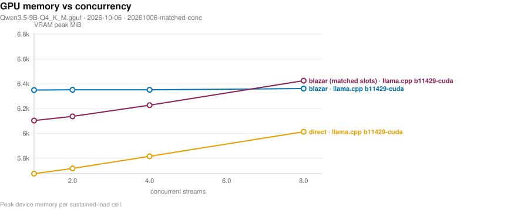
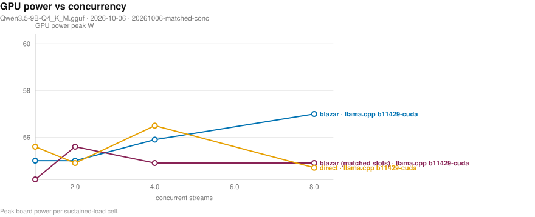

# Blazar benchmark matrix

- **date**: 2026-10-06 22:31:13
- **model**: `Qwen3.5-9B-Q4_K_M.gguf` (5366 MiB)
- **gpu**: NVIDIA GeForce RTX 4070 Laptop GPU / driver 595.91.07
- **engines**: b11429-cuda, inventory, ollama-host
- **harness**: bench_matrix v4 — `--artifacts-dir bench-artifacts/20261006-matched-conc --engines b11429-cuda --providers direct blazar blazar-matched --conc-sweep 1,2,4,8 --conc-rounds 3 --skip-ppl --skip-greedy --skip-tools --skip-reshape --skip-features --skip-idle --skip-ctxcurve --skip-quality --skip-variants --skip-media --fresh`
- **blazar**: `blazar 0.21.1` (sandbox daemon binary)
- **quality lane**: skipped — --skip-quality: no checker-verified receipts back any speed number in this campaign
- all blazar-owned rows measured by `blazar 0.21.1`

## Notable findings

- gateway vs direct decode (`b11429-cuda`, 2 configs): median -0.2%, 2/2 within ±5% (parity).
- concurrency system throughput (`b11429-cuda`, 1 streams): 36.8 vs direct 40.1 t/s = 0.92x.
- concurrency system throughput (`b11429-cuda`, 2 streams): 57.9 vs direct 70.7 t/s = 0.82x.
- concurrency system throughput (`b11429-cuda`, 4 streams): 85.1 vs direct 110.3 t/s = 0.77x.
- concurrency system throughput (`b11429-cuda`, 8 streams): 86.1 vs direct 133.9 t/s = 0.64x.
- concurrency system throughput (`b11429-cuda`, 1 streams, matched slots): 35.0 vs direct 40.1 t/s = 0.87x (gateway at the direct lane's own slot count).
- concurrency system throughput (`b11429-cuda`, 2 streams, matched slots): 55.3 vs direct 70.7 t/s = 0.78x (gateway at the direct lane's own slot count).
- concurrency system throughput (`b11429-cuda`, 4 streams, matched slots): 82.1 vs direct 110.3 t/s = 0.74x (gateway at the direct lane's own slot count).
- concurrency system throughput (`b11429-cuda`, 8 streams, matched slots): 96.2 vs direct 133.9 t/s = 0.72x (gateway at the direct lane's own slot count).

## Charts

- deterministic SVG renders of the cells below; source of truth is `cells.jsonl`, charts live in `plots/`.

### Single-stream decode throughput (chart)

_Median decode t/s per runtime and engine; whiskers span the interquartile range of the 5 runs; the dashed line marks the fastest direct engine. Higher is better. Source: 20261006-matched-conc/cells.jsonl._

### Gateway overhead (chart)

_Decode t/s delta of routing through blazar relative to driving the same engine build directly; left of zero means the gateway path won. Source: 20261006-matched-conc/cells.jsonl._

### Concurrency scaling (chart)

_Aggregate system tokens/s as parallel streams are added; flat-to-rising means the scheduler keeps the device saturated. Higher is better. Source: 20261006-matched-conc/cells.jsonl._

### Concurrency tail latency (chart)

_Worst-case first-token wait per stream as concurrency rises (log scale) - the tail the scheduler must bound. Lower is better. Dashed curves carry the median time-to-first-byte, which upper-bounds queue wait under burst arrival. Source: 20261006-matched-conc/cells.jsonl._

### Resource cost vs concurrency (chart)

_Peak VRAM footprint as parallel streams (and their KV caches) stack up. Source: 20261006-matched-conc/cells.jsonl._

### Resource cost vs concurrency (chart)

_Peak GPU board power per concurrency level - the energy price of keeping the device saturated. Source: 20261006-matched-conc/cells.jsonl._

### Lifecycle: cold start and idle wake (chart)

_Seconds to first token after a cold start (page cache dropped) and after idle-policy expiry; blazar keeps weights resident while ollama reloads from disk. Lower is better. Source: 20261006-matched-conc/cells.jsonl._

## Speed (single-stream, medians)

| engine | provider | params | n | ttft p50 (ms) | ttft p99 (ms) | itl p99 (ms) | decode t/s | prefill t/s (cached) | VRAM peak (MiB) |
|---||---||---||---||---||---||---||---||---||
| b11429-cuda | blazar | config=default child: np=4 ctx=65536 | 1 | 120 | 132 | 26 | 40.7 | 7306.9 | 6355 |
| b11429-cuda | blazar | config=single-stream child: np=1 ctx=16384 | 1 | 123 | 130 | 25 | 41.0 | 7488.4 | 6101 |
| b11429-cuda | direct | ctx=16384 np=1 | 1 | 122 | 124 | 25 | 41.5 | 7483.1 | 5681 |
| b11429-cuda | direct | ctx=16384 np=4 | 1 | 121 | 126 | 25 | 41.5 | 7259.6 | 5819 |
| b11429-cuda | direct | ctx=4096 np=1 | 1 | 126 | 131 | 32 | 41.1 | 7106.8 | 5285 |
| b11429-cuda | direct | ctx=4096 np=4 | 1 | 125 | 130 | 26 | 41.5 | 7282.5 | 5425 |

## Concurrency (parallel streams, medians)

| provider | engine | params | n | sys t/s | ttft max (ms) | itl p99 (ms) | ok/errors |
|---||---||---||---||---||---||---||---||
| conc-blazar | b11429-cuda | conc=1 rounds=3 | 1 | 36.8 | 273 | 26 | 3/0 |
| conc-blazar | b11429-cuda | conc=2 rounds=3 | 1 | 57.9 | 318 | 31 | 6/0 |
| conc-blazar | b11429-cuda | conc=4 rounds=3 | 1 | 85.1 | 564 | 38 | 12/0 |
| conc-blazar | b11429-cuda | conc=8 rounds=3 | 1 | 86.1 | 4092 | 167 | 24/0 |
| conc-blazar-matched | b11429-cuda | conc=1 rounds=3 slots=1 | 1 | 35.0 | 323 | 26 | 3/0 |
| conc-blazar-matched | b11429-cuda | conc=2 rounds=3 slots=2 | 1 | 55.3 | 406 | 31 | 6/0 |
| conc-blazar-matched | b11429-cuda | conc=4 rounds=3 slots=4 | 1 | 82.1 | 570 | 37 | 12/0 |
| conc-blazar-matched | b11429-cuda | conc=8 rounds=3 slots=8 | 1 | 96.2 | 804 | 85 | 24/0 |
| conc-direct | b11429-cuda | conc=1 rounds=3 | 1 | 40.1 | 135 | 26 | 3/0 |
| conc-direct | b11429-cuda | conc=2 rounds=3 | 1 | 70.7 | 222 | 29 | 6/0 |
| conc-direct | b11429-cuda | conc=4 rounds=3 | 1 | 110.3 | 412 | 36 | 12/0 |
| conc-direct | b11429-cuda | conc=8 rounds=3 | 1 | 133.9 | 802 | 58 | 24/0 |
- sys t/s = total tokens / wall (true system throughput); flat sys t/s with growing ttft max means streams queued on a fixed slot count instead of being served concurrently.

## Feature matrix

| feature | ollama(documented) |
|---|---|
| `anthropic-api` | - |
| `ctx-override` | Y |
| `embeddings` | Y |
| `grammar-gbnf` | - |
| `json-schema` | Y |
| `kv-quant` | - |
| `lora-adapter` | Y |
| `metrics-endpoint` | - |
| `paged-attn` | - |
| `parallel-np` | Y |
| `quant-on-load` | - |
| `rerank` | - |
| `slots-sessions` | - |
| `spec-decode` | - |
| `tokenize-endpoint` | Y |
| `vision-mmproj` | Y |

## Failed cells

**product** (engine/gateway behavior):

- `ollama-host` / ollama / {'reference': True}: ollama not reachable on 11434 (skipped, not started)
- `ollama-host` / cold-ollama / {'cold': True}: ollama not reachable on 11434 (skipped, not started)
- `ollama-host` / conc-ollama (4 cells): ollama not reachable on 11434 (skipped, not started) [{'conc': 1, 'rounds': 3}; {'conc': 2, 'rounds': 3}; {'conc': 4, 'rounds': 3}; {'conc': 8, 'rounds': 3}]

## Reading this report

- `direct` = raw child spawn on a probed free port (no gateway); `blazar` = full gateway path inside a sandboxed daemon (resolved engine argv in `child_argv`); `ollama` = HTTP-only reference against the host service.
- decode counts ALL emitted tokens (content + reasoning); engine `usage` counters are authoritative when present. GPU/power peaks sampled at ~1.2 s cadence.
- per-run spread, cold-start/resource detail, and every raw cell live in `cells.jsonl`; tables here are per-config medians.
