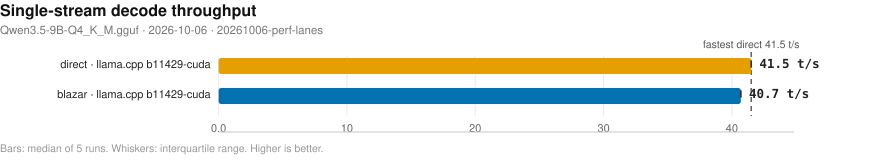
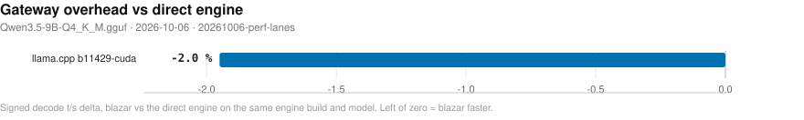
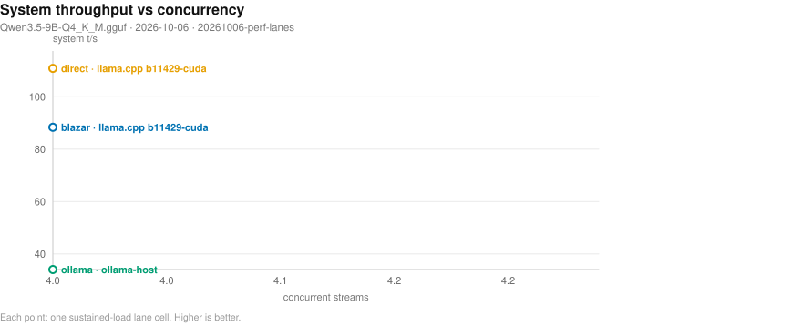
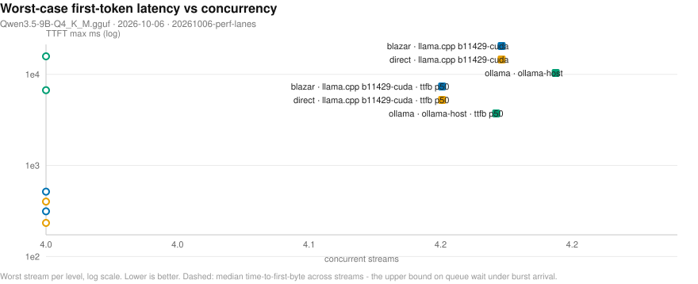
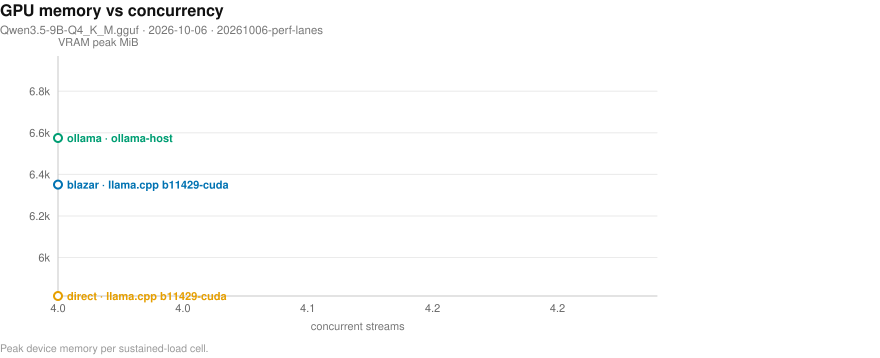
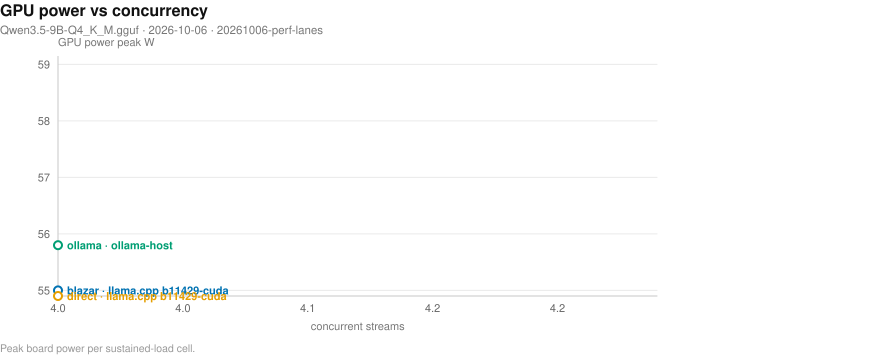
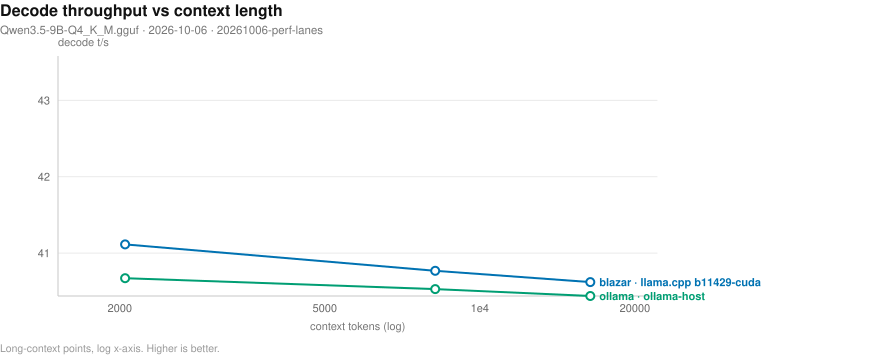
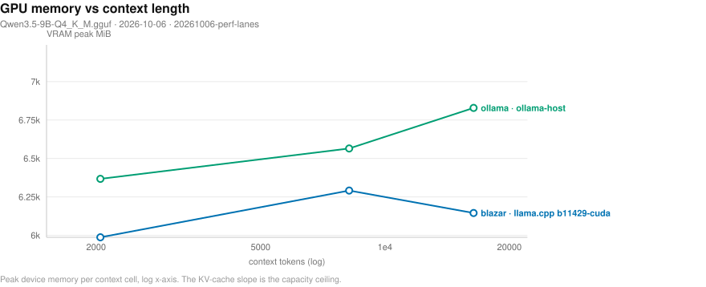
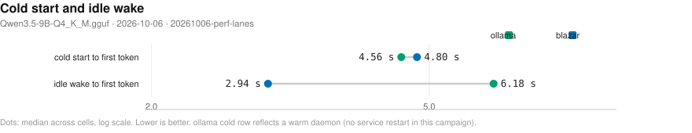

# Blazar benchmark matrix

- **date**: 2026-10-06 22:44:53
- **model**: `Qwen3.5-9B-Q4_K_M.gguf` (5366 MiB)
- **gpu**: NVIDIA GeForce RTX 4070 Laptop GPU / driver 595.91.07
- **engines**: b11429-cuda, inventory, ollama-host
- **harness**: bench_matrix v4 — `--artifacts-dir bench-artifacts/20261006-perf-lanes --engines b11429-cuda --skip-ppl --skip-greedy --skip-quality --skip-reshape --skip-features --skip-variants --skip-media --fresh`
- **blazar**: `blazar 0.21.1` (sandbox daemon binary)
- **quality lane**: skipped — --skip-quality: no checker-verified receipts back any speed number in this campaign
- all blazar-owned rows measured by `blazar 0.21.1`

## Notable findings

- gateway vs direct decode (`b11429-cuda`, 2 configs): median -1.4%, 2/2 within ±5% (parity).
- concurrency system throughput (`b11429-cuda`, 4 streams): 88.3 vs direct 110.8 t/s = 0.80x.

## Charts

- deterministic SVG renders of the cells below; source of truth is `cells.jsonl`, charts live in `plots/`.

### Single-stream decode throughput (chart)

_Median decode t/s per runtime and engine; whiskers span the interquartile range of the 5 runs; the dashed line marks the fastest direct engine. Higher is better. Source: 20261006-perf-lanes/cells.jsonl._

### Gateway overhead (chart)

_Decode t/s delta of routing through blazar relative to driving the same engine build directly; left of zero means the gateway path won. Source: 20261006-perf-lanes/cells.jsonl._

### Concurrency scaling (chart)

_Aggregate system tokens/s as parallel streams are added; flat-to-rising means the scheduler keeps the device saturated. Higher is better. Source: 20261006-perf-lanes/cells.jsonl._

### Concurrency tail latency (chart)

_Worst-case first-token wait per stream as concurrency rises (log scale) - the tail the scheduler must bound. Lower is better. Dashed curves carry the median time-to-first-byte, which upper-bounds queue wait under burst arrival. Source: 20261006-perf-lanes/cells.jsonl._

### Resource cost vs concurrency (chart)

_Peak VRAM footprint as parallel streams (and their KV caches) stack up. Source: 20261006-perf-lanes/cells.jsonl._

### Resource cost vs concurrency (chart)

_Peak GPU board power per concurrency level - the energy price of keeping the device saturated. Source: 20261006-perf-lanes/cells.jsonl._

### Long-context degradation (chart)

_Single-stream decode t/s as prompt context grows (log x-axis) - KV-cache pressure made visible. Source: 20261006-perf-lanes/cells.jsonl._

### Memory vs context (chart)

_Peak VRAM as prompt context grows (log x-axis) - the KV-cache slope that sets the usable context ceiling. Source: 20261006-perf-lanes/cells.jsonl._

### Lifecycle: cold start and idle wake (chart)

_Seconds to first token after a cold start (page cache dropped) and after idle-policy expiry; blazar keeps weights resident while ollama reloads from disk. Warm-daemon ollama caveat applies. Lower is better. Source: 20261006-perf-lanes/cells.jsonl._

## Speed (single-stream, medians)

| engine | provider | params | n | ttft p50 (ms) | ttft p99 (ms) | itl p99 (ms) | decode t/s | prefill t/s (cached) | VRAM peak (MiB) |
|---||---||---||---||---||---||---||---||---||
| b11429-cuda | blazar | config=default child: np=4 ctx=65536 | 1 | 119 | 124 | 26 | 40.7 | 6966.3 | 6355 |
| b11429-cuda | blazar | config=single-stream child: np=1 ctx=16384 | 1 | 120 | 134 | 25 | 41.1 | 7494.5 | 6101 |
| b11429-cuda | ctxcurve-blazar | ctx=16384 child: np=3 ctx=49152 | 1 | 126 | 494 | 26 | 40.6 | 7290.2 | 6145 |
| b11429-cuda | ctxcurve-blazar | ctx=2048 child: np=4 ctx=8192 | 1 | 177 | 386 | 30 | 41.1 | 7502.5 | 5987 |
| b11429-cuda | ctxcurve-blazar | ctx=8192 child: np=4 ctx=32768 | 1 | 126 | 532 | 26 | 40.8 | 7471.1 | 6291 |
| b11429-cuda | direct | ctx=16384 np=1 | 1 | 121 | 122 | 25 | 41.5 | 7185.0 | 5681 |
| b11429-cuda | direct | ctx=16384 np=4 | 1 | 117 | 119 | 25 | 41.6 | 7394.3 | 5819 |
| b11429-cuda | direct | ctx=4096 np=1 | 1 | 120 | 124 | 25 | 41.7 | 7155.2 | 5285 |
| b11429-cuda | direct | ctx=4096 np=4 | 1 | 121 | 124 | 25 | 41.6 | 7359.1 | 5431 |
| ollama-host | ctxcurve-ollama | ctx=16384 | 1 | 124 | - | - | 40.4 | - | 6829 |
| ollama-host | ctxcurve-ollama | ctx=2048 | 1 | 123 | - | - | 40.7 | - | 6367 |
| ollama-host | ctxcurve-ollama | ctx=8192 | 1 | 122 | - | - | 40.5 | - | 6565 |
| ollama-host | ollama | reference=True NOTE: serves 'qwen3.5:9b' - t/s NOT comparable | 1 | 122 | 130 | 75 | 40.6 | 7665.7 | 6569 |

## Concurrency (parallel streams, medians)

| provider | engine | params | n | sys t/s | ttft max (ms) | itl p99 (ms) | ok/errors |
|---||---||---||---||---||---||---||---||
| conc-blazar | b11429-cuda | conc=4 rounds=3 | 1 | 88.3 | 515 | 37 | 12/0 |
| conc-direct | b11429-cuda | conc=4 rounds=3 | 1 | 110.8 | 401 | 36 | 12/0 |
| conc-ollama | ollama-host | conc=4 rounds=3 | 1 | 34.0 | 15768 | 75 | 12/0 |
- sys t/s = total tokens / wall (true system throughput); flat sys t/s with growing ttft max means streams queued on a fixed slot count instead of being served concurrently.

## Feature matrix

| feature | ollama(documented) |
|---|---|
| `anthropic-api` | - |
| `ctx-override` | Y |
| `embeddings` | Y |
| `grammar-gbnf` | - |
| `json-schema` | Y |
| `kv-quant` | - |
| `lora-adapter` | Y |
| `metrics-endpoint` | - |
| `paged-attn` | - |
| `parallel-np` | Y |
| `quant-on-load` | - |
| `rerank` | - |
| `slots-sessions` | - |
| `spec-decode` | - |
| `tokenize-endpoint` | Y |
| `vision-mmproj` | Y |

## Reading this report

- `direct` = raw child spawn on a probed free port (no gateway); `blazar` = full gateway path inside a sandboxed daemon (resolved engine argv in `child_argv`); `ollama` = HTTP-only reference against the host service.
- decode counts ALL emitted tokens (content + reasoning); engine `usage` counters are authoritative when present. GPU/power peaks sampled at ~1.2 s cadence.
- per-run spread, cold-start/resource detail, and every raw cell live in `cells.jsonl`; tables here are per-config medians.
